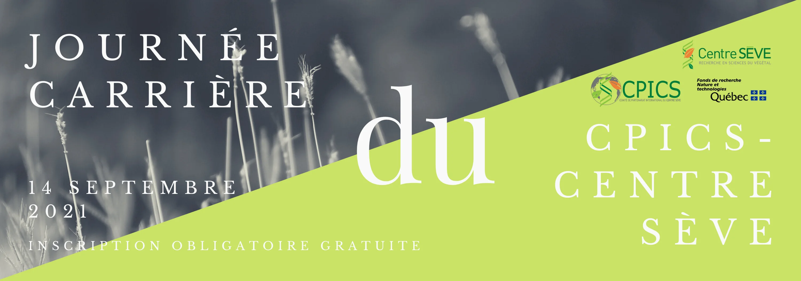
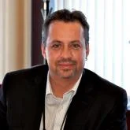
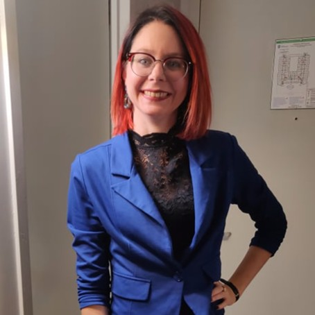
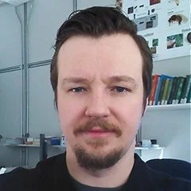

<head>
<meta charset="utf-8">
<link rel="apple-touch-icon" sizes="180x180" href="../apple-touch-icon.png">
<link rel="icon" type="image/png" sizes="32x32" href="../favicon-32x32.png">
<link rel="icon" type="image/png" sizes="16x16" href="../favicon-16x16.png">
<link rel="manifest" href="../site.webmanifest">
<link rel="mask-icon" href="../safari-pinned-tab.svg" color="#5bbad5">
<link rel="alternate" hreflang="fr-fr" href="../fr/news.html">
<meta name="msapplication-TileColor" content="#da532c">
<meta name="theme-color" content="#ffffff">
<meta name="viewport" content="width=device-width, initial-scale=1">

<link rel="stylesheet" href="column_text_style.css">
<link rel="stylesheet" href="symposium_style.css">
<link rel="stylesheet" href="slideshow.css">

</head>

  
  

  

<h1></h1>

Have you ever wondered what comes next after finishing your graduate studies?  
What options are there and how to make the most of the different tools available to make such decisions? 
The Centre SÈVE and the CSIPC are here to help with an online Career Day.

There will be two workshops on the use of LinkedIn as a networking tool and the benefits that networking offers in the work environment. 
You will also have the opportunity to talk to former Centre SÈVE students about their career and their path after their graduate studies.

Click [here](https://event.fourwaves.com/journeecarriere/registration) to register or look below for more information on our guests and the workshops.

[Program](https://event.fourwaves.com/journeecarriere/schedule)
  

<h2>Workshops</h2>

Workshops will be given in french.
 

<h3>Autonomous search for internships and jobs</h3>

The workshop aims to remind the participants of the diversity of possible approaches and the importance of a preparation step before embarking on the search for different opportunities. It is about building on one's own experiences and skills and having an organized approach to finding the right internship or job for one's aspirations.

<h3>LinkedIn: a professional networking tool</h3>

You are finishing or have just finished your studies? Are you still in university and looking for an internship? LinkedIn, this powerful professional networking tool, could be just what you need. Provided, of course, that you use it correctly!

In this workshop, you will learn how to optimize your profile to be seen and recognized, how to build and expand an impactful network and, finally, discuss strategies that could help you find the job or internship of your dreams.

<h2>Guests</h2>

[Tony Savard](https://profils-profiles.science.gc.ca/en/profile/tony-savard-phd) Research Scientist Saint-Hyacinthe Research and Development Centre

[Lauriane Giroux](https://www.linkedin.com/in/lauriane-giroux-83b68b11a/) Research professional Ulysse Biotech

 

 

[Tanya Copley](https://cerom.qc.ca/organisation/notre-equipe/chercheurs.html) Phytopathologist Centre de recherche sur les grains, inc.

 

 

[Jean-Philippe Légaré](https://www.linkedin.com/in/jean-phillippe-legare-29209368/?originalSubdomain=ca) Biologist-entomologist MAPAQ's Laboratory of expertise and diagnostic in en phytoprotection

 

 

[Ayooluwa Bolaji](https://www.linkedin.com/in/ayooluwa-bolaji-ph-d-2a9a64159/?originalSubdomain=ca) Research scientist at the Genomics Unit National Centre for Foreign Animal Disease (Canadian Food Inspection Agency)

 
 [<i class="fab fa-twitter"></i>](https://twitter.com/CPICSEVE) [<i class="fab fa-linkedin-in"></i>](https://www.linkedin.com/company/cpics/about/) [<i class="fab fa-facebook"></i>](https://www.facebook.com/CPICS-Comit%C3%A9-de-partenariat-international-du-Centre-S%C3%88VE-395275957711442) <a  href = "mailto:cpicseve@gmail.com"><i class="fas fa-envelope" align="center" style="font-size:24px"></i></a> 

<a class="twitter-timeline" data-height=1000px href="https://twitter.com/CPICSEVE?ref_src=twsrc%5Etfw">Tweets by CPICS</a> 

