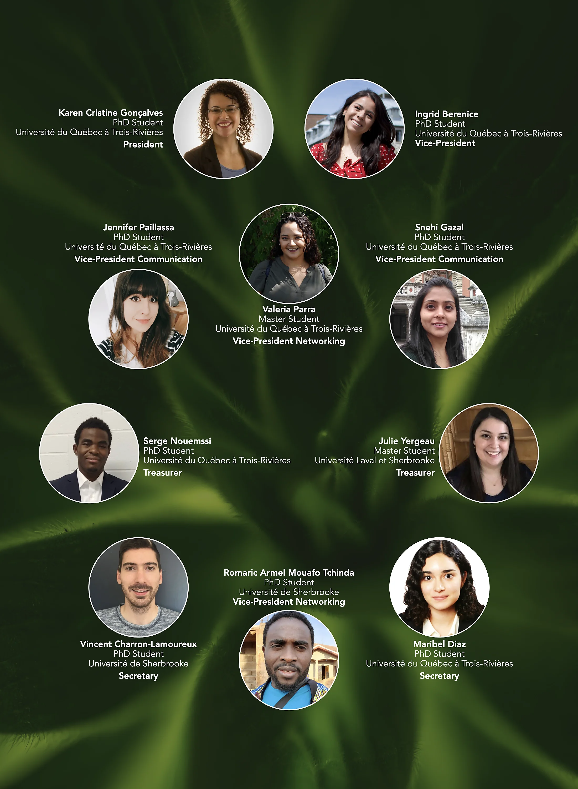
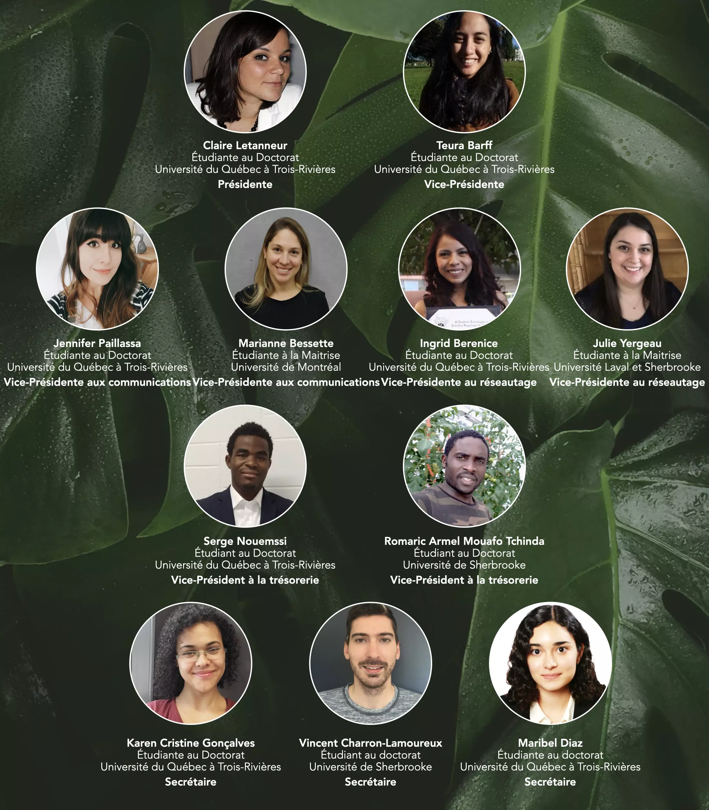
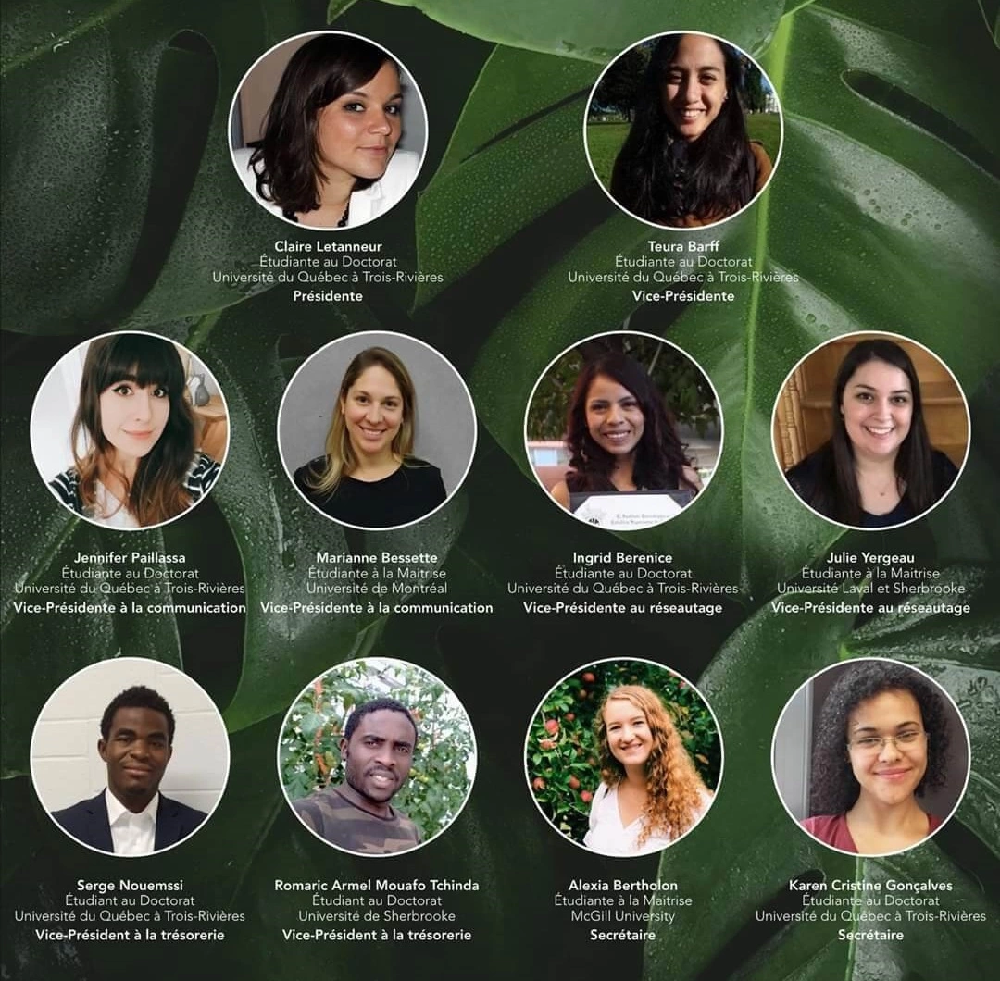
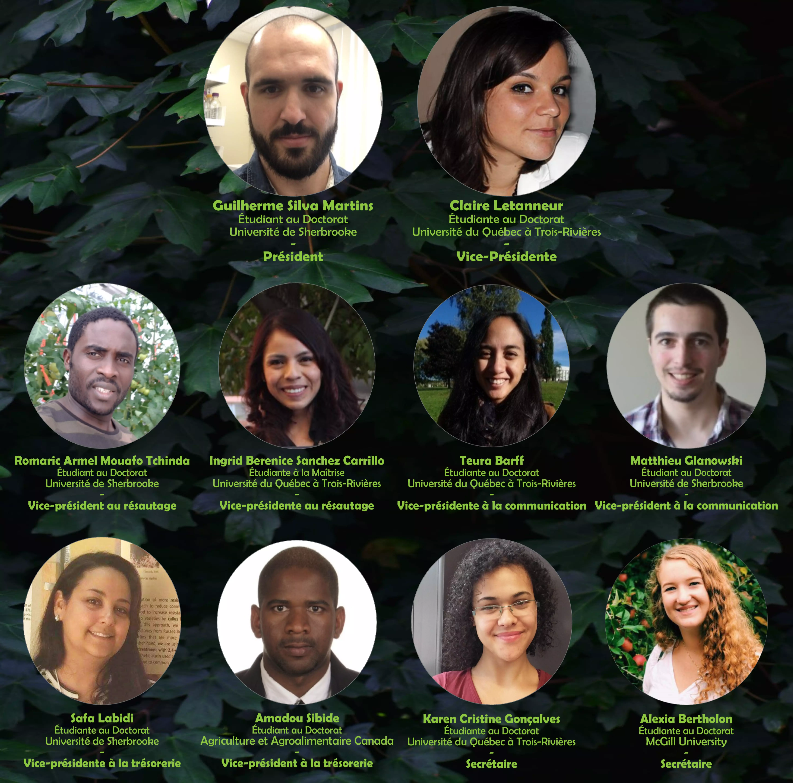

<head>
<meta charset="utf-8">
<link rel="apple-touch-icon" sizes="180x180" href="/apple-touch-icon.png">
<link rel="icon" type="image/png" sizes="32x32" href="/favicon-32x32.png">
<link rel="icon" type="image/png" sizes="16x16" href="/favicon-16x16.png">
<link rel="manifest" href="/site.webmanifest">
<link rel="mask-icon" href="/safari-pinned-tab.svg" color="#5bbad5">
<link rel="alternate" hreflang="fr-fr" href="../fr/comites.html">
<meta name="msapplication-TileColor" content="#da532c">
<meta name="theme-color" content="#ffffff">
<meta name="viewport" content="width=device-width, initial-scale=1">

<link rel="stylesheet" href="column_text_style.css">
<head>

</head>

  
  

 
[<i class="fab fa-twitter"></i>](https://twitter.com/CPICSEVE) 
[<i class="fab fa-linkedin-in"></i>](https://www.linkedin.com/company/cpics/about/) 
[<i class="fab fa-facebook"></i>](https://www.facebook.com/CPICS-Comit%C3%A9-de-partenariat-international-du-Centre-S%C3%88VE-395275957711442) 
<a href = "mailto:cpicseve@gmail.com"><i class="fas fa-envelope" align="center" style="font-size:24px"></i></a> 

<a class="twitter-timeline" data-height=1800px href="https://twitter.com/CPICSEVE?ref_src=twsrc%5Etfw">Tweets by CPICS</a> 

# &nbsp; {.tabset .tabset-fade .tabset-pills} 

## Description of the roles

### **President**

The president directs the deliberations, maintains order and decorum, receives the proposals and submits them to the assembly. He/She also ensures that the CSIPC schedule runs smoothly and helps each of the other sectors if necessary. This person represents the committee during each of the activities in which CSIPC participates. The president calls the vote and proclaims the result, signs the official documents and confirms the minutes of the previous sessions approved by the assembly. In the event of parity in the last ballot, it is usually given the casting vote in order to resolve a situation which would otherwise appear insoluble. In the event of an appeal from one of its decisions, it is entitled to be heard first on the reasons for its decision.

> <b><i>I wanted to do more for the scientific community. I met great people, developed organizational skills and learn more about academic processes related to research. Working with this great team, brings me so much!</b>
 
> Claire Letanneur, President 2020</i>

 
### **Vice-President**

The Vice-President, together with the President, ensures that the CSIPC calendar runs smoothly and helps each of the other sectors if necessary. He/She fulfills the functions of the president in the meetings in the event of his absence or other impediment; it is he/she who is generally called to preside over the meetings of the assembly when it sits in a committee of the whole.

 
### **Secretary**

The secretary writes up, in the two official languages of CSIPC, and signs the minutes of the general, regular, special and Executive Council meetings which he/she then submits for the approval of the assembly while the chairman of the meeting or they are adopted confirms his signature indicating the date of this confirmation. He/She must prepare the agenda that will be accepted by the presidency and made available to members before the meeting. He/She will communicate to the members the reports of the committees, the proposals and other official documents in his care. The secretary will also be responsible for the management of these documents.

> <b><i>The CPICS is  amazing and I am proud to have helped create it. I like to participate in the organization of events, but I am too shy to take the lead. So being the secretary allowed me to be a part of this committee in the "background", giving my opinion, being part of important decisions and helping in the organization of our conferences and our Symposium. As a secretary I also had to push myself to improve my organization skills and pay more attention to the meetings. Finally, I also got to mentor two incredible people that replaced me in the position.</b>
 
> Karen Goncalves dos Santos, Secretary 2019-2020</i>

### **Vice-President for Communications**

He/She will be in charge of creating and managing social media platforms, setting up and managing the association's official means of communication (mailbox). In the case of organizing an event, it will help to maximize the visibility of the event for all members of the Center SÈVE as well as for any public targeted by the Committee.

<b><i>

> Following the CSIPC's symposium in August 2019, I thought it was great that students from many different backgrounds were bridging the gap between research in Quebec and elsewhere. It is very enriching to share our knowledge with other researchers internationally.
> Promoting CSIPC's activities was a natural fit since the mission is inspiring. Moreover, it is a real pleasure to be part of this dynamic and dedicated team.</b>
 
>Marianne Bessette, VP Communication 2020</i>

### **Vice-President of Networking**

He/She will be in charge of creating, managing and updating the database. In these steps, he/she must contact the researchers, former members and students currently members of the SÈVE Center to obtain information as well as authorizations to use this information.

<b><i>

> I have always believed that networking is a fundamental pillar when seeking to grow both personally and professionally. 
> When I knew that I could have the opportunity to organize and keep up to date the contact information of the Centre SEVE members, as well as communicate with international experts in the area of plant biology, I knew that I wanted to contribute and be part of CSIPC in the position of VP of Networking.</b>
 
> Ingrid Berenice Sánchez Carrillo, Vice-President of Networking 2019-2020</i>

 
### **Treasurer**

He/She will be in charge of managing the budget allocated to CSIPC and of presenting a financial report when it is necessary to withdraw funds and dispose of them. If necessary, he/she will be responsible for finding and contacting potential partners to obtain additional funds during the CSIPC activity. He/She must work closely with the vice-president of communications, the president and the vice-president.

## Current

 

 

<table>
<thead>
<tr>
<td scope="col">Role</td>
<td scope="col">Name</td>
<td scope="col">University</td>
</tr>
</thead>
<tbody>
<tr>
<th scope="row">Presidence</th><td>[Karen Cristine Goncalves dos Santos]</td><td rowspan="5">Université du Québec à Trois-Rivières</td>
</tr>
<tr>
<th scope="row">Vice-Presidence</th><td>[Ingrid Berenice Sanchez Carrillo]</td>
</tr>
<tr>
<th scope="row" rowspan="2">Vice-Presidence of Communications</th><td>[Jennifer Paillassa]</td>
</tr>
<tr>
<td>[Snehi Gazal]</td>
</tr>
<tr>
<th scope="row" rowspan="2">Vice-Presidence of Networking</th><td>[Valeria Parra]</td>
</tr>
<tr>
<td>[Romaric Armel Mouafo Tchinda]</td><td>Université de Sherbrooke</td>
</tr>
<tr>
<th scope="row" rowspan="2">Vice-Presidence of Treasury</th><td>[Serge Nouemssi]</td><td>Université du Québec à Trois-Rivières</td>
</tr>
<tr>
<td>[Julie Yergeau]</td><td>Université de Sherbrooke Université Laval</td>
</tr>
<tr>
<th scope="row" rowspan="3"> Secretary</th><td>[Aracely Maribel Diaz Garza]</td><td >Université du Québec à Trois-Rivières</td>
</tr>
<tr>
<td>[Vincent Charron-Lamoureux]</td><td>Université de Sherbrooke</td>
</tr>
</tbody>
</table>

## Past {.tabset .tabset-pill}

### 2020 {.tabset .tabset-pill}

#### 2020-05
 

 

<table>
<thead>
<tr>
<td scope="col">Role</td>
<td scope="col">Name</td>
<td scope="col">University</td>
</tr>
</thead>
<tbody>
<tr>
<th scope="row">Presidence</th><td>[Claire Letanneur]</td><td rowspan="3">Université du Québec à Trois-Rivières</td>
</tr>
<tr>
<th scope="row">Vice-Presidence</th><td>[Teura Barff]</td>
</tr>
<tr>
<th scope="row" rowspan="2">Vice-Presidence of Communications</th><td>[Jennifer Paillassa]</td>
</tr>
<tr>
<td>[Marianne Bessette]</td><td>Université de Montréal</td>
</tr>
<tr>
<th scope="row" rowspan="2">Vice-Presidence of Networking</th><td>[Ingrid Berenice Sanchez Carrillo]</td><td>Université du Québec à Trois-Rivières</td>
</tr>
<tr>
<td>[Julie Yergeau]</td><td>Université de Sherbrooke Université Laval</td>
</tr>
<tr>
<th scope="row" rowspan="2">Vice-Presidence of Treasury</th><td>[Serge Nouemssi]</td><td>Université du Québec à Trois-Rivières</td>
</tr>
<tr>
<td>[Romaric Armel Mouafo Tchinda]</td><td>Université de Sherbrooke</td>
</tr>
<tr>
<th scope="row" rowspan="3"> Secretary</th><td>[Karen Cristine Goncalves dos Santos]</td><td rowspan="2">Université du Québec à Trois-Rivières</td>
</tr>
<tr>
<td>[Aracely Maribel Diaz Garza]</td>
</tr>
<tr>
<td>[Vincent Charron-Lamoureux]</td><td>Université de Sherbrooke</td>
</tr>
</tbody>
</table>

  

#### 2020-01-10

 

 

<table>
<thead>
<tr>
<td>Role</td>
<td>Name</td>
<td>University</td>
</tr>
</thead>
<tbody>
<tr>
<th scope="row">Presidence</td><td>[Claire Letanneur]</th><td rowspan="3">Université du Québec à Trois-Rivières</td>
</tr>
<tr>
<th scope="row">Vice-Presidence</td><td>[Teura Barff]</th>
</tr>
<tr>
<th scope="row" rowspan="2">Vice-Presidence of Communications</th><td>[Jennifer Paillassa]</td>
</tr>
<tr>
<td>[Marianne Bessette]</td><td>Université de Montréal</td>
</tr>
<tr>
<th scope="row" rowspan="2">Vice-Presidence of Networking</th><td>[Ingrid Berenice Sanchez Carrillo]</td><td>Université du Québec à Trois-Rivières</td>
</tr>
<tr>
<td>[Julie Yergeau]</td><td>Université de Sherbrooke, Université Laval</td>
</tr>
<tr>
<th scope="row" rowspan="2">Vice-Presidence of Treasury</th><td>[Serge Nouemssi]</td><td>Université du Québec à Trois-Rivières</td>
</tr>
<tr>
<td>[Romaric Armel Mouafo Tchinda]</td><td>Université de Sherbrooke</td>
</tr>
<tr>
<th scope="row" rowspan="2">Secretary</th><td>[Karen Cristine Goncalves dos Santos]</td><td>Université du Québec à Trois-Rivières</td>
</tr>
<tr>
<td>[Alexia Bertholon]</td>
<td>McGill University</td>
</tr>
</tbody>
</table>

###  2019

 

<table>
<thead>
<tr>
<td>Role</td><td>Name</td><td>University</td>
</tr>
</thead>
<tbody>
<tr>
<th scope="row" rowspan="1">Presidence</th><td>[Guilherme Silva Martins]</td><td>Université de Sherbrooke</td>
</tr>
<tr>
<th scope="row" rowspan="1">Vice-Presidence</th><td>[Claire Letanneur]</td><td rowspan="2">Université du Québec à Trois-Rivières</td>
</tr>
<tr>
<th scope="row" rowspan="2">Vice-Presidence of Communications</th><td>[Teura Barff]</td>
</tr>
<tr>
<td>[Matthieu Glanowski]</td><td>Université de Sherbrooke</td>
</tr>
<tr>
<th scope="row" rowspan="2">Vice-Presidence of Networking</th><td>[Ingrid Berenice Sanchez Carrillo]</td><td>Université du Québec à Trois-Rivières</td>
</tr>
<tr>
<td>[Romaric Armel Mouafo Tchinda]</td><td rowspan="2">Université de Sherbrooke</td>
</tr>
<tr>
<th scope="row" rowspan="2">Vice-Presidence of Treasury</th><td>[Safa Labidi]</td>
</tr>
<tr>
<td>Amadou Sibide</td><td>Agriculture et Agrolimentaire Canada</td>
</tr>
<tr>
<th scope="row" rowspan="2">Secretary</th><td>[Karen Cristine Goncalves dos Santos]</td><td>Université du Québec à Trois-Rivières</td>
</tr>
<tr>
<td>[Alexia Bertholon]</td>
<td>McGill University</td>
</tr>
</tbody>
</table>

[Aracely Maribel Diaz Garza]: https://www.linkedin.com/in/aracely-maribel-diaz-garza-6989b5169/
[Vincent Charron-Lamoureux]: https://www.researchgate.net/profile/Vincent_Charron-Lamoureux
[Jennifer Paillassa]: https://www.linkedin.com/in/jennifer-paillassa-087600a3/
[Marianne Bessette]: https://www.linkedin.com/in/marianne-bessette-b16287146/
[Julie Yergeau]: https://www.linkedin.com/in/julie-yergeau-b58508186/
[Serge Nouemssi]: https://www.linkedin.com/in/serge-basile-nouemssi-a95913121/
[Guilherme Silva Martins]: https://www.linkedin.com/in/guilherme-martins-1268202b/
[Claire Letanneur]: https://www.researchgate.net/profile/Claire_Letanneur
[Teura Barff]: https://www.linkedin.com/in/teura-barff-66526647/
[Matthieu Glanowski]: https://www.linkedin.com/in/matthieu-glanowski-585254116/
[Ingrid Berenice Sanchez Carrillo]: https://www.linkedin.com/in/ingrid-sanchez/
[Romaric Armel Mouafo Tchinda]: https://www.linkedin.com/in/romaric-armel-mouafo-tchinda-ba266185/
[Safa Labidi]: https://www.linkedin.com/in/safa-labidi-41749b73/
[Karen Cristine Goncalves dos Santos]: https://www.linkedin.com/in/karen-cristine-gon%C3%A7alves-dos-santos-05847a113/
[Alexia Bertholon]: https://www.linkedin.com/in/alexiabertholon/
[Snehi Gazal]: https://www.linkedin.com/in/snehi-gazal-9172856b/
[Valeria Parra]: 
