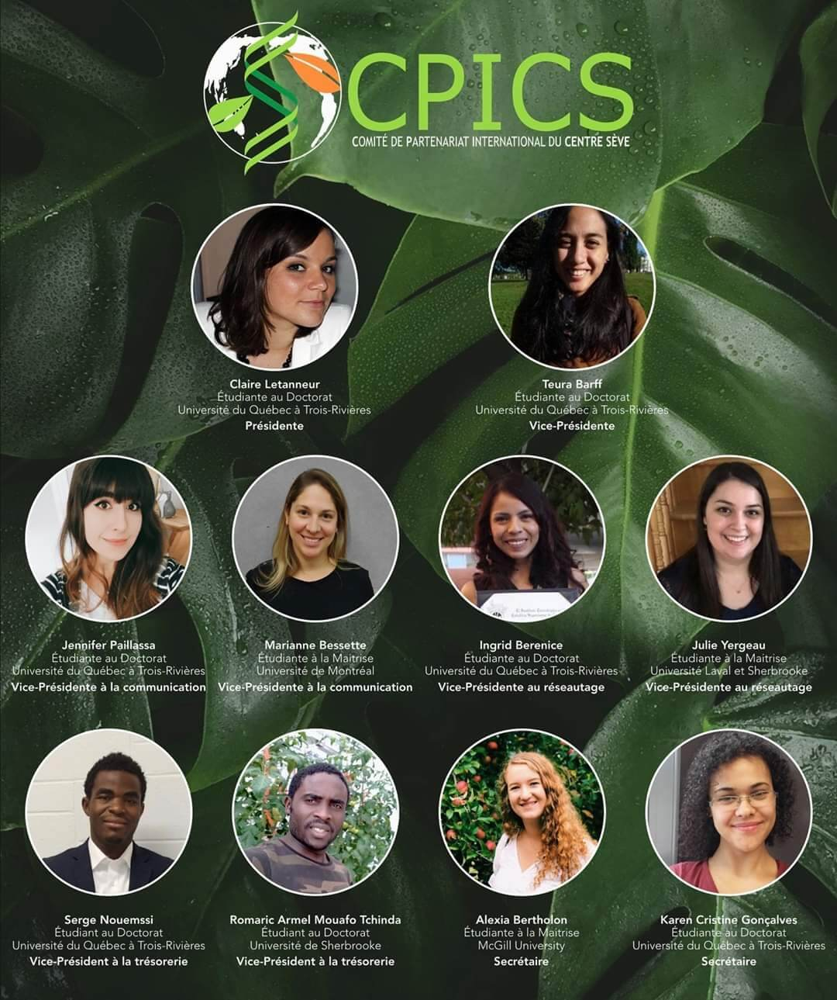
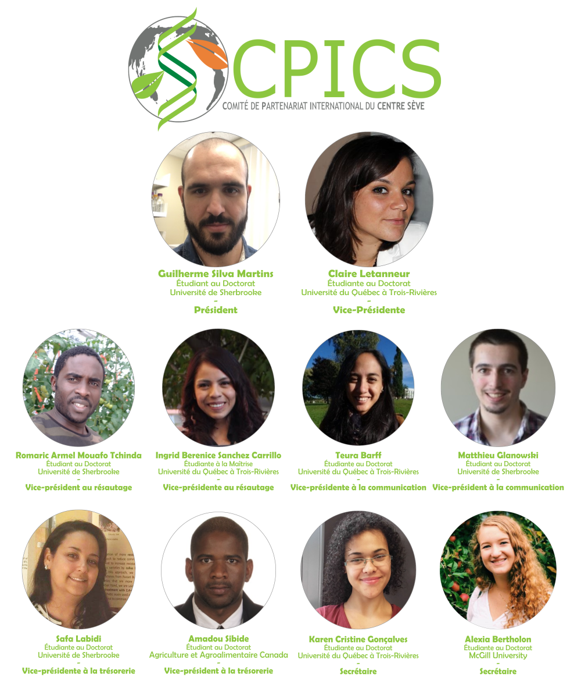

<head>
<link rel="apple-touch-icon" sizes="180x180" href="/apple-touch-icon.png">
<link rel="icon" type="image/png" sizes="32x32" href="/favicon-32x32.png">
<link rel="icon" type="image/png" sizes="16x16" href="/favicon-16x16.png">
<link rel="manifest" href="/site.webmanifest">
<link rel="mask-icon" href="/safari-pinned-tab.svg" color="#5bbad5">
<meta name="msapplication-TileColor" content="#da532c">
<meta name="theme-color" content="#ffffff">
<meta charset="utf-8">
<meta name="viewport" content="width=device-width, initial-scale=1">
<link rel="stylesheet" href="./column_text_style.css">

</head>

# &nbsp; {.tabset .tabset-fade .tabset-pills} 

## 2020

### 2020-05-09

 

<table>
<thead>
<tr>
<td scope="col">Role</td>
<td scope="col">Name</td>
<td scope="col">University</td>
</tr>
</thead>
<tbody>
<tr>
<th scope="row">Presidence</th><td>[Claire Letanneur]</td><td>Université du Québec à Trois-Rivières</td>
</tr>
<tr>
<th scope="row">Vice-Presidence</th><td>[Teura Barff]</td><td>Université du Québec à Trois-Rivières</td>
</tr>
<tr>
<th scope="row" rowspan="2">Vice-Presidence of Communications</th><td>[Jennifer Paillassa]</td><td>Université du Québec à Trois-Rivières</td>
</tr>
<tr>
<td>[Marianne Bessette]</td><td>Université de Montréal</td>
</tr>
<tr>
<th scope="row" rowspan="2">Vice-Presidence of Networking</th><td>[Ingrid Berenice Sanchez Carrillo]</td><td>Université du Québec à Trois-Rivières</td>
</tr>
<tr>
<td>[Julie Yergeau]</td><td>Université de Sherbrooke, Université Laval</td>
</tr>
<tr>
<th scope="row" rowspan="2">Vice-Presidence of Treasury</th><td>[Serge Nouemssi]</td><td>Université du Québec à Trois-Rivières</td>
</tr>
<tr>
<td>[Romaric Armel Mouafo Tchinda]</td><td>Université de Sherbrooke</td>
</tr>
<tr>
<th scope="row" rowspan="3"> Secretary</th><td>[Karen Cristine Goncalves dos Santos]</td><td rowspan="2">Université du Québec à Trois-Rivières</td>
</tr>
<tr>
<td>[Aracely Maribel Diaz Garza]</td>
</tr>
<tr>
<td>[Vincent Charron-Lamoureux]</td><td>Université de Sherbrooke</td>
</tr>
</tbody>
</table>

  

### 2020-01-10

 

<table>
<thead>
<tr>
<td>Role</td>
<td>Name</td>
<td>University</td>
</tr>
</thead>
<tbody>
<tr>
<th scope="row">Presidence</td><td>[Claire Letanneur]</th><td>Université du Québec à Trois-Rivières</td>
</tr>
<tr>
<th scope="row">Vice-Presidence</td><td>[Teura Barff]</th><td>Université du Québec à Trois-Rivières</td>
</tr>
<tr>
<th scope="row" rowspan="2">Vice-Presidence of Communications</th><td>[Jennifer Paillassa]</td><td>Université du Québec à Trois-Rivières</td>
</tr>
<tr>
<td>[Marianne Bessette]</td><td>Université de Montréal</td>
</tr>
<tr>
<th scope="row" rowspan="2">Vice-Presidence of Networking</th><td>[Ingrid Berenice Sanchez Carrillo]</td><td>Université du Québec à Trois-Rivières</td>
</tr>
<tr>
<td>[Julie Yergeau]</td><td>Université de Sherbrooke, Université Laval</td>
</tr>
<tr>
<th scope="row" rowspan="2">Vice-Presidence of Treasury</th><td>[Serge Nouemssi]</td><td>Université du Québec à Trois-Rivières</td>
</tr>
<tr>
<td>[Romaric Armel Mouafo Tchinda]</td><td>Université de Sherbrooke</td>
</tr>
<tr>
<th scope="row" rowspan="2">Secretary</th><td>[Karen Cristine Goncalves dos Santos]</td><td>Université du Québec à Trois-Rivières</td>
</tr>
<tr>
<td>[Alexia Bertholon]</td>
<td>McGill University</td>
</tr>
</tbody>
</table>

##  2019

<table>
<thead>
<tr>
<td>Role</td><td>Name</td><td>University</td>
</tr>
</thead>
<tbody>
<tr>
<th scope="row" rowspan="1">Presidence</th><td>[Guilherme Silva Martins]</td><td>Université de Sherbrooke</td>
</tr>
<tr>
<th scope="row" rowspan="1">Vice-Presidence</th><td>[Claire Letanneur]</td><td>Université du Québec à Trois-Rivières</td>
</tr>
<tr>
<th scope="row" rowspan="2">Vice-Presidence of Communications</th><td>[Teura Barff]</td><td>Université du Québec à Trois-Rivières</td>
</tr>
<tr>
<td>[Matthieu Glanowski]</td><td>Université de Sherbrooke</td>
</tr>
<tr>
<th scope="row" rowspan="2">Vice-Presidence of Networking</th><td>[Ingrid Berenice Sanchez Carrillo]</td><td>Université du Québec à Trois-Rivières</td>
</tr>
<tr>
<td>[Romaric Armel Mouafo Tchinda]</td><td>Université de Sherbrooke</td>
</tr>
<tr>
<th scope="row" rowspan="2">Vice-Presidence of Treasury</th><td>[Safa Labidi]</td><td>Université de Sherbrooke</td>
</tr>
<tr>
<td>Amadou Sibide</td><td>Agriculture et Agrolimentaire Canada</td>
</tr>
<tr>
<th scope="row" rowspan="2">Secretary</th><td>[Karen Cristine Goncalves dos Santos]</td><td>Université du Québec à Trois-Rivières</td>
</tr>
<tr>
<td>[Alexia Bertholon]</td>
<td>McGill University</td>
</tr>
</tbody>
</table>

[Aracely Maribel Diaz Garza]: https://www.linkedin.com/in/aracely-maribel-diaz-garza-6989b5169/
[Vincent Charron-Lamoureux]: https://www.researchgate.net/profile/Vincent_Charron-Lamoureux
[Jennifer Paillassa]: https://www.linkedin.com/in/jennifer-paillassa-087600a3/
[Marianne Bessette]: https://www.linkedin.com/in/marianne-bessette-b16287146/
[Julie Yergeau]: https://www.linkedin.com/in/julie-yergeau-b58508186/
[Serge Nouemssi]: https://www.linkedin.com/in/serge-basile-nouemssi-a95913121/
[Guilherme Silva Martins]: https://www.linkedin.com/in/guilherme-martins-1268202b/
[Claire Letanneur]: https://www.researchgate.net/profile/Claire_Letanneur
[Teura Barff]: https://www.linkedin.com/in/teura-barff-66526647/
[Matthieu Glanowski]: https://www.linkedin.com/in/matthieu-glanowski-585254116/
[Ingrid Berenice Sanchez Carrillo]: https://www.linkedin.com/in/ingrid-sanchez/
[Romaric Armel Mouafo Tchinda]: https://www.linkedin.com/in/romaric-armel-mouafo-tchinda-ba266185/
[Safa Labidi]: https://www.linkedin.com/in/safa-labidi-41749b73/
[Karen Cristine Goncalves dos Santos]: https://www.linkedin.com/in/karen-cristine-gon%C3%A7alves-dos-santos-05847a113/
[Alexia Bertholon]: https://www.linkedin.com/in/alexiabertholon/

