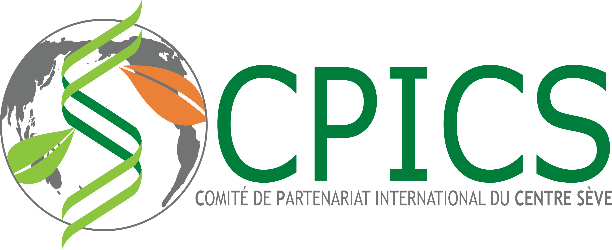
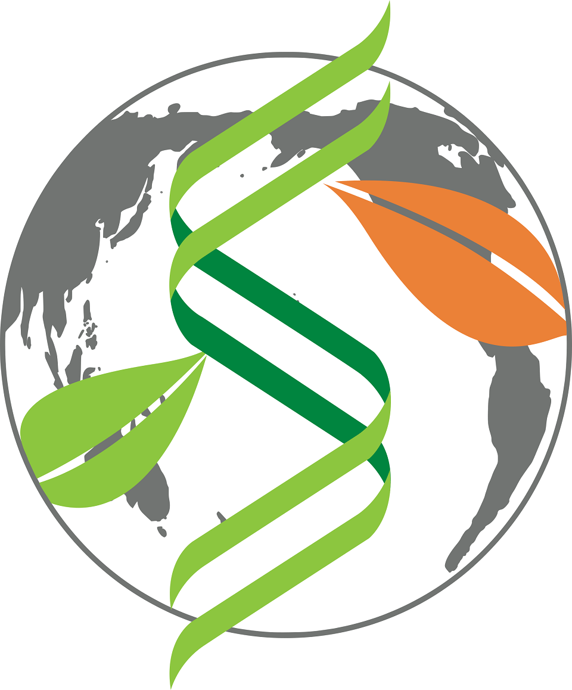

<head>

<link rel="apple-touch-icon" sizes="180x180" href="/apple-touch-icon.png">
<link rel="icon" type="image/png" sizes="32x32" href="/favicon-32x32.png">
<link rel="icon" type="image/png" sizes="16x16" href="/favicon-16x16.png">
<link rel="manifest" href="/site.webmanifest">
<link rel="mask-icon" href="/safari-pinned-tab.svg" color="#5bbad5">
<meta name="msapplication-TileColor" content="#da532c">
<meta name="theme-color" content="#ffffff">
<meta charset="utf-8">

<meta name="viewport" content="width=device-width, initial-scale=1">
<link rel="stylesheet" href="./column_text_style.css">
</head>

 
 [<i class="fab fa-twitter"></i>](https://twitter.com/CPICSEVE) [<i class="fab fa-linkedin-in"></i>](https://www.linkedin.com/company/cpics/about/)
[<i class="fab fa-facebook"></i>](https://www.facebook.com/CPICS-Comit%C3%A9-de-partenariat-international-du-Centre-S%C3%88VE-395275957711442)

 <i class="fas fa-envelope" align="center" style=" display: block;  margin-left: auto;  margin-right: auto; color : #ffffff; font-size:24px"></i> 
 
cpicseve@gmail.com 

    

  

  <a class="twitter-timeline" data-height="600" href="https://twitter.com/CPICSEVE?ref_src=twsrc%5Etfw">Tweets by CPICS</a> 
  

  

  

  

     
  

  

