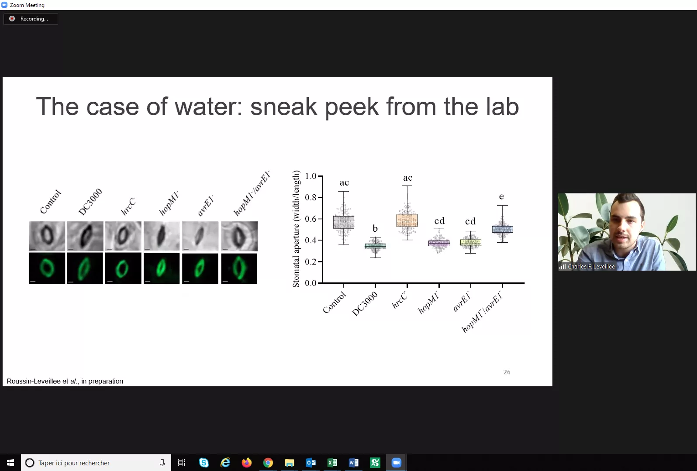
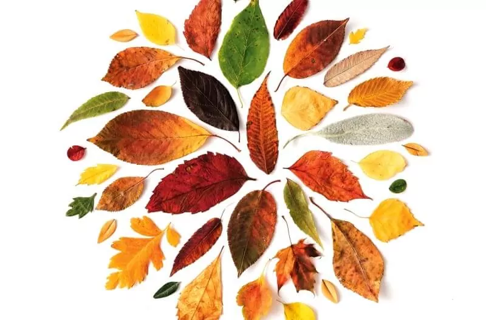
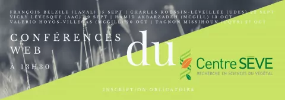

<head>
<link rel="apple-touch-icon" sizes="180x180" href="/apple-touch-icon.png">
<link rel="icon" type="image/png" sizes="32x32" href="/favicon-32x32.png">
<link rel="icon" type="image/png" sizes="16x16" href="/favicon-16x16.png">
<link rel="manifest" href="/site.webmanifest">
<link rel="mask-icon" href="/safari-pinned-tab.svg" color="#5bbad5">
<meta name="msapplication-TileColor" content="#da532c">
<meta name="theme-color" content="#ffffff">
<meta charset="utf-8">
<meta name="viewport" content="width=device-width, initial-scale=1">
<link rel="stylesheet" href="./column_text_style.css">

</head>

     

 
 [<i class="fab fa-twitter"></i>](https://twitter.com/CPICSEVE) [<i class="fab fa-linkedin-in"></i>](https://www.linkedin.com/company/cpics/about/) [<i class="fab fa-facebook"></i>](https://www.facebook.com/CPICS-Comit%C3%A9-de-partenariat-international-du-Centre-S%C3%88VE-395275957711442) <a  href = "mailto:cpicseve@gmail.com"><i class="fas fa-envelope" align="center" style="font-size:24px"></i></a> 

<a class="twitter-timeline" data-height=2100px href="https://twitter.com/CPICSEVE?ref_src=twsrc%5Etfw">Tweets by CPICS</a> 

# {.tabset .tabset-fade .tabset-pills}

## 2020

### 2020-11-10

Next Synbio Canada webinar, organized by one of our members, [Fatima Awwad].

[Inscriptions](https://www.synbiocanada.org/webinar?fbclid=IwAR0UzO2pRipx5sGNU_XaTmMth2y2Ie36ga0YuB1FaoL6MGCdlH2WdkbLL0k)

  

### 2020-11-06

Congratulations to [Karen Cristine Goncalves], our secretary, for her preprint about fungal candidate effectors. 

Great work!

Preprint: [Differential alteration of plant functions by homologous fungal candidate effectors](https://www.biorxiv.org/content/10.1101/2020.10.30.363010v1)

  

### 2020-11-05 

Congratulations to [Fadoua Dhaouadi], [Fatima Awwad] and [Andrew Diamond] for the publication of a scientific review about diatoms.

We specially congratulate Fadoua Dhaouadi for her first publication!

Review: [Diatoms' breakthroughs in biotechnology: <i>Phaeodactylum tricornutum</i> as a model for producing high-added value molecules](https://doi.org/10.4236/ajps.2020.1110118)

  

### 2020-10-27

Today, [Romaric](https://www.linkedin.com/in/romaric-armel-mouafo-tchinda-ba266185/) practiced his presentation for [Ma thèse en 180s de l'ACFAS](https://www.acfas.ca/prix-concours/ma-these-en-180-secondes/a-propos), where he will represent Université de Sherbrooke.

Watch the [finals](https://www.facebook.com/events/662935087680358/?__cft__[0]=AZXNWtUJCyabQaszn7XJsgAxsRqUxaDbIQDJgpYKHlppwZhK9ObJmIhVBBh8JEnGpfa1fqzZZDRt1vBboYo7xpZxCB7OuQUAeMohCwbNwSpP1D6W-Qb-eHGUd3RXaiYHPt1GhsTbOt20HDDoREZBi7sP&__tn__=-UK-R) November 19^th^.

  

### 2020-10-24

Submitted by their students, the laboratories of [Pr. Desgagné-Penix](https://www.linkedin.com/in/isabel-desgagn%C3%A9-penix-86081aa6/) et [Pr. Germain](https://www.researchgate.net/profile/Hugo_Germain) won the [Canadian Bureau for International Education](https://cbie.cen/) [Equity, Diversity and Inclusion (EDI) Award](https://cbie.ca/2020-excellence-award-winners/).

Congratulations!
<!-- blank line -->
<figure class="video_container">
<iframe src="https://www.youtube.com/embed/QPqd4jLihyU" frameborder="0" allow="accelerometer; autoplay; clipboard-write; encrypted-media; gyroscope; picture-in-picture" allowfullscreen></iframe>
</figure>
<!-- blank line -->

  

### 2020-10-02

We are happy to announce and invite you to Centre SÈVE's Student Poster Competition 2020. This virtual event will take place on November 25^th^ and 26^th^ 2020.

The [registration page](https://event.fourwaves.com/fr/a6183e12-d9e0-420a-8038-0209e3bc0682/registration/) for participants and for submission of posters is now online. There you will find also all the [information about the event](https://event.fourwaves.com/fr/a6183e12-d9e0-420a-8038-0209e3bc0682/pages).

We look forward to seeing you there!

  

### 2020-09-22

Conférence Web from Centre SÈVE today, with Charles Roussin-Léveillée from the Université de Sherbrooke. Thank you to all participants!

Source: [Centre SÈVE](https://www.facebook.com/centreseve/posts/1511546979039577)

### 2020-08-17

You want to know more about our guest [Isabelle Laforest-Lapointe](https://twitter.com/Isabel_Laforest), of [USherbrooke](https://twitter.com/USherbrooke) for the [August 25th](whats_up.html#inscriptions) ? 

Read this [article](https://www.quebecscience.qc.ca/sciences/les-10-decouvertes-de-2017/4-probiotiques-forestiers/) about her work!!  

 

 

 [#whatsupconferences](https://twitter.com/hashtag/whatsupconferences?src=hashtag_click)  [#plantscience](https://twitter.com/hashtag/plantscience?src=hashtag_click) [#SEVE](https://twitter.com/hashtag/SEVE?src=hashtag_click) [#CPICS](https://twitter.com/hashtag/CPICS?src=hashtag_click)

### 2020-08-14

You want to know more about our guest [Leena Tripathi](https://twitter.com/Leena_Tripathi) for the [August 25th](whats_up.html#inscriptions) ? 

Watch this video of [IITA CGIAR](https://twitter.com/IITA_CGIAR) about her work !!  

 

<!-- blank line -->
<figure class="video_container">
<iframe width="1000" height="536.8958" src="https://www.youtube.com/embed/QBdYOA0dvRY" frameborder="0" allow="accelerometer; autoplay; encrypted-media; gyroscope; picture-in-picture" allowfullscreen style="display: block;margin-left: auto;  margin-right: auto;"></iframe>
</figure>
<!-- blank line -->
  
 
 [#whatsupconferences](https://twitter.com/hashtag/whatsupconferences?src=hashtag_click)  [#plantscience](https://twitter.com/hashtag/plantscience?src=hashtag_click) [#SEVE](https://twitter.com/hashtag/SEVE?src=hashtag_click) [#CPICS](https://twitter.com/hashtag/CPICS?src=hashtag_click)

  

### 2020-08-10

**Centre SÈVE has announced a new series of Web Conferences that starts September 15^th^!**

  
<table class="center">
<colgroup>
<col width="10%" />
<col width="17%" />
<col width="73%" />
</colgroup>
<tbody>
<tr>
<td> September 15^th^</td><td>[François Belzile]</td><td>Aventures dans l’univers des SNP : un premier bilan de SoyaGen, un projet de grande envergure en génomique du soya</td>
</tr>
<tr>
<td>September 22^nd^</td><td>[Charles Roussin-Léveillée]</td><td>The Apoplastic Battleground in Plant-Pathogen Interactions</td>
</tr><tr>
<td>September 29^th^</td><td>[Vicky Lévesque]</td><td>L’amendement en biochar: Une approche durable pour améliorer la santé du sol et la croissance de la plante en horticulture</td>
</tr><tr>
<td> October 13^th^</td><td>[Hamid Akbarzadeh]</td><td>Sustainable Bio-inspired Metamaterials</td>
</tr><tr>
<td> October 20^th^</td><td>[Valerio Hoyos-Villegas]</td><td>The McGill Field Phenomics Platform: Increasing Resolution for Complex Trait Improvement</td>
</tr><tr>
<td> October 27^th^</td><td>[Tagnon Missihoun]</td><td></td>
</tr>
</tbody>
</table>
 
<b>
 [Inscriptions](http://centreseve.recherche.usherbrooke.ca/fr/node/226#overlay-context=fr/node/223) 
</b>
  

### 2020-07-29

Congratulation to the Centre SEVE students that are presenting at the Worldwide Plant Biology Summit 2020. 

You can see their posters in our twitter (link bellow).

[<i class="fab fa-twitter"></i> Karuna Kapoor <i class="fab fa-twitter"></i>][1]
 

[<i class="fab fa-twitter"></i> Amir Bidhendi, Francisco Campos, Gaële Lajeunesse, and Julian Henao-Martinez <i class="fab fa-twitter"></i>][2]
 

[<i class="fab fa-twitter"></i> Adrien Fremont, Charles Roussin-Léveillée, Eszter Sas and Guilherme Silva-Martins <i class="fab fa-twitter"></i>][3]

[1]: https://twitter.com/CPICSEVE/status/1289294256281022465  "Tweet with Karuna Kapoor's poster"
[2]: https://twitter.com/CPICSEVE/status/1288906455446364160 "Tweet with posters from Amir Bidhendi, Francisco Campos, Gaële Lajeunesse, and Julian Henao-Martinez"
[3]: https://twitter.com/CPICSEVE/status/1288912736412405763 "Tweet with posters from Adrien Fremont, Charles Roussin-Léveillée, Eszter Sas and Guilherme Silva-Martins"

<table>
<colgroup>
<col width="15%" />
<col width="15%" />
<col width="15%" />
<col width="15%" />
<col width="15%" />
</colgroup>
<thead>
<tr class="header">
<th><b>IRBV</b></th><th><b>McGill University</b></th><th><b>Université de Laval</b></th><th><b>Université de Montréal</b></th><th><b>Université de Sherbrooke</b></th>
</tr>
</thead>
<tbody>
<tr>
<td>Camille Auger</td><td>[Amir Bidhendi]</td><td>[Francisco Campos]</td><td>[Eszter Sas]</td><td>[Charles Roussin-Léveillée]</td>
</tr>
<tr class="even">
<td>[Adrien Fremont]</td><td>[Karuna Kapoor]</td><td></td><td></td><td>Gaële Lajeunesse</td>
</tr>
<tr class="odd">
<td></td><td>[Meha Sharma]</td><td></td><td></td><td>[Guilherme Silva-Martins]</td>
</tr>
<tr class="even">
<td></td><td>[Julian Henao-Martinez]</td><td></td><td></td><td>[Iauhenia Isayenka]</td>
</tr>
</tbody>
</table>

  

### 2020-07-07

**Fatima Awwad**, postdoc from _UQTR_, presented us today the potential of microalgae in the Centre SEVE's web conferences. Thank you to all participants.

Source: [Centre SEVE](https://www.facebook.com/centreseve/photos/a.445334158994203/1444690485725227/)

  

### 2020-06-16

 Another captivating Centre SEVE's web conference today with **Karen Cristine Gonçalves Dos Santos** from _UQTR_. Thank you to all participants.

Source: [Centre SEVE](https://www.facebook.com/centreseve/photos/a.445334158994203/1427129864147956/)

  

### 2020-05-09

Welcome to **Maribel Diaz** and **Vincent Charron-Lamoureux** in CSPIC's administration as secretaries, replacing **Alexia Bertholon**, who unfortunatly had to leave the committee.

**_Congratulation to you two!_**

  

### 2020-03-02

 Congratulations to **Claire Letanneur**, PhD student at _UQTR_, for the award of a grant at the first competition of the student category from the FRQNT illustration of DIALOGUE funding. Only four projects were selected for each research sector of the FRQ's

  

## 2019

### 2019-09-30

We would like to thank Rose-Marie Bell, master's student in Plant Biology at the Université Laval, for sharing her experience at the **Centre SÈVE Annual International Symposium** in the student newspaper [**_L'Agral_**](https://journalagral.wordpress.com/).

[**_OGM, tabou démystifié : topo sur le symposium international annuel du centre SÈVE_**](https://journalagral.wordpress.com/2019/09/29/ogm-tabou-demystifie-topo-sur-le-symposium-international-annuel-du-centre-seve/) 
_French only_

  

### 2019-08-29

**Some memories of the Centre SÈVE Annual International Symposium**

[Department of Biology - University of Sherbrooke](https://www.facebook.com/biologie.USherbrooke/?__cft__[0]=AZUmaWk-zvwOikcNCt0OcvfmvkrKzFs2buKKe4i7TbO_wFdba43AV9Qkt9jzIiuCnPC89OojsapHhjomKzSxYirPALxNNf7i4_xczXp8scgjmlGSvsz9PaAH1Qe_K_5T7UAoQv0hGdhOZyfVEP-t370IioP1WMCoLP79KMgzfiSfAQ&__tn__=kK-R)

About sixty participants and speakers were able to share their knowledge, discuss and forge links on the theme of _"Biotechnology for food security"_

Objective achieved for this first symposium organized by the students of CPICS!

Thank you once again to the event sponsors:

- [Fonds d’appui à l’engagement étudiant (FAEE) de l’UdeS](https://www.usherbrooke.ca/etudiants/vie-etudiante/financement-pour-les-activites-etudiantes/fonds-dappui-a-lengagement-etudiant/)

- [Faculté des sciences](https://www.usherbrooke.ca/sciences/)

- [Regroupement des étudiantes et des étudiants de maîtrise, de diplôme et de doctorat de l’UdeS (REMDUS)](http://www.remdus.qc.ca/fr/)

- [Regroupement étudiant des chercheurs et chercheuses en sciences de l’UdeS (RECSUS)](https://www.recsus.org/)

- [VWR](https://www.vwr.com/)

- [Sarstedt](https://www.sarstedt.com/en/home/)

  

### 2019-06-11

Registration for the first edition of the **Centre SÈVE Annual International Symposium** which will take place on **_August 23_**, is now open!

Students have the option of submitting an abstract to be selected for an oral presentation.

Here is the information to know:

- The deadline for submitting an abstract is **Monday July 22**.

- The abstract should be a **maximum of 200 words**.

- It should be sent to the address: _cpicseve@gmail.com_, putting in cc. _chantal.binda@usherbrooke.ca_ and _mina.zitouni@usherbrooke.ca_.

- The expected duration per presentation is **10 minutes**, followed by 5 minutes of questions.

- Given the international scope of the symposium, English will be prioritized as the language of presentation and submission of abstracts. However French will also be accepted.

- The decision taken by the committee will be communicated to each author no later than Monday, August 2, 2019.

To register, go to the [Center SÈVE website](http://tiny.cc/ugt47y). You will also find the schedule for the day and more, so don't delay.

We can't wait to see you there.

  

### 2019-03-14

We finally have the pleasure to introduce the **Centre SÈVE International Partnership Committee**. As you might know, we aspire to create collaboration opportunities between Centre SÈVE researchers and research laboratories in the rest of the world. We are currently working on the first **Centre SÈVE Annual International Symposium**, which will address **"Biotechnology for Food Security"** this year.

Stay tuned for more information not only on the symposium, but also on research topics addressed within Québec and outside. 

In the meantime, We are leaving you with this pretty picture of this year’s committee. 

[Charles Roussin-Léveillée]: https://www.linkedin.com/in/charles-roussin-l%C3%A9veill%C3%A9e-075851a6/?originalSubdomain=ca/
[Amir Bidhendi]: https://www.researchgate.net/profile/Amir_Bidhendi/experience/
[Francisco Campos]: https://www.researchgate.net/profile/Francisco_Campos23/
[Eszter Sas]: https://www.linkedin.com/in/eszter-sas-1b907141/?originalSubdomain=ca/
[Adrien Fremont]: https://bio.umontreal.ca/repertoire-departement/etudiants-aux-cycles-superieurs/adrien-fremont/
[Karuna Kapoor]: https://scholar.google.ca/citations?user=gHKRIVEAAAAJ&hl=en/
[Meha Sharma]: https://www.researchgate.net/profile/Meha_Sharma5/
[Guilherme Silva-Martins]: https://www.linkedin.com/in/guilherme-martins-1268202b/
[Julian Henao-Martinez]: https://www.linkedin.com/in/julian-martinez-henao/?originalSubdomain=ca/
[Iauhenia Isayenka]: https://www.researchgate.net/profile/Iauhenia_Isayenka/
[François Belzile]: http://www.ibis.ulaval.ca/en/research/francois-belzile/
[Vicky Lévesque]: https://www.linkedin.com/in/vickylevesque/
[Hamid Akbarzadeh]: https://www.mcgill.ca/macdonald/abdolhamid-akbarzadeh-shafaroudi/
[Valerio Hoyos-Villegas]: https://www.mcgill.ca/plant/faculty/valerio-hoyos-villegas/
[Tagnon Missihoun]: https://www.researchgate.net/profile/Tagnon_M
[Fadoua Dhaouadi]: https://www.linkedin.com/in/dhaouadi-fadoua-276b191a3/
[Fatima Awwad]: https://www.linkedin.com/in/fatima-awwad-06553a29/
[Andrew Diamond]: https://www.linkedin.com/in/andrew-diamond-74390b137/) 
[Karen Cristine Goncalves]: https://www.linkedin.com/in/karen-cristine-gon%C3%A7alves-dos-santos-05847a113/
