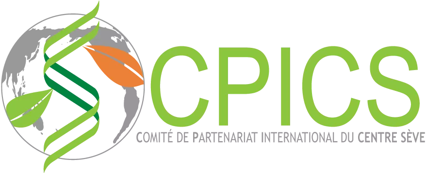

<head>
<meta charset="utf-8">
<link rel="apple-touch-icon" sizes="180x180" href="/apple-touch-icon.png">
<link rel="icon" type="image/png" sizes="32x32" href="/favicon-32x32.png">
<link rel="icon" type="image/png" sizes="16x16" href="/favicon-16x16.png">
<link rel="manifest" href="/site.webmanifest">
<link rel="mask-icon" href="/safari-pinned-tab.svg" color="#5bbad5">
<link rel="alternate" hreflang="fr-fr" href="../fr/news_2019.html">
<meta name="msapplication-TileColor" content="#da532c">
<meta name="theme-color" content="#ffffff">
<meta name="viewport" content="width=device-width, initial-scale=1">

<!-- scripts -->
<script src="https://kit.fontawesome.com/0af1a424a5.js" crossorigin="anonymous"></script>

```{r echo=FALSE, message=FALSE, warning=FALSE, results='asis'}
source("topFunctionJS.R", local = knitr::knit_global())

```

<!-- stylesheets -->
<link rel="stylesheet" href="column_text_style.css">
<link rel="stylesheet" href="news_style.css">
</head>

<main class="container-fluid">

<div class="row">

<section class="cpics-logo"></div>
<br><br><br>

<section class="col-md-9" style="padding-right:2%">

<div class="row text">

<section class="col-md-3 news_links" id="news_links">
<div class="row">


```{r echo=FALSE, message=FALSE, warning=FALSE, results='asis'}
source("create_news_links.R", local = knitr::knit_global())

```


</div><!-- row under sidebar with news links -->
</section> 

<section class="col-md-9" id="main_news">

<div class="row">


Are you a Centre SEVE member? 

Don’t know yet, check out the link below to find out.

Also, get your email registered to get the CPICS meetings alerts.

https://cpics.netlify.app/en/participate.html
<br><br>

<article id="2019-09-30">
<strong>2019-09-30</strong>


<div >
We would like to thank Rose-Marie Bell, master's student in Plant Biology at the Université Laval, for sharing her experience at the **[Centre SÈVE Annual International Symposium]** in the student newspaper [**_L'Agral_**](https://journalagral.wordpress.com/).
</div>

<span class="row" style="display: block;  margin-left: auto; text-align:center; margin-right: auto;">
[**_OGM, tabou démystifié : topo sur le symposium international annuel du centre SÈVE_**](https://journalagral.wordpress.com/2019/09/29/ogm-tabou-demystifie-topo-sur-le-symposium-international-annuel-du-centre-seve/)<br>
_French only_
</span>
<br><br>
</article> 

<article id="2019-08-29">
<strong>2019-08-29</strong>

<div>

**Some memories of the [Centre SÈVE Annual International Symposium]**

[Department of Biology - University of Sherbrooke](https://www.facebook.com/biologie.USherbrooke/?__cft__[0]=AZUmaWk-zvwOikcNCt0OcvfmvkrKzFs2buKKe4i7TbO_wFdba43AV9Qkt9jzIiuCnPC89OojsapHhjomKzSxYirPALxNNf7i4_xczXp8scgjmlGSvsz9PaAH1Qe_K_5T7UAoQv0hGdhOZyfVEP-t370IioP1WMCoLP79KMgzfiSfAQ&__tn__=kK-R)

About sixty participants and speakers were able to share their knowledge, discuss and forge links on the theme of _"Biotechnology for food security"_

Objective achieved for this first symposium organized by the students of CPICS!

Thank you once again to the event sponsors:

</div>

<span class="row" style="display: block;  margin-left: auto; text-align:center; margin-right: auto;">

- [Fonds d’appui à l’engagement étudiant (FAEE) de l’UdeS](https://www.usherbrooke.ca/etudiants/vie-etudiante/financement-pour-les-activites-etudiantes/fonds-dappui-a-lengagement-etudiant/)

- [Faculté des sciences](https://www.usherbrooke.ca/sciences/)

- [Regroupement des étudiantes et des étudiants de maîtrise, de diplôme et de doctorat de l’UdeS (REMDUS)](http://www.remdus.qc.ca/fr/)

- [Regroupement étudiant des chercheurs et chercheuses en sciences de l’UdeS (RECSUS)](https://www.recsus.org/)

- [VWR](https://www.vwr.com/)

- [Sarstedt](https://www.sarstedt.com/en/home/)

</span>
</article> 

<br><br>


<article id="2019-06-11">
<strong>2019-06-11</strong>

<div>
Registration for the first edition of the **[Centre SÈVE Annual International Symposium]** which will take place on **_August 23_**, is now open!

Students have the option of submitting an abstract to be selected for an oral presentation.

Here is the information to know:

- The deadline for submitting an abstract is **Monday July 22**.

- The abstract should be a **maximum of 200 words**.

- It should be sent to the address: _cpicseve@gmail.com_, putting in cc. _chantal.binda@usherbrooke.ca_ and _mina.zitouni@usherbrooke.ca_.

- The expected duration per presentation is **10 minutes**, followed by 5 minutes of questions.

- Given the international scope of the symposium, English will be prioritized as the language of presentation and submission of abstracts. However French will also be accepted.

- The decision taken by the committee will be communicated to each author no later than Monday, August 2, 2019.

To register, go to the [Center SÈVE website](http://tiny.cc/ugt47y). You will also find the schedule for the day and more, so don"t delay.

We can"t wait to see you there.
</div>
</article> 

<br><br>

<article id="2019-03-14">
<strong>2019-03-14</strong>


We finally have the pleasure to introduce the **Centre SÈVE International Partnership Committee**. As you might know, we aspire to create collaboration opportunities between Centre SÈVE researchers and research laboratories in the rest of the world. We are currently working on the first **[Centre SÈVE Annual International Symposium]**, which will address **"Biotechnology for Food Security"** this year.

Stay tuned for more information not only on the symposium, but also on research topics addressed within Québec and outside. 

In the meantime, We are leaving you with this pretty picture of this year’s committee. 


<a href="comites.html"></a>
</article> 

</div><!-- row main_news -->
</section> 

</div><!-- row text under col9 section -->
</section> 

<section class="col-md-3">

<div class="row">
<span> <p class="sidebar_logos">[<i class="fab fa-twitter"></i>](https://twitter.com/CPICSEVE) [<i class="fab fa-linkedin-in"></i>](https://www.linkedin.com/company/cpics/about/) [<i class="fab fa-facebook"></i>](https://www.facebook.com/CPICS-Comit%C3%A9-de-partenariat-international-du-Centre-S%C3%88VE-395275957711442) <a  href = "mailto:cpicseve@gmail.com"><i class="fas fa-envelope" align="center" style="font-size:24px"></i></a> </p></span>
<div class="row" style="margin: 1%">
<a href="http://centreseve.recherche.usherbrooke.ca/fr"></a><a href="http://www.frqnt.gouv.qc.ca/en/accueil"></a>
</div>

<a class="twitter-timeline" data-height=1500px href="https://twitter.com/CPICSEVE?ref_src=twsrc%5Etfw">Tweets by CPICS</a> <script async src="https://platform.twitter.com/widgets.js" charset="utf-8"></script>

</div><!-- row under sidebar section -->
</section> 

<button onclick="topFunction()" id="myBtn" title="Go to top">Top</button>
```{r echo=FALSE, message=FALSE, warning=FALSE, results='asis'}
source("topFunctionJS.R", local = knitr::knit_global())

```

</div> <!-- row under container-fluid -->
</main>

[Centre SÈVE Annual International Symposium]: https://cpics.netlify.app/en/symposia.html
[Adrien Fremont]: https://bio.umontreal.ca/repertoire-departement/etudiants-aux-cycles-superieurs/adrien-fremont/
[Alexia Bertholon]: https://www.linkedin.com/in/alexiabertholon/
[Amal Jaballi]: https://www.researchgate.net/profile/Amal-Jaballi
[Amir Bidhendi]: https://www.researchgate.net/profile/Amir_Bidhendi/experience/
[Andrew Diamond]: https://www.linkedin.com/in/andrew-diamond-74390b137/) 
[Aracely Maribel Diaz Garza]: https://www.linkedin.com/in/aracely-maribel-diaz-garza-6989b5169/
[Charles Roussin-Léveillée]: https://www.linkedin.com/in/charles-roussin-l%C3%A9veill%C3%A9e-075851a6/?originalSubdomain=ca/
[Claire Letanneur]: https://www.researchgate.net/profile/Claire_Letanneur
[Eszter Sas]: https://www.linkedin.com/in/eszter-sas-1b907141/?originalSubdomain=ca/
[Fadoua Dhaouadi]: https://www.linkedin.com/in/dhaouadi-fadoua-276b191a3/
[Fatima Awwad]: https://www.linkedin.com/in/fatima-awwad-06553a29/
[Francisco Campos]: https://www.researchgate.net/profile/Francisco_Campos23/
[François Belzile]: http://www.ibis.ulaval.ca/en/research/francois-belzile/
[Guilherme Silva Martins]: https://www.linkedin.com/in/guilherme-martins-1268202b/
[Hamid Akbarzadeh]: https://www.mcgill.ca/macdonald/abdolhamid-akbarzadeh-shafaroudi/
[Hugo Germain]: https://www.researchgate.net/profile/Hugo_Germain
[Iauhenia Isayenka]: https://www.researchgate.net/profile/Iauhenia_Isayenka/
[Ingrid Berenice Sanchez Carrillo]: https://www.linkedin.com/in/ingrid-sanchez/
[Isabel Desgagné-Penix]: https://www.linkedin.com/in/isabel-desgagn%C3%A9-penix-86081aa6/
[Jennifer Paillassa]: https://www.linkedin.com/in/jennifer-paillassa-087600a3/
[Julian Henao-Martinez]: https://www.linkedin.com/in/julian-martinez-henao/?originalSubdomain=ca/
[Julie Yergeau]: https://www.linkedin.com/in/julie-yergeau-b58508186/
[Karen Cristine Goncalves]: https://www.linkedin.com/in/karen-gon%C3%A7alves-05847a113/
[Karen Garrett]: https://plantpath.ifas.ufl.edu/people/faculty-pages/karen-garrett/
[Karuna Kapoor]: https://scholar.google.ca/citations?user=gHKRIVEAAAAJ&hl=en/
[Manoj Koirala]: https://www.linkedin.com/in/manoj-koirala-72a149120/?originalSubdomain=ca
[Marianne Bessette]: https://www.linkedin.com/in/marianne-bessette-b16287146/
[Matthieu Glanowski]: https://www.linkedin.com/in/matthieu-glanowski-585254116/
[Meha Sharma]: https://www.researchgate.net/profile/Meha_Sharma5/
[Nikunj Sharma]: https://in.linkedin.com/in/nikunj-sharma-5a863490
[Peter Moffet]: https://www.usherbrooke.ca/biologie/nous-joindre/personnel/corps-professoral/biologie-moleculaire-et-cellulaire/peter-moffett
[Romaric Armel Mouafo Tchinda]: https://www.linkedin.com/in/romaric-armel-mouafo-tchinda-ba266185/
[Safa Labidi]: https://www.linkedin.com/in/safa-labidi-41749b73/
[Seydou Ka]: https://www.linkedin.com/in/seydou-ka-9a41a4167/
[Serge Nouemssi]: https://www.linkedin.com/in/serge-basile-nouemssi-a95913121/
[Snehi Gazal]: https://www.linkedin.com/in/snehi-gazal-9172856b/
[Tagnon Missihoun]: https://www.researchgate.net/profile/Tagnon_M
[Teura Barff]: https://www.linkedin.com/in/teura-barff-66526647/
[Théo Devèze]: aaa
[Valeria Parra]: https://www.linkedin.com/in/valeria-parra-0b0b86167/
[Valerio Hoyos-Villegas]: https://www.mcgill.ca/plant/faculty/valerio-hoyos-villegas/
[Vicky Lévesque]: https://www.linkedin.com/in/vickylevesque/
[Vincent Charron-Lamoureux]: https://www.researchgate.net/profile/Vincent_Charron-Lamoureux

