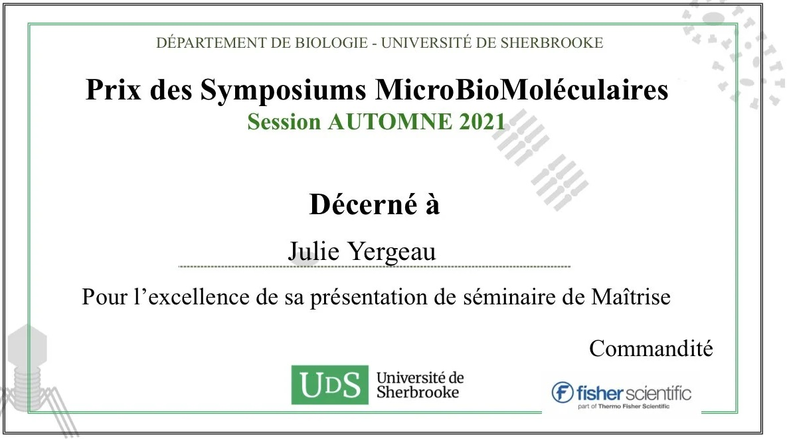

<head>
<meta charset="utf-8">
<link rel="apple-touch-icon" sizes="180x180" href="/apple-touch-icon.png">
<link rel="icon" type="image/png" sizes="32x32" href="/favicon-32x32.png">
<link rel="icon" type="image/png" sizes="16x16" href="/favicon-16x16.png">
<link rel="manifest" href="/site.webmanifest">
<link rel="mask-icon" href="/safari-pinned-tab.svg" color="#5bbad5">
<link rel="alternate" hreflang="fr-fr" href="../fr/news.html">
<meta name="msapplication-TileColor" content="#da532c">
<meta name="theme-color" content="#ffffff">
<meta name="viewport" content="width=device-width, initial-scale=1">

<!-- scripts -->
<script src="https://kit.fontawesome.com/0af1a424a5.js" crossorigin="anonymous"></script>

<!-- stylesheets -->
<link rel="stylesheet" href="column_text_style.css">
<link rel="stylesheet" href="news_style.css">
</head>

<main class="container-fluid">

<div class="row">

<section class="cpics-logo"></div>
<br><br><br>
<section class="col-md-9" style="padding-right: 2%">

<div class="row text">

<section class="col-md-3" id="news_links">
<div class="row">


```{r echo=FALSE, message=FALSE, warning=FALSE, results='asis'}
source("create_news_links.R", local = knitr::knit_global())

```


</div><!-- row under sidebar with news links -->
</section> 

<section class="col-md-9" id="main_news">

<div class="row">


Are you a Centre SEVE member? 

Don’t know yet, check out the link below to find out.

Also, get your email registered to get the CPICS meetings alerts.

https://cpics.netlify.app/en/participate.html
<br><br>

<article id="2021-12-03">
<strong>2021-12-03</strong>

Our treasurer [Julie Yergeau] just finished her master's titled "The identificatoin of species of _Phytophthora_ in the cultivars of Christmas trees in Quebec and the validatoin of the pathogenicity of _P. abietivora_" !

In addition, she won the prize of best presentation during the Symposiums MicroBioMoléculaires of the Fall Session of 2021 from the Université de Sherbrooke.

Congratulations, Julie!


<br><br></article> 

<article id="2021-11-24">
<strong>2021-11-24</strong>

Our Vice-President in Networking [Romaric Armel Mouafo Tchinda] finished successfully his PhD degree on Phytopathology, with the thesis "Comparative epidemiology of the two main clades of Plasmopara viticola prevalent in eastern Canada", under the directon of Dr. Carole Beaulieu and Dr. Odile Carisse.

Many congratulations!!!

<br><br></article> 

<article id="2021-09-02"> 
<strong>2021-09-02</strong>

New publication from one of Centre SÈVE's researchers, Dr. [Isabel Desgagné-Penix], and her students [Manoj Koirala] and [Seydou Ka], through an international collaboration with the [Universita’ di Napoli Federico II](http://www.unina.it/en_GB/home) (Italy) and the [Universite Cheikh Anta Diop de Dakar](https://fmpos.ucad.sn/) (Senegal).
<br>

Publication: [Isolation and biological characterization of homoisoflavanoids and the alkylamide N-p-Coumaroyltyramine from _Crinum biflorum_ Rottb., an Amaryllidaceae species collected in Senegal](https://doi.org/10.3390/biom11091298)
<br>

Congratulations to all involved for the hard work and specially to Dr. [Isabel Desgagné-Penix] for  collaborating with researchers worldwide!

<br><br></article> 

<article id="2021-08-30">
<strong>2021-08-30</strong>

Do you want to know more about the challenges faced by postdocs, the life of a bioinformatician or the academic path of our president, Dr. [Karen Cristine Goncalves]?

Watch her interview by the doctorate student  [Nikunj Sharma], from the Université du Québec à Trois-Rivières!

<!-- blank line -->
<figure class="video_container">
<iframe src="https://www.youtube.com/embed/2Xx9Anv2nqY" frameborder="0" allow="accelerometer; autoplay; clipboard-write; encrypted-media; gyroscope; picture-in-picture" allowfullscreen></iframe>
</figure>
<!-- blank line -->

<br><br></article> 

<article id="2021-05-05">
<strong>2021-05-05</strong>

Our president, [Karen Cristine Goncalves], successfully finished her PhD in Cellular and Molecular Biology, with the thesis "Unrelated Fungal Rust Candidate Effectors Act on Overlapping Plant Functions", under the direction of Dr. [Hugo Germain] and Dr. [Isabel Desgagné-Penix]. 

She also published her work in MPDI Microorganisms:
[Unrelated Fungal Rust Candidate Effectors Act on Overlapping Plant Functions](https://doi.org/10.3390/microorganisms9050996).

Finally, she has started her postdoctoral fellowship with Dr. [Damase Khasa](https://www.sbf.ulaval.ca/professeurs/damase-p-khasa), Dr. [Juan Carlos Villarreal Aguilar](https://www.bio.ulaval.ca/departement-et-professeurs/professeurs-et-personnel/professeurs/fiche/show/villarreal-a-juan-carlos/) and Dr. [Ilga Porth](http://www.ibis.ulaval.ca/en/research/ilga-porth/).

Bravo, Karen!!!

<br><br></article> 

<article id="2021-04-06">
<strong>2021-04-06</strong> 
<div id="Professors_articles" class="section level3 tabset tabset-fade tabset-pills">


Although 2021 has only begun, researchers members of Centre SEVE have been busy.
Congrats for their great job during this pandemic!

Take a look at their publications here:

#### Anja Geitmann

<div class='professors'>
__Anja Geitmann__

- <a href='https://scholar.google.co.uk/scholar?oi=bibs&cluster=13339576317686526099&btnI=1&hl=en'>Biomechanics of hair fibre growth: A multi-scale modeling approach</a>
</div><br><br>

#### Anne-Lise Routier-Kierzkowska

<div class='professors'>
__Anne-Lise Routier-Kierzkowska__

- <a href='https://www.sciencedirect.com/science/article/pii/S0960982220318364'>Mechanochemical feedback mediates tissue bending required for seedling emergence</a>
</div>
<br><br>

#### Benjamin Mimee

<div class='professors'>
__Benjamin Mimee__

- <a href='https://www.frontiersin.org/articles/10.3389/fmicb.2020.619827/full'>Neonicotinoid Seed Treatments Have Significant Non-target Effects on Phyllosphere and Soil Bacterial Communities</a>
- <a href='https://apsjournals.apsnet.org/doi/abs/10.1094/PHYTO-09-20-0418-RVW'>Recent advances in population genomics of plant-parasitic nematodes</a>
- <a href='https://apsjournals.apsnet.org/doi/abs/10.1094/PHYTO-08-20-0348-FI'>Genomic profiling of virulence in the soybean cyst nematode using single-nematode sequencing</a>
</div><br><br>

#### Damase Khasa

<div class='professors'>
__Damase Khasa__

- <a href='https://journals.plos.org/plosone/article?id=10.1371/journal.pone.0248485'>16S rRNA gene amplicon-based metagenomic analysis of bacterial communities in the rhizospheres of selected mangrove species from Mida Creek and Gazi Bay, Kenya</a>
- <a href='https://www.mdpi.com/969402'>Early Selection of Tree Species for Regeneration in Degraded Woodland of Southeastern Congo Basin</a>
- <a href='https://popups.uliege.be/2295-8010/index.php?id=1740'>Evaluation of an _Acacia mangium_ Provenance Trial after Seven Years, on the Ibi-Batéké Plateau, Democratic Republic of the Congo</a>
- <a href='https://search.proquest.com/openview/7467a2cccd51af57bb8a25ef94af4430/1?pq-origsite=gscholar&cbl=2032398'>Early Selection of Tree Species for Regeneration in Degraded Woodland of Southeastern Congo Basin</a>
</div><br><br>

#### Daniel Kierzkowski

<div class='professors'>
__Daniel Kierzkowski__

- <a href='https://www.sciencedirect.com/science/article/pii/S0960982220318364'>Mechanochemical feedback mediates tissue bending required for seedling emergence</a>
</div>

#### Dominique Michaud

<div class='professors'>
__Dominique Michaud__

- <a href='https://patents.google.com/patent/US10907168B2/en'>Jasmonic acid pathway activator</a>
</div><br><br>

#### Donald Smith

<div class='professors'>
__Donald Smith__

- <a href='https://www.mdpi.com/1047014'>Plant Holobiont Theory: The Phytomicrobiome Plays a Central Role in Evolution and Success</a>
- <a href='https://www.sciencedirect.com/science/article/pii/S1364032120309758'>Biomass for a sustainable bioeconomy: An overview of world biomass production and utilization</a>
- <a href='https://www.frontiersin.org/articles/10.3389/fsufs.2021.630628/full'>Thuricin17 Production and Proteome Differences in _Bacillus thuringiensis_ NEB17 Cell-Free Supernatant Under NaCl Stress</a>
- <a href='https://www.frontiersin.org/articles/10.3389/fmicb.2021.634807/full'>Microbial Derived Compounds, a Step Toward Enhancing Microbial Inoculants Technology for Sustainable Agriculture</a>
- <a href='https://doi.org/10.3389/fsufs.2020.617978'>Rhizobacteria from root nodules of an indigenous legume enhance salinity stress tolerance in Soybean</a>
- <a href='https://www.ncbi.nlm.nih.gov/pmc/articles/PMC8009966/'>Plant associated rhizobacteria for biocontrol and plant growth enhancement</a>
- <a href='https://link.springer.com/chapter/10.1007/978-981-15-6125-2_13'>Inter-organismal signaling in the rhizosphere</a>
</div>
<br><br>


#### Edel Pérez-López

<div class='professors'>
__Edel Pérez-López__

- <a href='https://link.springer.com/article/10.1007/s13314-020-00415-7'>Molecular characterization of a 'Candidatus Phytoplasma asteris'-related strain (16SrI-B/cpn60UT I-IB) affecting daisies ( _Argyranthemum_ spp.) in Mexico</a>
</div>
<br><br>


#### Francois Belzile

<div class='professors'>
__Francois Belzile__

- <a href='https://www.researchsquare.com/article/rs-244194/latest.pdf'>GWAS identifies a wheat orthologue of the rice D11 gene as an important contributor to grain size in an international collection of hexaploid wheat</a>
- <a href='https://cdnsciencepub.com/doi/abs/10.1139/CJPS-2020-0187'>Genome-wide association study (GWAS) to identify soybean stem pushing resistance and lodging resistance loci</a>
- <a href='https://academic.oup.com/g3journal/advance-article-abstract/doi/10.1093/g3journal/jkab031/6128399'>Genome Assembly of the Canadian Two-row Malting Barley Cultivar AAC Synergy</a>
- <a href='https://onlinelibrary.wiley.com/doi/abs/10.1111/pbi.13466'>Soybean ( _Glycine max_ ) Haplotype Map (GmHapMap): a universal resource for soybean translational and functional genomics</a>
- <a href='https://onlinelibrary.wiley.com/doi/abs/10.1111/pbi.13551'>A bumper crop of SNPs in soybean through high‐density genotyping‐by‐sequencing (HD‐GBS)</a>
- <a href='https://europepmc.org/article/med/33606262'>Accurate Imputation of Untyped Variants from Deep Sequencing Data.</a>
</div><br><br>

#### Gerald Chouinard

<div class='professors'>
__Gerald Chouinard__

- <a href='https://www.mdpi.com/2075-4450/12/3/197'>Pest Activity and Protection Practices: Four Decades of Transformation in Quebec Apple Orchards</a>
</div><br><br>


#### Hugo Germain

<div class='professors'>
__Hugo Germain__

- <a href='https://scholar.google.com/scholar?oi=bibs&cluster=1838276166457437533&btnI=1&hl=en'>Diatoms Biotechnology: Various Industrial Applications for a Greener Tomorrow</a>
- <a href='https://scholar.google.com/scholar?oi=bibs&cluster=5452494446004638908&btnI=1&hl=en'>Recent Development on Plant Aldehyde Dehydrogenase Enzymes and Their Functions in Plant Development and Stress Signaling</a>
- <a href='https://scholar.google.com/scholar?oi=bibs&cluster=11426209543910114205&btnI=1&hl=en'>Asymptomatic carriers of COVID-19 in a confined adult community population in Quebec: a cross-sectional study</a>
</div><br><br>


#### Isabel Desgagne-Penix

<div class='professors'>
__Isabel Desgagne-Penix__

- <a href='https://www.frontiersin.org/articles/10.3389/fmars.2021.636613/full?&utm_source=Email_to_authors_&utm_medium=Email&utm_content=T1_11.5e1_author&utm_campaign=Email_publication&field&journalName=Frontiers_in_Marine_Science&id=636613&fbclid=IwAR2v-e12Zt4B8vFqMAJWjb56j-82_4gLvGDd69Up_jmCFw73k3-YwJ8F4uQ'>Diatoms Biotechnology: Various Industrial Applications for a Greener Tomorrow</a>
</div><br><br>

#### Isabelle Laforest-Lapointe

<div class='professors'>
__Isabelle Laforest-Lapointe__

- <a href='https://www.mdpi.com/2227-9059/9/1/66'>Concurrent Prebiotic Intake Reverses Insulin Resistance Induced by Early-Life Pulsed Antibiotic in Rats</a>
- <a href='https://www.tandfonline.com/doi/abs/10.1080/19490976.2020.1857513'>Maternal consumption of artificially sweetened beverages during pregnancy is associated with infant gut microbiota and metabolic modifications and increased infant body mass index</a>
</div><br><br>


#### Jacqueline C Bede

<div class='professors'>
__Jacqueline C Bede__

- <a href='https://www.intechopen.com/online-first/the-endangered-species-dioon-edule-in-the-sierra-madre-oriental-in-san-luis-potos-demography-and-gen'>The Endangered Species _Dioon edule_ in the Sierra Madre Oriental in San Luis Potosí: Demography and Genetic Diversity</a>
- <a href='https://apsjournals.apsnet.org/doi/abs/10.1094/PHYTOFR-07-20-0002-R'>Distinct _Arabidopsis_ Responses to Two Generalist Caterpillar Species Differing in Host Breadth</a>
</div><br><br>

#### Jaswinder Singh

<div class='professors'>
__Jaswinder Singh__

- <a href='https://journals.plos.org/plosone/article?id=10.1371/journal.pone.0247380'>The effect of light quality on plant physiology, photosynthetic, and stress response in _Arabidopsis thaliana_ leaves</a>
- <a href='https://academic.oup.com/g3journal/advance-article-abstract/doi/10.1093/g3journal/jkab031/6128399'>Genome Assembly of the Canadian Two-row Malting Barley Cultivar AAC Synergy</a>
</div>
<br><br>

#### Jean-Benoit Charron

<div class='professors'>
__Jean-Benoit Charron__

- <a href='https://nph.onlinelibrary.wiley.com/doi/abs/10.1111/nph.16945'>Transcriptional memories mediate the plasticity of cold stress responses to enable morphological acclimation in _Brachypodium distachyon_</a>
</div><br><br>

#### Jean-Philippe Bellenger

<div class='professors'>
__Jean-Philippe Bellenger__

- <a href='https://www.cambridge.org/core/journals/lichenologist/article/stigonema-associated-with-boreal-stereocaulon-possesses-the-alternative-vanadium-nitrogenase/4AB78369AB598919146F33D31C9A4063'> _Stigonema_ associated with boreal _Stereocaulon_ possesses the alternative vanadium nitrogenase</a>
- <a href='https://www.frontiersin.org/articles/10.3389/fmicb.2020.611792/full'>Quantification of Moss-Associated Cyanobacteria Using Phycocyanin Pigment Extraction</a>
</div><br><br>

#### Joann Whalen

<div class='professors'>
__Joann Whalen__

- <a href='https://www.sciencedirect.com/science/article/pii/S0016706121001762'>Macroaggregate persistence: Definition and applications to describe soil surface dynamics</a>
- <a href='https://www.sciencedirect.com/science/article/pii/S0045653521002502'>Quantitative screening for cyanotoxins in soil and groundwater of agricultural watersheds in Quebec, Canada</a>
- <a href='http://scholar.google.com/scholar?cluster=17221476388349032923&hl=en&oi=scholarr'>Earthworms in soil ecology and organic waste management (Preface)</a>
- <a href='https://link.springer.com/article/10.1007/s00374-020-01537-x'>Freeze-thaw cycles release nitrous oxide produced in frozen agricultural soils</a>
- <a href='https://www.sciencedirect.com/science/article/pii/S1002016020600868'>Earthworm contributions to soil nitrogen supply in corn-soybean agroecosystems in Quebec, Canada</a>
- <a href='https://link.springer.com/chapter/10.1007/978-3-030-49244-1_3'>Perspectives to Increase the Precision of Soil Fertility Management on Farms</a>
- <a href='https://www.sciencedirect.com/science/article/pii/S135223102030529X'>Seasonal variation of aerosol composition in Orange County, Southern California</a>
- <a href='https://www.sciencedirect.com/science/article/pii/S0929139320307150'>Fall-applied manure with cover crop did not increase nitrous oxide emissions during spring freeze-thaw periods</a>
- <a href='https://cdnsciencepub.com/doi/abs/10.1139/cjss-2020-0126'>Fall-applied cattle manure did not provide nitrogen fertilizer value to spring cereal crops</a>
- <a href='https://besjournals.onlinelibrary.wiley.com/doi/abs/10.1111/1365-2745.13548'>Functional diversity of decomposers modulates litter decomposition affected by plant invasion along a climate gradient</a>
- <a href='https://www.sciencedirect.com/science/article/pii/S0045653521007451'>Characteristics and health risk assessment of heavy metal contamination from dust collected on household HVAC air filters</a>
- <a href='https://www.sciencedirect.com/science/article/pii/S0031405621000214'>Earthworms did not increase long-term nitrous oxide fluxes in perennial forage and riparian buffer ecosystems</a>
- <a href='https://www.sciencedirect.com/science/article/pii/S1002016020600807'>Earthworm populations are stable in temperate agricultural soils receiving wood-based biochar</a>
- <a href='https://www.sciencedirect.com/science/article/pii/S1002016020600844'>Earthworm functional groups are related to denitrifier activity in riparian soils</a>
</div>	<br><br>

#### Laurent Cappadocia

<div class='professors'>
__Laurent Cappadocia__

- <a href='https://www.researchgate.net/profile/Marc-Lussier/publication/349735800_Functional_interaction_of_ubiquitin_ligase_RNF167_with_UBE2D1_and_UBE2N_promotes_ubiquitination_of_AMPA_receptor/links/60445089a6fdcc9c781ade9f/Functional-interaction-of-ubiquitin-ligase-RNF167-with-UBE2D1-and-UBE2N-promotes-ubiquitination-of-AMPA-receptor.pdf'>Functional interaction of ubiquitin ligase RNF167 with UBE2D1 and UBE2N promotes ubiquitination of AMPA receptor</a>
- <a href='https://www.sciencedirect.com/science/article/pii/S0955286320305507'>Functional targeting of the TGF-βR1 kinase domain and downstream signaling: A role for the galloyl moiety of green tea-derived catechins in ES-2 ovarian clear cell carcinoma</a>
</div><br><br>

#### Marc Bélisle

<div class='professors'>
__Marc Bélisle__

- <a href='https://www.biorxiv.org/content/10.1101/2021.03.24.436831v1.abstract'>Negative effects of agricultural intensification on energetic gain rates of a declining aerial insectivore</a>
- <a href='https://www.biorxiv.org/content/10.1101/2021.02.02.427782v1.abstract'>Combined influence of food availability and agricultural intensification on a declining aerial insectivore</a>
</div><br><br>

#### Martina Stromvik

<div class='professors'>
__Martina Stromvik__

- <a href='https://www.tandfonline.com/doi/abs/10.1080/23802359.2021.1883486'>The complete plastome sequences of nine diploid potato clones</a>
- <a href='https://www.tandfonline.com/doi/abs/10.1080/23802359.2021.1886016'>Complete mitogenome assemblies from a panel of 13 diverse potato taxa</a>
</div>
<br><br>

#### Maxime Paré
<div class='professors'>
__Maxime Paré__

- <a href='https://www.sciencedirect.com/science/article/pii/S0168192321000320'>Cold acclimation and deacclimation in wild blueberry: Direct and indirect influence of environmental factors and non-structural carbohydrates</a>
</div><br><br>


#### Martine Dorais

<div class='professors'>
__Martine Dorais__

- <a href='https://cdnsciencepub.com/doi/abs/10.1139/CJSS-2020-0147'>Reducing peat in growing media: impact on N content, microbial activity and CO<sub>2</sub> and N<sub>2</sub>O emissions</a>
</div><br><br>

#### Philippe Seguin

<div class='professors'>
__Philippe Seguin__

- <a href='http://scholar.google.com/scholar?cluster=10382021517732928995&hl=en&oi=scholarr'>Validation in Quebec of equations to predict the nutritional value of alfalfa in the field before harvest</a>
</div><br><br>


#### Pierre Dutilleul

<div class='professors'>
__Pierre Dutilleul__

- <a href='https://agupubs.onlinelibrary.wiley.com/doi/abs/10.1029/2020GL089673'>Periodicity analysis of earthquake occurrence and hypocenter depth near Parkfield, California, 1994-2002 versus 2006-2014</a>
- <a href='https://www.sciencedirect.com/science/article/pii/S0016706121001762'>Macroaggregate persistence: definition and applications to describe soil surface dynamics</a>
</div><br><br>

#### Richard Bélanger

<div class='professors'>
__Richard Bélanger__

- <a href='https://apsjournals.apsnet.org/doi/abs/10.1094/PHYTO-08-20-0348-FI'>Genomic profiling of virulence in the soybean cyst nematode using single-nematode sequencing</a>
</div><br><br>


#### Robert L Bradley

<div class='professors'>
__Robert L Bradley__

- <a href='https://www.sciencedirect.com/science/article/abs/pii/S0031405621000214?via%3Dihub'>Earthworms did not increase long-term nitrous oxide fluxes in perennial forage and riparian buffer ecosystems</a>
</div><br><br>


#### Steeve Pepin

<div class='professors'>
__Steeve Pepin__

- <a href='https://www.sciencedirect.com/science/article/pii/S0168192321000939'>Can a physically-based land surface model accurately represent evapotranspiration partitioning? A case study in a humid boreal forest</a>
- <a href='https://onlinelibrary.wiley.com/doi/abs/10.1002/hyp.14021'>Observations of canopy storage capacity and wet canopy evaporation in a humid boreal forest</a>
</div><br><br>


#### Valérie Fournier

<div class='professors'>
__Valérie Fournier__

- <a href='https://scholar.google.com/scholar?oi=bibs&cluster=560255130753671258&btnI=1&hl=fr'>Overwintering survival of _Drosophila suzukii_ (Diptera: Drosophilidae) in temperature regimes emulating partly protected winter conditions in a cold–temperate climate of Québec, Canada</a>
</div><br><br>


#### Valerio Hoyos-Villegas

<div class='professors'>
__Valerio Hoyos-Villegas__

- <a href='https://scholar.google.com/scholar?oi=bibs&cluster=14849547404776337262&btnI=1&hl=en'>Transpiration rate of white clover (_Trifolium repens_ L.) cultivars in drying soil</a>
</div><br><br>


#### Vincent Maire

<div class='professors'>
__Vincent Maire__

- <a href='https://www.pnas.org/content/118/7/e2019355118.short'>Functional rarity and evenness are key facets of biodiversity to boost multifunctionality</a>
</div><br><br>

</div>
</article> 

<article id="2021-01-29">
<strong>2021-01-29</strong>

Say hello to our two new members of the CSIPC: [Snehi Gazal] (VP Communication) and [Valeria Parra] (VP Networking)!

We thank [Claire Letanneur], [Teura Barff] and [Marianne Bessette] for their work. They may no longer be part of the executive committee, but they will always be welcome to our meetings and events.

<br><br>
</article> 

<article id="2021-01-27">
<strong>2021-01-27</strong>

Congratulations to Michelle Boivin (UQTR), a student at the Centre SÈVE for her intriguing project of revalorizing organic matter.

<center>

<a href="https://neo.uqtr.ca/2021/01/26/un-elixir-de-jouvence-naturel-pour-les-patates/?fbclid=IwAR20dE7XqTMOcri8oFFGIEJPwXB4ZYWQzzWAaNBSYfqc-folknVrpcIquz4"></a>
</center>
<br><br>
</article> 


</div><!-- row main_news -->
</section> 

</div><!-- row text under col9 section -->
</section> 

<section class="col-md-3" style="float:right">

<div class="row">
<span> <p class="sidebar_logos">[<i class="fab fa-twitter"></i>](https://twitter.com/CPICSEVE) [<i class="fab fa-linkedin-in"></i>](https://www.linkedin.com/company/cpics/about/) [<i class="fab fa-facebook"></i>](https://www.facebook.com/CPICS-Comit%C3%A9-de-partenariat-international-du-Centre-S%C3%88VE-395275957711442) <a  href = "mailto:cpicseve@gmail.com"><i class="fas fa-envelope" align="center" style="font-size:24px"></i></a> </p></span>
<div class="row" style="margin: 1%">
<a href="http://centreseve.recherche.usherbrooke.ca/fr"></a><a href="http://www.frqnt.gouv.qc.ca/en/accueil"></a>
</div>

<a class="twitter-timeline" data-height=1500px href="https://twitter.com/CPICSEVE?ref_src=twsrc%5Etfw">Tweets by CPICS</a> <script async src="https://platform.twitter.com/widgets.js" charset="utf-8"></script>

</div><!-- row under sidebar section -->
</section> 

<button onclick="topFunction()" id="myBtn" title="Go to top">Top</button>
```{r echo=FALSE, message=FALSE, warning=FALSE, results='asis'}
source("topFunctionJS.R", local = knitr::knit_global())

```

</div> <!-- row under container-fluid -->
</main>

[Centre SÈVE Annual International Symposium]: https://cpics.netlify.app/en/symposia.html
[Adrien Fremont]: https://bio.umontreal.ca/repertoire-departement/etudiants-aux-cycles-superieurs/adrien-fremont/
[Alexia Bertholon]: https://www.linkedin.com/in/alexiabertholon/
[Amal Jaballi]: https://www.researchgate.net/profile/Amal-Jaballi
[Amir Bidhendi]: https://www.researchgate.net/profile/Amir_Bidhendi/experience/
[Andrew Diamond]: https://www.linkedin.com/in/andrew-diamond-74390b137/) 
[Aracely Maribel Diaz Garza]: https://www.linkedin.com/in/aracely-maribel-diaz-garza-6989b5169/
[Charles Roussin-Léveillée]: https://www.linkedin.com/in/charles-roussin-l%C3%A9veill%C3%A9e-075851a6/?originalSubdomain=ca/
[Claire Letanneur]: https://www.researchgate.net/profile/Claire_Letanneur
[Eszter Sas]: https://www.linkedin.com/in/eszter-sas-1b907141/?originalSubdomain=ca/
[Fadoua Dhaouadi]: https://www.linkedin.com/in/dhaouadi-fadoua-276b191a3/
[Fatima Awwad]: https://www.linkedin.com/in/fatima-awwad-06553a29/
[Francisco Campos]: https://www.researchgate.net/profile/Francisco_Campos23/
[François Belzile]: http://www.ibis.ulaval.ca/en/research/francois-belzile/
[Guilherme Silva Martins]: https://www.linkedin.com/in/guilherme-martins-1268202b/
[Hamid Akbarzadeh]: https://www.mcgill.ca/macdonald/abdolhamid-akbarzadeh-shafaroudi/
[Hugo Germain]: https://www.researchgate.net/profile/Hugo_Germain
[Iauhenia Isayenka]: https://www.researchgate.net/profile/Iauhenia_Isayenka/
[Ingrid Berenice Sanchez Carrillo]: https://www.linkedin.com/in/ingrid-sanchez/
[Isabel Desgagné-Penix]: https://www.linkedin.com/in/isabel-desgagn%C3%A9-penix-86081aa6/
[Jennifer Paillassa]: https://www.linkedin.com/in/jennifer-paillassa-087600a3/
[Julian Henao-Martinez]: https://www.linkedin.com/in/julian-martinez-henao/?originalSubdomain=ca/
[Julie Yergeau]: https://www.linkedin.com/in/julie-yergeau-b58508186/
[Karen Cristine Goncalves]: https://www.linkedin.com/in/karen-gon%C3%A7alves-05847a113/
[Karen Garrett]: https://plantpath.ifas.ufl.edu/people/faculty-pages/karen-garrett/
[Karuna Kapoor]: https://scholar.google.ca/citations?user=gHKRIVEAAAAJ&hl=en/
[Manoj Koirala]: https://www.linkedin.com/in/manoj-koirala-72a149120/?originalSubdomain=ca
[Marianne Bessette]: https://www.linkedin.com/in/marianne-bessette-b16287146/
[Matthieu Glanowski]: https://www.linkedin.com/in/matthieu-glanowski-585254116/
[Meha Sharma]: https://www.researchgate.net/profile/Meha_Sharma5/
[Nikunj Sharma]: https://in.linkedin.com/in/nikunj-sharma-5a863490
[Peter Moffet]: https://www.usherbrooke.ca/biologie/nous-joindre/personnel/corps-professoral/biologie-moleculaire-et-cellulaire/peter-moffett
[Romaric Armel Mouafo Tchinda]: https://www.linkedin.com/in/romaric-armel-mouafo-tchinda-ba266185/
[Safa Labidi]: https://www.linkedin.com/in/safa-labidi-41749b73/
[Seydou Ka]: https://www.linkedin.com/in/seydou-ka-9a41a4167/
[Serge Nouemssi]: https://www.linkedin.com/in/serge-basile-nouemssi-a95913121/
[Snehi Gazal]: https://www.linkedin.com/in/snehi-gazal-9172856b/
[Tagnon Missihoun]: https://www.researchgate.net/profile/Tagnon_M
[Teura Barff]: https://www.linkedin.com/in/teura-barff-66526647/
[Théo Devèze]: aaa
[Valeria Parra]: https://www.linkedin.com/in/valeria-parra-0b0b86167/
[Valerio Hoyos-Villegas]: https://www.mcgill.ca/plant/faculty/valerio-hoyos-villegas/
[Vicky Lévesque]: https://www.linkedin.com/in/vickylevesque/
[Vincent Charron-Lamoureux]: https://www.researchgate.net/profile/Vincent_Charron-Lamoureux

