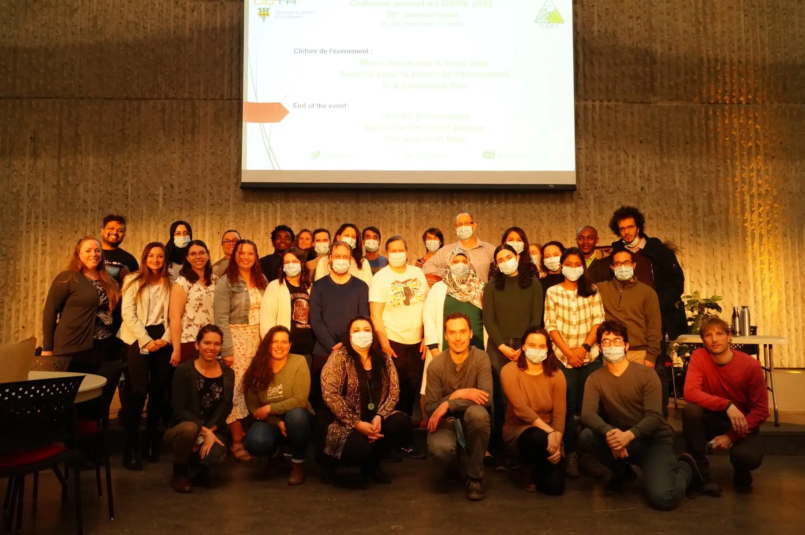

<head>
<meta charset="utf-8">
<link rel="apple-touch-icon" sizes="180x180" href="/apple-touch-icon.png">
<link rel="icon" type="image/png" sizes="32x32" href="/favicon-32x32.png">
<link rel="icon" type="image/png" sizes="16x16" href="/favicon-16x16.png">
<link rel="manifest" href="/site.webmanifest">
<link rel="mask-icon" href="/safari-pinned-tab.svg" color="#5bbad5">
<link rel="alternate" hreflang="fr-fr" href="../fr/news_2022.html">
<meta name="msapplication-TileColor" content="#da532c">
<meta name="theme-color" content="#ffffff">
<meta name="viewport" content="width=device-width, initial-scale=1">

<!-- scripts -->
<script src="https://kit.fontawesome.com/0af1a424a5.js" crossorigin="anonymous"></script>

<!-- stylesheets -->
<link rel="stylesheet" href="column_text_style.css">
<link rel="stylesheet" href="news_style.css">
</head>

<main class="container-fluid">

<div class="row">

<section class="cpics-logo"></div>
<br><br><br>

<section class="col-md-9" style="padding-right:2%">

<div class="row text">

<section class="col-md-3 news_links" id="news_links">
<div class="row">


```{r echo=FALSE, message=FALSE, warning=FALSE, results='asis'}
source("create_news_links.R", local = knitr::knit_global())

```


</div><!-- row under sidebar with news links -->
</section> 

<section class="col-md-9" id="main_news">

<div class="row">


Are you a Centre SEVE member? 

Don’t know yet, check out the link below to find out.

Also, get your email registered to get the CPICS meetings alerts.

https://cpics.netlify.app/en/participate.html
<br><br>


<article id="2022-05-04">
<strong>2022-05-04</strong>

Many congratulations to our ex-vice president of Networking [Romaric Armel Mouafo Tchinda] for getting a postdoctorate position at the University of Florida in Dr. [Karen Garrett]'s Lab (who was a guest at our [What's up Conference last year](./wup_may2021.html)).

We wish you all the best in your future endeavors!
<br><br>
</article> 

<article id="2022-04-26">
<strong>2022-04-26</strong>

Congratulations to the [Plant Biology Research Group (GRBV)](https://oraprdnt.uqtr.uquebec.ca/pls/public/gscw031?owa_no_site=4210) on its 20th anniversary. Also, kudos to the presenters and the organizers of the GRBV annual symposium.

<center>

</center>
<br><br>
</article> 

<article id="2022-04-12">
<strong>2022-04-12</strong>

Congratulations to our Centre SÈVE member Dr. [Hugo Germain] and his team members [Théo Devèze], [Claire Letanneur], [Nikunj Sharma] and [Snehi Gazal] for having a successful Indian expedition on the biodiversity of _Cannabis_ in the fall 2021! 

Their work has been published in [NEO UQTR](https://neo.uqtr.ca/2022/03/30/expedition-scientifique-en-inde-etudier-la-biodiversite-du-cannabis/?fbclid=IwAR3jYGNy2PgEz1I_JzIjh6sePDGWw1PQgAH9UWvJ7vo1onOkwfdZLhSUcp4).

Read about their journey and scientific work carried out in India with mesmerizing images of Himalayan ranges with _Cannabis_. 

<br><br>
</article> 

<article id="2022-03-10">
<strong>2022-03-10</strong>

New publication by Dr. [Tagnon Missihoun] his master's student [Amal Jaballi] from UQTR.
<br>

Publication: 
[The phytohormone abscisic acid modulates protein carbonylation in _Arabidopsis thaliana_](https://doi.org/10.1111/ppl.13658)

Also, the PhD candidate [Charles Roussin-Léveillée] from Dr. [Peter Moffet]'s lab published his research in the Cells Host & Microbe journal. Here is their publication:

[Evolutionarily conserved bacterial effectors hijack abscisic acid signaling to induce an aqueous environment in the apoplast](https://doi.org/10.1016/j.chom.2022.02.006)

<br>
Congratulations !
<br><br>
</article> 

<article id="2022-02-10">
<strong>2022-02-10</strong>

New publication of our previous Vice-President of Communications, [Marianne Bessette].
<br>

Publication: 
[Population genetic structure of the carrot weevil (<i>Listronotus oregonensis</i>) in North America](https://doi.org/10.1111/eva.13343)

<br>
Congratulations !
<br><br>
</article> 

<article id="2022-01-03">
<strong>2022-01-03</strong>

New publication from one of the researchers from Centre Séve, Dr. [Isabel Desgagné-Penix], and her students Laurence Tousignant, [Aracely Maribel Diaz Garza], [Bharat Bhusan Majhi](https://www.researchgate.net/profile/Bharat-Majhi) and [Sarah-Eve Gélinas](https://ca.linkedin.com/in/sarah-%C3%A8ve-g%C3%A9linas-695971159), in collaboration with the postdoctoral fellow [Aparna Singh](https://ca.linkedin.com/in/aparna-singh-5049b462), from the University of New Brunswick.
<br>

Publication: 
[Transcriptome analysis of _Leucojum aestivum_ and identification of genes involved in norbelladine biosynthesis](https://doi.org/10.1007/s00425-021-03741-x)

<br>
Congratulations !!
<br><br>
</article> 
</div><!-- row main_news -->
</section> 

</div><!-- row text under col9 section -->
</section> 

<section class="col-md-3">

<div class="row">
<span> <p class="sidebar_logos">[<i class="fab fa-twitter"></i>](https://twitter.com/CPICSEVE) [<i class="fab fa-linkedin-in"></i>](https://www.linkedin.com/company/cpics/about/) [<i class="fab fa-facebook"></i>](https://www.facebook.com/CPICS-Comit%C3%A9-de-partenariat-international-du-Centre-S%C3%88VE-395275957711442) <a  href = "mailto:cpicseve@gmail.com"><i class="fas fa-envelope" align="center" style="font-size:24px"></i></a> </p></span>
<div class="row" style="margin: 1%">
<a href="http://centreseve.recherche.usherbrooke.ca/fr"></a><a href="http://www.frqnt.gouv.qc.ca/en/accueil"></a>
</div>

<a class="twitter-timeline" data-height=1500px href="https://twitter.com/CPICSEVE?ref_src=twsrc%5Etfw">Tweets by CPICS</a> <script async src="https://platform.twitter.com/widgets.js" charset="utf-8"></script>

</div><!-- row under sidebar section -->
</section> 

<button onclick="topFunction()" id="myBtn" title="Go to top">Top</button>
```{r echo=FALSE, message=FALSE, warning=FALSE, results='asis'}
source("topFunctionJS.R", local = knitr::knit_global())

```

</div> <!-- row under container-fluid -->
</main>

[Centre SÈVE Annual International Symposium]: https://cpics.netlify.app/en/symposia.html
[Adrien Fremont]: https://bio.umontreal.ca/repertoire-departement/etudiants-aux-cycles-superieurs/adrien-fremont/
[Alexia Bertholon]: https://www.linkedin.com/in/alexiabertholon/
[Amal Jaballi]: https://www.researchgate.net/profile/Amal-Jaballi
[Amir Bidhendi]: https://www.researchgate.net/profile/Amir_Bidhendi/experience/
[Andrew Diamond]: https://www.linkedin.com/in/andrew-diamond-74390b137/) 
[Aracely Maribel Diaz Garza]: https://www.linkedin.com/in/aracely-maribel-diaz-garza-6989b5169/
[Charles Roussin-Léveillée]: https://www.linkedin.com/in/charles-roussin-l%C3%A9veill%C3%A9e-075851a6/?originalSubdomain=ca/
[Claire Letanneur]: https://www.researchgate.net/profile/Claire_Letanneur
[Eszter Sas]: https://www.linkedin.com/in/eszter-sas-1b907141/?originalSubdomain=ca/
[Fadoua Dhaouadi]: https://www.linkedin.com/in/dhaouadi-fadoua-276b191a3/
[Fatima Awwad]: https://www.linkedin.com/in/fatima-awwad-06553a29/
[Francisco Campos]: https://www.researchgate.net/profile/Francisco_Campos23/
[François Belzile]: http://www.ibis.ulaval.ca/en/research/francois-belzile/
[Guilherme Silva Martins]: https://www.linkedin.com/in/guilherme-martins-1268202b/
[Hamid Akbarzadeh]: https://www.mcgill.ca/macdonald/abdolhamid-akbarzadeh-shafaroudi/
[Hugo Germain]: https://www.researchgate.net/profile/Hugo_Germain
[Iauhenia Isayenka]: https://www.researchgate.net/profile/Iauhenia_Isayenka/
[Ingrid Berenice Sanchez Carrillo]: https://www.linkedin.com/in/ingrid-sanchez/
[Isabel Desgagné-Penix]: https://www.linkedin.com/in/isabel-desgagn%C3%A9-penix-86081aa6/
[Jennifer Paillassa]: https://www.linkedin.com/in/jennifer-paillassa-087600a3/
[Julian Henao-Martinez]: https://www.linkedin.com/in/julian-martinez-henao/?originalSubdomain=ca/
[Julie Yergeau]: https://www.linkedin.com/in/julie-yergeau-b58508186/
[Karen Cristine Goncalves]: https://www.linkedin.com/in/karen-gon%C3%A7alves-05847a113/
[Karen Garrett]: https://plantpath.ifas.ufl.edu/people/faculty-pages/karen-garrett/
[Karuna Kapoor]: https://scholar.google.ca/citations?user=gHKRIVEAAAAJ&hl=en/
[Manoj Koirala]: https://www.linkedin.com/in/manoj-koirala-72a149120/?originalSubdomain=ca
[Marianne Bessette]: https://www.linkedin.com/in/marianne-bessette-b16287146/
[Matthieu Glanowski]: https://www.linkedin.com/in/matthieu-glanowski-585254116/
[Meha Sharma]: https://www.researchgate.net/profile/Meha_Sharma5/
[Nikunj Sharma]: https://in.linkedin.com/in/nikunj-sharma-5a863490
[Peter Moffet]: https://www.usherbrooke.ca/biologie/nous-joindre/personnel/corps-professoral/biologie-moleculaire-et-cellulaire/peter-moffett
[Romaric Armel Mouafo Tchinda]: https://www.linkedin.com/in/romaric-armel-mouafo-tchinda-ba266185/
[Safa Labidi]: https://www.linkedin.com/in/safa-labidi-41749b73/
[Seydou Ka]: https://www.linkedin.com/in/seydou-ka-9a41a4167/
[Serge Nouemssi]: https://www.linkedin.com/in/serge-basile-nouemssi-a95913121/
[Snehi Gazal]: https://www.linkedin.com/in/snehi-gazal-9172856b/
[Tagnon Missihoun]: https://www.researchgate.net/profile/Tagnon_M
[Teura Barff]: https://www.linkedin.com/in/teura-barff-66526647/
[Théo Devèze]: aaa
[Valeria Parra]: https://www.linkedin.com/in/valeria-parra-0b0b86167/
[Valerio Hoyos-Villegas]: https://www.mcgill.ca/plant/faculty/valerio-hoyos-villegas/
[Vicky Lévesque]: https://www.linkedin.com/in/vickylevesque/
[Vincent Charron-Lamoureux]: https://www.researchgate.net/profile/Vincent_Charron-Lamoureux

