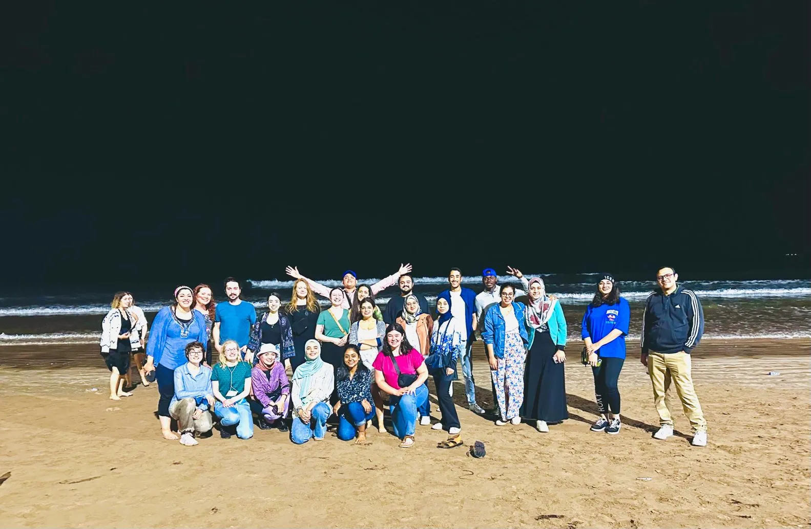

<head>
<meta charset="utf-8">
<link rel="stylesheet" href="slideshow.css">
<link rel="stylesheet" href="column_text_style.css">
<link rel="stylesheet" href="news_style.css">
<script src="slideView.js"></script>
<link rel="alternate" hreflang="fr-fr" href="../fr/news_2023.html">

```{r echo=FALSE, results='asis'}
source('header.R')
```

<section class="col-md-9" style="padding-right:2%">

<div class="row text">

<section class="col-md-3 news_links" id="news_links">
<div class="row">


```{r echo=FALSE, message=FALSE, warning=FALSE, results='asis'}
source("create_news_links.R", local = knitr::knit_global())

```


</div><!-- row under sidebar with news links -->
</section> 

<section class="col-md-9" id="main_news">

<div class="row">

<br>
[Subscribe to get the CPICS meetings alerts.](https://cpics.netlify.app/en/participate.html)


<article id="2023-07-01">
<strong>2023-07-01</strong>

Were you at the [CSPB](https://cspb-scbv.ca/) 2023 meeting at U. Laval?

Centre SÈVE was well represented (and so was the CSIPC) this year, with several talks and posters from students, postdocs and professors from UQTR, UQAM, UdeS, McGill, ULaval, UQAR and other universities!

We wish to congratulate [Charles Roussin-Léveillée] for receiving an honourable mention for the <em>Ragai Ibrahim Award</em> for his paper on [how bacteria use conserved effectors to create an aqueous environment in the leaf apoplast](https://www.sciencedirect.com/science/article/pii/S1931312822000920), he also received the <em>Prix Relève Étoile</em> from FRQNT for the same paper. Bravo, Charles!!!

Charles research supervisor and Centre SÈVE's director [Peter Moffet] received the <em>Mary Spencer Award</em> for his outstanding research and outreach in the plant biology community. Congratulations, Peter!

```{r echo=FALSE, results='asis'}
source("Photos_cspb.R", local = knitr::knit_global())

```

<br><br>
</article>

<article id="2023-06-01">
<strong>2023-04-07</strong>

Did you know Centre SÈVE's summer school this year was in Morocco? Yes, the [Mohammed VI Polytechnic University](https://www.linkedin.com/school/um6p/) hosted several Centre SÈVE students and professors for this extraordinary learning opportunity.

[Snehi Gazal], our vice-president, and [Prabhjot Sanghera], our secretary, taught about their projects, visited the area and learned about the Moroccan culture.

[Click here to read a bit more about their experience.](https://www.linkedin.com/feed/update/urn:li:activity:7064053495145848832/)



<br><br>
</article>

<article id="2023-04-07">
<strong>2023-04-07</strong>

We'd like to welcome our new secretary [Prabhjot Sanghera], who is doing his Master's at McGill University, and our new treasurer [Charlotte Blasi], who is finishing her doctorate degree at the Université Sherbrooke.

With a full committee, we now can plan the year. We look forward to seeing you at the [Canadian Society of Plant Biology](https://www.cspb2023.org/) at Quebec City in June!


<br><br>
</article>

<article id="2023-02-24">
<strong>2023-02-24</strong>

With the new year, it is time to renovate our committee!

On February 23rd, we welcomed to CPICS [Arghavan Arjmandi] and [Valeria Parra], as VP Communications, [Rohith Grandhi] and [Ayoub Bouhadada], as VP Networking, and [Arnold William Tazon], as secretary. Welcome again!

Also, our long time secretary, [Aracely Maribel Diaz Garza], stepped up to be president, helped by our previous VP communication, [Snehi Gazal]. Thank you for your leadearship!

We would like to thank the members that are now leaving the committee for their work these previous years: [Nicolas Sene], [Serge Nouemssi], [Théo Devèze] and [Jennifer Paillassa]. [Karen Cristine Goncalves], our former secretary, has stepped out of the position and is now exclusively our web designer. Thank you all for your work!

Finally, we still have places open for an English-speaking secretary and treasurers. If you are interested, add your name to [our mailing list](./participate.html) to receive the link to our next meeting (April 6th at 15h).


<br><br>
</article>

</div><!-- row main_news -->
</section> 

</div><!-- row text under col9 section -->
</section> 

<section class="col-md-3">
```{r echo=FALSE, message=FALSE, warning=FALSE, results='asis'}
source("sidebar.R", local = knitr::knit_global())

```


</section> 

<button onclick="topFunction()" id="myBtn" title="Go to top">Top</button>
```{r echo=FALSE, message=FALSE, warning=FALSE, results='asis'}
source("topFunctionJS.R", local = knitr::knit_global())

```

</div> <!-- row under container-fluid -->
</main>

```{r echo=FALSE, message=FALSE, warning=FALSE, results='asis'}
source("textLinksNews.R", local = knitr::knit_global())
```
