<head>
<link rel="apple-touch-icon" sizes="180x180" href="/apple-touch-icon.png">
<link rel="icon" type="image/png" sizes="32x32" href="/favicon-32x32.png">
<link rel="icon" type="image/png" sizes="16x16" href="/favicon-16x16.png">
<link rel="manifest" href="/site.webmanifest">
<link rel="mask-icon" href="/safari-pinned-tab.svg" color="#5bbad5">
<meta name="msapplication-TileColor" content="#da532c">
<meta name="theme-color" content="#ffffff">
<meta charset="utf-8">
<meta name="viewport" content="width=device-width, initial-scale=1">

<link rel="stylesheet" href="./column_text_style.css">
<link rel="stylesheet" href="./symposium_style.css">

</head>

  
The *Annual International Symposium of Center SÈVE* is a scientific meeting which reflects **_CSIPC_**’s philosophy. Its objective is to develop _Center SÈVE_'s international network and, at the same time, give a chance to student members to meet international researcher. This is an opportunity to increase _Center SÈVE_'s visibility at international scene but also to create new  collaborations between Canadians and international researchers. Student members take advantage of this privileged event to present their own research in front of their peers, enjoying the proximity favored by the event.

  

# {.tabset}

##  **1st Annual International Symposium of Center SÈVE** {.tabset .tabset-pills}

  

###  Program 

<a href="../fr/symposia.html#Program">**Program (french only)**
</a>

### Professors

<table style=" display: block;  margin-left: auto;  margin-right: auto;">
<tr>
<td>
  
</td>
<td>
  
</td>
</tr>
</table>

### Photos

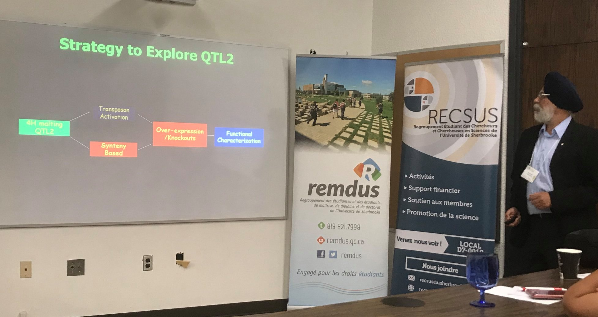

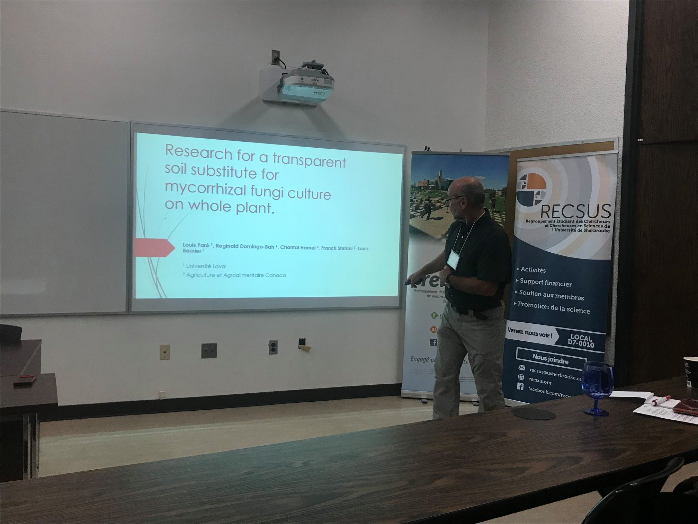

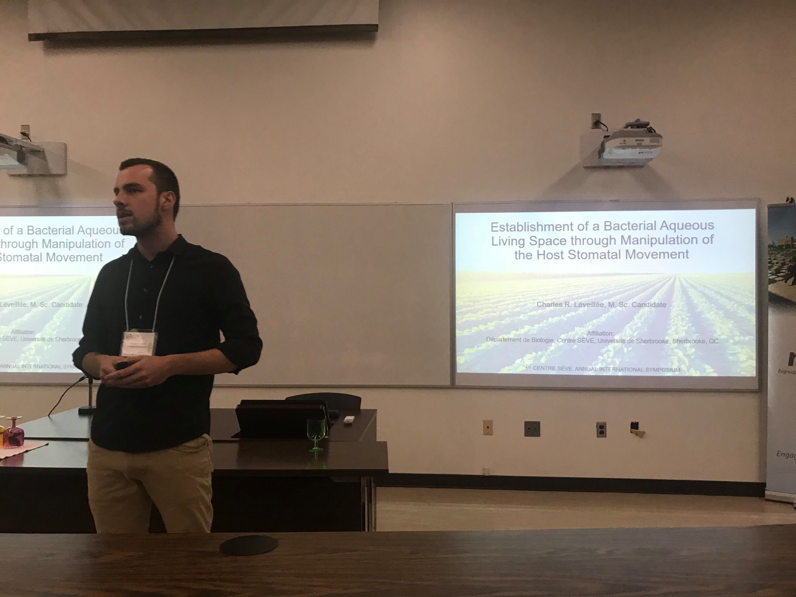

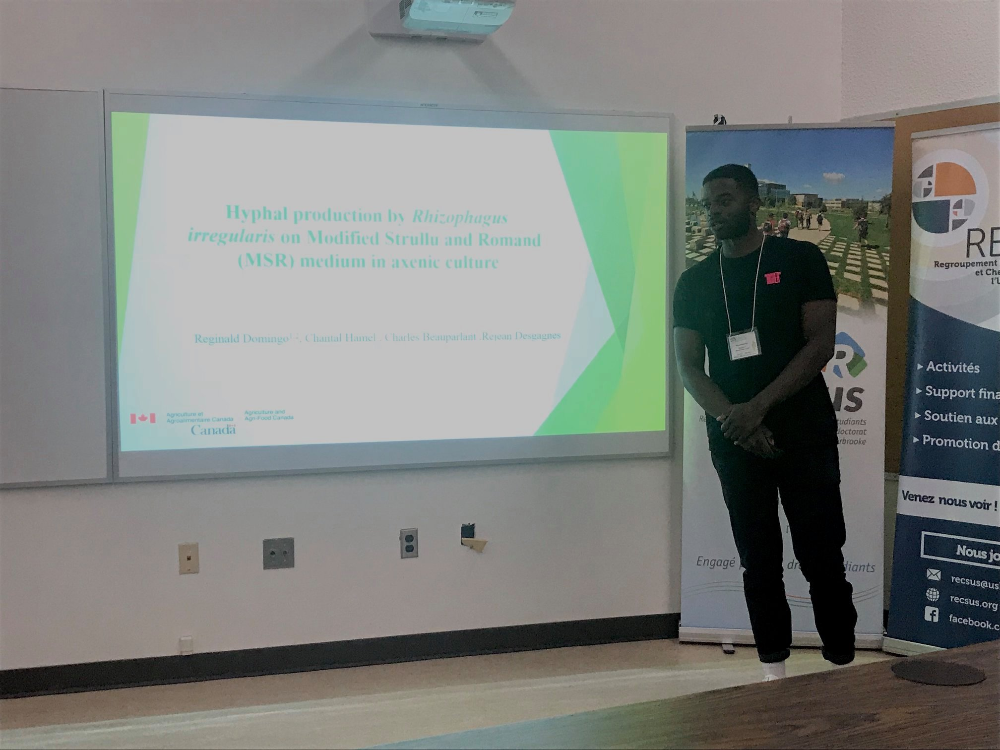

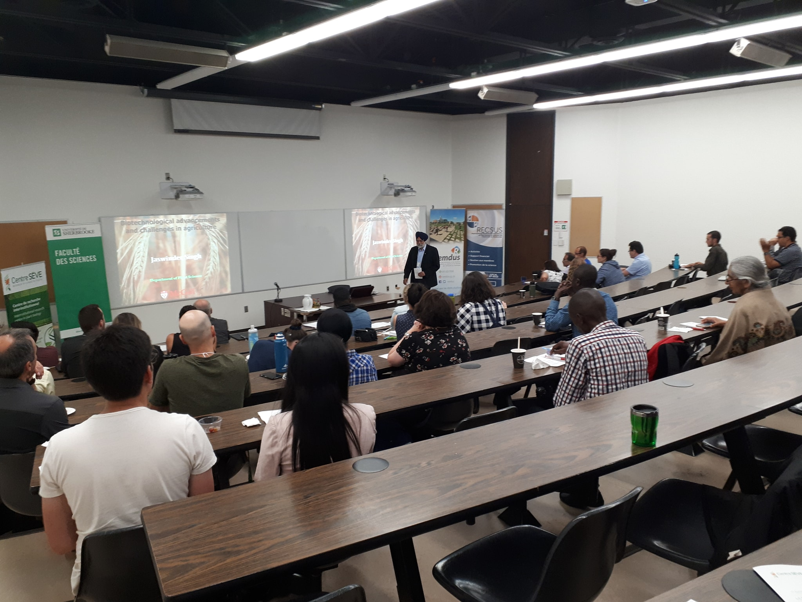

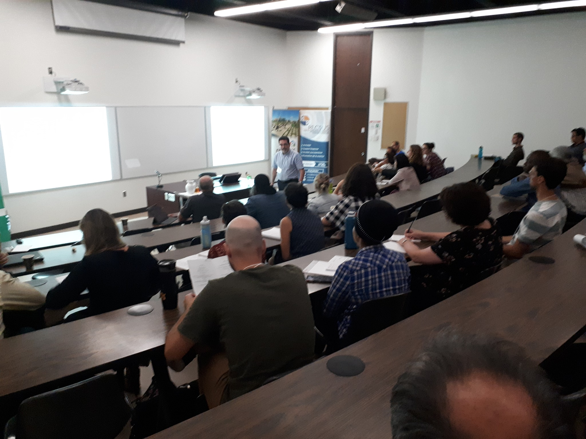

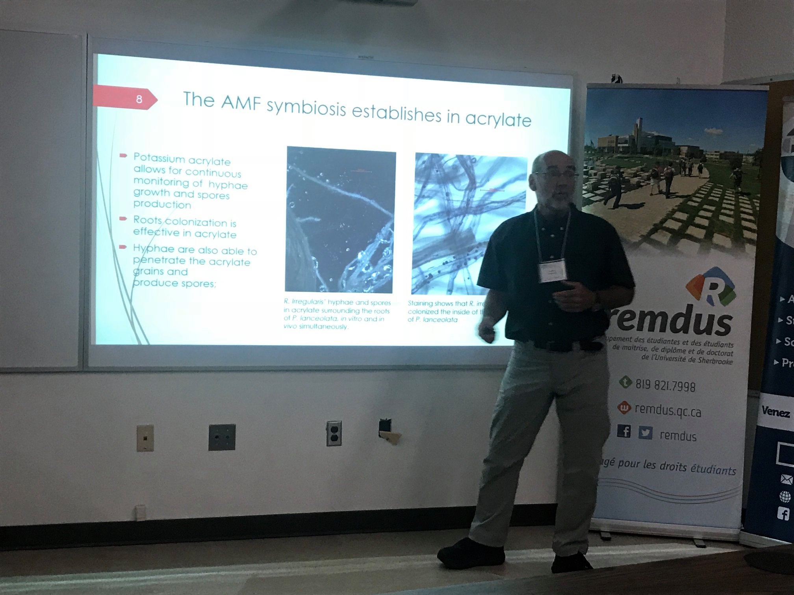

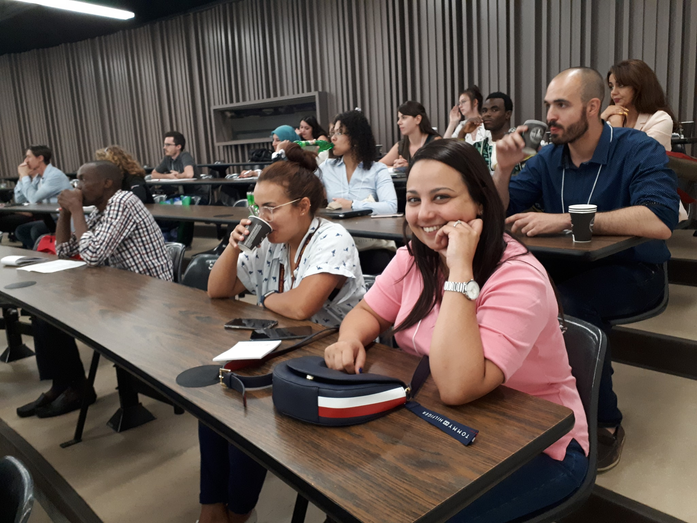

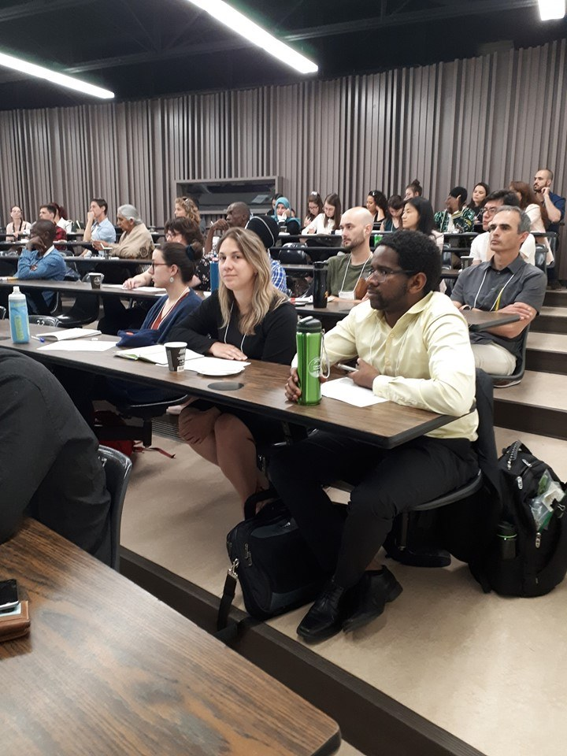

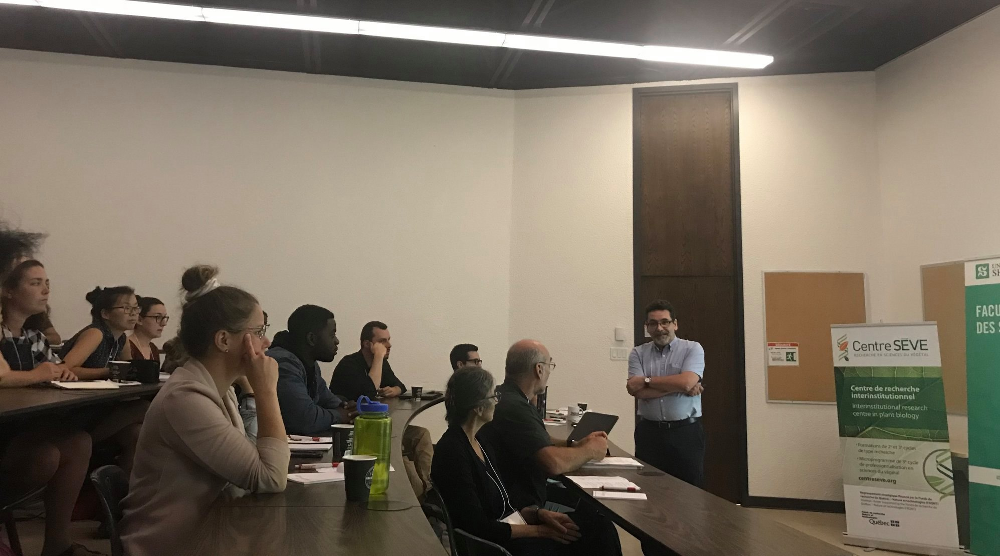

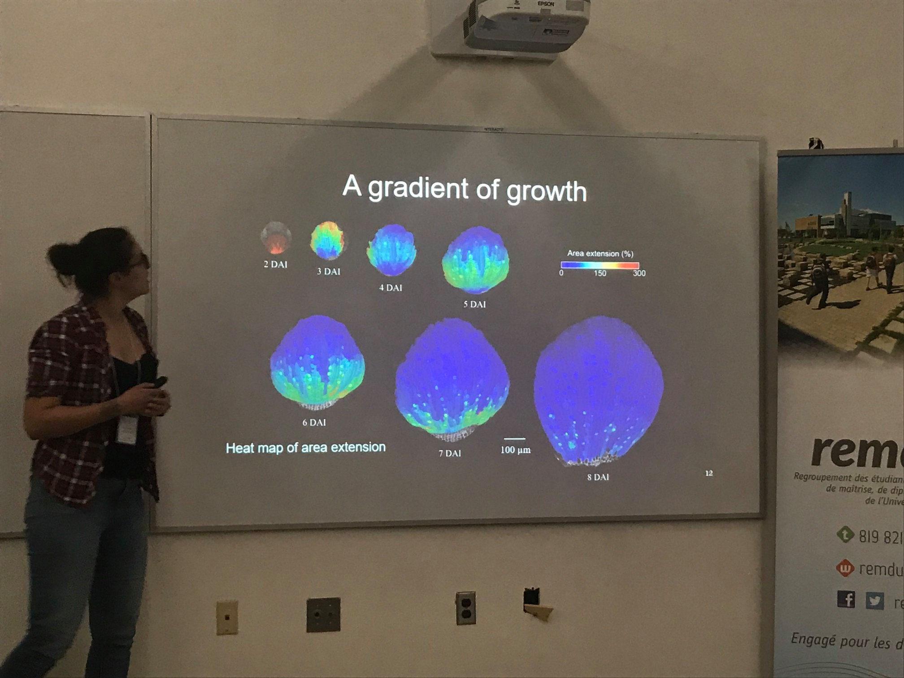

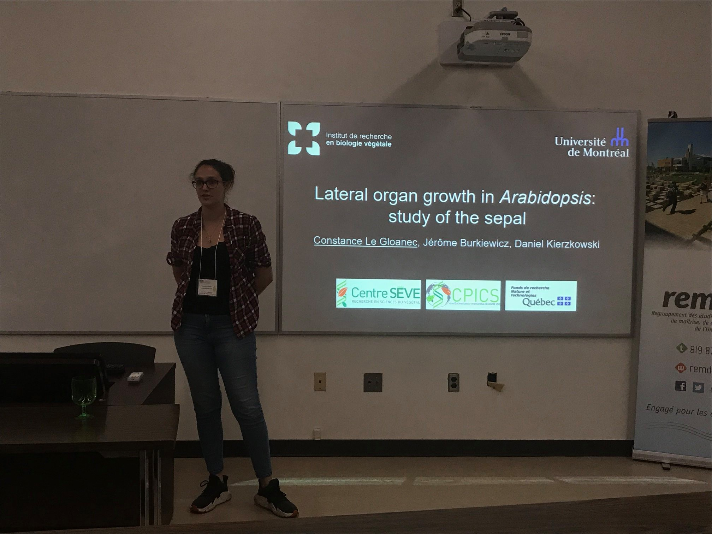

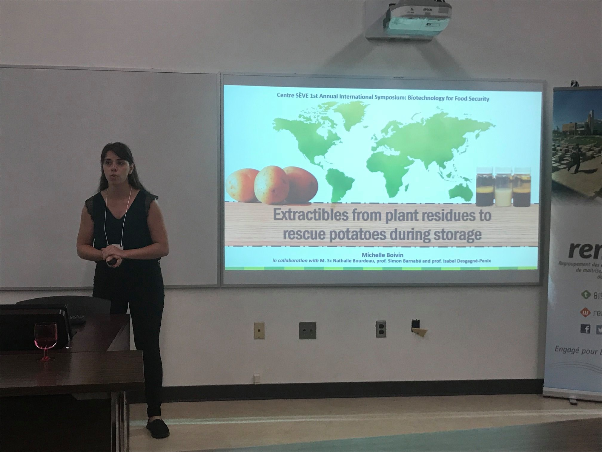

### Sponsors

