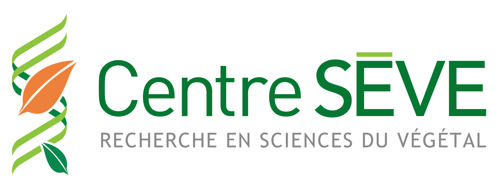

<!-- May 2021-->

<head>
<meta charset="utf-8">
<link rel="apple-touch-icon" sizes="180x180" href="/apple-touch-icon.png">
<link rel="icon" type="image/png" sizes="32x32" href="/favicon-32x32.png">
<link rel="icon" type="image/png" sizes="16x16" href="/favicon-16x16.png">
<link rel="manifest" href="/site.webmanifest">
<link rel="mask-icon" href="/safari-pinned-tab.svg" color="#5bbad5">
<link rel="alternate" hreflang="fr-fr" href="../fr/whats_up.html">
<meta name="msapplication-TileColor" content="#da532c">
<meta name="theme-color" content="#ffffff">
<meta name="viewport" content="width=device-width, initial-scale=1">

<link rel="stylesheet" href="column_text_style.css">
<link rel="stylesheet" href="form.css">

  

<h1></h1>

<h2>May 19th, 2021</h2>

th at 10h am with Dr. Karen Garrett from University of Florida and Dr. Mamadou Lamine Fall from Agriculture and Agri-Food Canada" width="100%">

  
 
 

 

<h3>The conference</h3>

At a time of internationalization of scientific knowledge, environmental upheaval and the COVID-19 pandemic, science and scientists have had to be inventive and resilient.  But, after one year:  **How are scientists in the world today?**  How did plant biology researchers adapt to the pandemy?  The third edition of the What's Up Conference **meets with two fascinating researchers** to discuss their work, projects, their challenges and their reflections about the scientific world of tomorrow.

 

 

 **Dr. Karen Garrett**  University of Florida 
 
 

 

 **Dr. Mamadou Lamine Fall** Agriculture and Agri-Food Canada
 
 

<!-- blank line -->
<figure class="video_container">
<iframe width="816" height="480" src="https://www.facebook.com/plugins/video.php?height=314&href=https%3A%2F%2Fwww.facebook.com%2FCPICS.SEVE%2Fvideos%2F375707827207980%2F&show_text=false&width=560" frameborder="0" allow="accelerometer; autoplay; encrypted-media; gyroscope; picture-in-picture" allowfullscreen style="display: block;margin-left: auto;  margin-right: auto;"></iframe>
</figure>
<!-- blank line -->  
O. Carisse, M. L. Fall & C. Vincent. (2017). **Using a biovigilance approach for pest and disease management in Quebec vineyards**. *Canadian Journal of Plant Pathology*, 39:4, 393-404, DOI: [10.1080/07060661.2017.1366368](https://doi.org/10.1080/07060661.2017.1366368)

C. E. Buddenhagen, J. F. Hernandez Nopsa, K. F. Andersen, J. Andrade-Piedra, G. A. Forbes, P. Kromann, S. Thomas-Sharma, P. Useche, and K. A. Garrett. **Epidemic Network Analysis for Mitigation of Invasive Pathogens in Seed Systems: Potato in Ecuador**.  *Phytopathology*, 107(10). DOI: [10.1094/PHYTO-03-17-0108-FI](https://doi.org/10.1094/PHYTO-03-17-0108-FI)

Tool box for working with root, tuber and banana seed systems [tools4seedsystems.org/](https://tools4seedsystems.org/)

R Poudel, A Jumpponen, D C Schlatter, T C Paulitz, B B McSpadden Gardener, L L Kinkel, K A Garrett. (2016). **Microbiome Networks: A Systems Framework for Identifying Candidate Microbial Assemblages for Disease Management**. *Phytopathology*, 106(10):1083-1096. doi: [10.1094/PHYTO-02-16-0058-FI](https://doi.org/10.1094/PHYTO-02-16-0058-FI).

Ricardo I Alcalá-Briseño, Kena Casarrubias-Castillo, Diana López-Ley, Karen A Garrett, Laura Silva-Rosales. (2020). **Network Analysis of the Papaya Orchard Virome from Two Agroecological Regions of Chiapas, Mexico**. *mSystems*, 5(1): e00423-19. doi: 10.1128/mSystems.00423-19.

K. A. Garrett. (2020). **Impact network analysis and the INA R package: Decision support for regional management interventions**. *bioRxiv*. DOI: [10.1101/2020.11.08.373621](https://doi.org/10.1101/2020.11.08.373621)

M. Carvajal-Yepes, K. Cardwell, A. Nelson, K. A. Garrett, B. Giovani, D. G. O. Saunders, S. Kamoun, J. P. Legg, V. Verdier, J. Lessel, R. A. Neher, R. Day, P. Pardey, M. L. Gullino, A. R. Records, B. Bextine, J. E. Leach, S. Staiger, J. Tohme. (2019). **A global surveillance system for crop diseases**. *Science*, 364(6447): 1237-1239. DOI: 10.1126/science.aaw1572

Yanru Xing, John F Hernandez Nopsa, Kelsey F Andersen, Jorge L Andrade-Piedra, Fenton D Beed, Guy Blomme, Mónica Carvajal-Yepes, Danny L Coyne, Wilmer J Cuellar, Gregory A Forbes, Jan F Kreuze, Jürgen Kroschel, P Lava Kumar, James P Legg, Monica Parker, Elmar Schulte-Geldermann, Kalpana Sharma, Karen A Garrett.  (2020). **Global Cropland Connectivity: A Risk Factor for Invasion and Saturation by Emerging Pathogens and Pests**. *Bioscience*, 70(9): 744-758. DOI: [10.1093/biosci/biaa067](https://doi.org/10.1093/biosci/biaa067)

Garrett, K. A., Andersen, K. F., Asche, F., Bowden, R. L., Forbes, G. A., Kulakow, P. A., & Zhou, B. (2017). **Resistance genes in global crop breeding networks**. *Phytopathology*, 107(10): 1268-1278. https://doi.org/10.1094/PHYTO-03-17-0082-FI

Garrett, K.A., Alcalá-Briseño, R.I., Andersen, K.F., Brawner, J., Choudhury, R.A., Delaquis, E., Fayette, J., Poudel, R., Purves, D., Rothschild, J. and Small, I.M., (2020). **Effective altruism as an ethical lens on research priorities**. *Phytopathology*, 110(4): 708-722. [10.1094/PHYTO-05-19-0168-RVW](https://doi.org/10.1094/PHYTO-05-19-0168-RVW)

Armijo, G., Schlechter, R., Agurto, M., Muñoz, D., Nuñez, C., & Arce-Johnson, P. (2016). **Grapevine pathogenic microorganisms: understanding infection strategies and host response scenarios**. *Frontiers in plant science*, 7, 382. doi: [10.3389/fpls.2016.00382](https://doi.org/10.3389/fpls.2016.00382)

Fall, Mamadou L., Dong Xu, Pierre Lemoyne, Issam E. Ben Moussa, Carole Beaulieu, and Odile Carisse. (2020). **A Diverse Virome of Leafroll-Infected Grapevine Unveiled by dsRNA Sequencing**. *Viruses*, 12(10): 1142. doi: [10.3390/v12101142](https://doi.org/10.3390/v12101142)

Ben Moussa, I., Lemoyne, P. and Fall, M., 2019. **Virus et vigne, un mariage difficile à défaire: la biovigilance est nécessaire plus que jamais**. *Phytoprotection*, 99(1), pp.15-20. doi: [10.7202/1059305ar](https://doi.org/10.7202/1059305ar)

<!-- 
div id="section-6" class="section level3">
<h3>Inscriptions</h3>

<form name="CPICS_whatsup_registration_may2021" method="POST" data-netlify="true">

<label > First Name:* </label>  

<input type="text" name="First name" placeholder="" required/>
        
	 
<label > Last Name:* </label> 

<input type="text" name="Last name" placeholder="" required/>   
    
<label > Affiliation:* </label>  

<input type="text" name="Affiliation" placeholder="" required/>   

<label>Email:* </label> 

<input type="text" name="Email" placeholder="" required/>   

<input type="hidden" name="_subject" value="inscription" />

<label> You are:* </label>

<select name="Occupation_level" id="Occupation level" onchange="showfield(this.options[this.selectedIndex].value)" required>
<option value="Baccalauréat / Bachelor" > Bachelor </option>
<option value="Maîtrise / Master's" > Master's </option>
<option value="Doctorat / PhD" > PhD </option>
<option value="Postdoc" > Postdoc </option>
<option value="Technicien(ne) / Technician" > Technician </option>
<option value="Chercheur(e) / Researcher" > Researcher </option>
<option value="Autre / Other"> Other</option>
</select>

<label> Other: </label>
<input type="text" name="Other occupation" id="Other occupation" style="padding: 0.75em ; border: 1px solid #e5e5e5; border-radius: 30px; margin: 0em;"/>
  
 
<label> For statistical purposes, do you feel prefer meetings in: </label>

<select name="Prefered_language" id="Prefered language">
<option value="Anglais / English"> English </option>
<option value="Francais / French"> French </option>
<option value="Les deux / Both"> Both </option>
</select>

<input type="hidden" name="_gotcha" />
    

<label class="container">By participating in the Zoom meeting, I consent to be recorded during the conference if I appear.
  <input name="agree_recording" type="checkbox" checked="checked" required>
  
</label>
  

<input type="submit" value="Submit"/>

</form>

-->

<h3>Post-conference survey</h3>

<form name="post_conference_survey_19mai" method="POST" data-netlify="true">

<fieldset>
<legend> Who are you? </legend>
<label >Name:* </label>  
<input type="text" name="Name" placeholder="First_name Last_name" required/>   
    
<label > Affiliation:* </label>   
<input type="text" name="Affiliation" placeholder="University" required/>   

<label>Email:* </label>  
<input type="text" name="Email" placeholder="email@email.com" required/>   

<input type="hidden" name="_subject" value="survey_8dec" />

<label> You are:* </label> 
<select name="Occupation_level" id="Occupation level" onchange="showfield(this.options[this.selectedIndex].value)" required>
<option value="Baccalauréat / Bachelor" > Bachelor </option>
<option value="Maîtrise / Master's" > Master's </option>
<option value="Doctorat / PhD" > PhD </option>
<option value="Postdoc" > Postdoc </option>
<option value="Technicien(ne) / Technician" > Technician </option>
<option value="Chercheur(e) / Researcher" > Researcher </option>
<option value="Autre / Other"> Other</option>
</select>

<label> Other: </label>
<input type="text" name="Other occupation" id="Other occupation" placeholder="Research assistant" style="padding: 0.75em ; border: 1px solid #e5e5e5; border-radius: 30px; margin: 0em;"/>
  

</fieldset>
 
<input type="hidden" name="_gotcha" />

<fieldset>
<legend> About the Conference </legend>
<label> You watched the conference on:* </label>

<select name="Platform" id="Platform" required>
<option value="Facebook Live" > Facebook Live </option>
<option value="Zoom" > Zoom </option>
<option value="Enregistrement / Recording" > Recording </option>
</select>  

<label> Did you like the format?* </label>

<select name="Like_format" id="Like_format" required>
<option value="Yes / Oui" >Yes</option>
<option value="Non / No" >No</option>
<option value="Pourrait être amélioré / Could be better" >Could be better</option>
</select>  

<label > Suggestions: </label>  
<input type="text" name="suggestions" placeholder="What you think we could do better" />   

<label >What subject would you like to see discussed?</label>  
<input type="text" name="new_subjects" placeholder="Subject to discuss" />   

<input type="submit" value="Submit"/>

</fieldset>

</form>

<h2>December 8th, 2020</h2>

<a href="wup_december2020.html">th at 9h30 am with Dr. Eddy L. Ngonkeu from Université de Yaoundé and Dr. Tanya Arseneault from Agriculture and Agri-Food Canada" width="100%"></a>

 
 

 

<h2>August 25^th^ 2020</h2>

<a href="wup_august2020.html">th at 9h am with Dr. Leena Tripathi from IITA Kenya and Dr. Isabelle Laforest-Lapointe from University of Sherbrooke Canada" width="100%"></a>
  
 
 

 

 
 [<i class="fab fa-twitter"></i>](https://twitter.com/CPICSEVE) [<i class="fab fa-linkedin-in"></i>](https://www.linkedin.com/company/cpics/about/) [<i class="fab fa-facebook"></i>](https://www.facebook.com/CPICS-Comit%C3%A9-de-partenariat-international-du-Centre-S%C3%88VE-395275957711442) <a  href = "mailto:cpicseve@gmail.com"><i class="fas fa-envelope" align="center" style="font-size:24px"></i></a> 

<a class="twitter-timeline" data-height=1200px href="https://twitter.com/CPICSEVE?ref_src=twsrc%5Etfw">Tweets by CPICS</a> 

