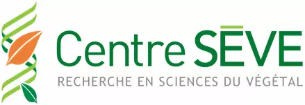

<!-- June 2022-->
<head>
<meta charset="utf-8">
<link rel="stylesheet" href="column_text_style.css">
<link rel="stylesheet" href="form.css">
<link rel="stylesheet" href="wupc_style.css">
<link rel="alternate" hreflang="fr-fr" href="../fr/wup_may2021.html">

```{r echo=FALSE, results='asis'}
source('header.R')
```

<section class="col-md-9" style="padding-right:2%">
<div class="row text">


<div  id="section-1" class="section level1 tabset tabset-fade tabset-pills active">
<h1></h1>

<div id="section-2" class="section level2">
<h2>The conference</h2>

<div class="row" style="text-align: justify; color: black; padding-right: 2%; padding-left: 2%">
<center>**We are happy to invite you to join us (*finally*) in person or via ZOOM for the 4th edition of the "What's up? Conferences"!**<br><br>In this edition, we will focus on climate change and how biotechnology and its applications can alleviate this emergency. Thus, we invite you to discuss, debate and share your ideas and curiosities with our keynote speakers:</center>

<br>


<div class="col-md-6" style="text-align: center">

<center> <a href="https://www.icgeb.org/shashi-kumar/"></a></center>
<center> **Dr. Shashi Kumar**<br> International Centre for Genetic Engineering and Biotechnology<br>New Delhi, India </center> 
<br>

</div>

<div class="col-md-6" style="text-align: center">

<center> <a href="https://oraprdnt.uqtr.uquebec.ca/pls/public/gscw031?owa_no_site=3466"></a></center>
<center> **Dr. Isabel Desgagné-Penix**<br>Université du Québec à Trois-Rivières</center> 
<br>

</div>


<div class="col-md-12" style="text-align: center">
<figure class="video_container">
<iframe width="816" height="480" src="https://www.facebook.com/plugins/video.php?href=https%3A%2F%2Fwww.facebook.com%2FCPICS.SEVE%2Fvideos%2F547263030398633%2F&width=816&show_text=false&height=480&appId" frameborder="0" allow="accelerometer; autoplay; encrypted-media; gyroscope; picture-in-picture" allowfullscreen style="display: block;margin-left: auto;  margin-right: auto;"></iframe>
</figure>

<br><br>
<center><span style="font-size: 1.75em">**Our sponsors:**</span></center>
<div style="background-color: white">
<a href="http://centreseve.recherche.usherbrooke.ca/fr"></a><a href="https://www.usherbrooke.ca/etudiants/vie-etudiante/financement-pour-les-activites-etudiantes/fonds-appui-a-engagement-etudiant"></a>
</div>

</div>
</div>
</div>

<!--
<div id="section-3" class="section level2">
<h2>Inscriptions</h2>

<div rows=2 class="row" style="width: 100%; padding-left: 10%; padding-right: 10%">

<form name="CPICS_wup_registration_june2022" method="POST" action="https://script.google.com/macros/s/AKfycbxM7w_NrNf9uHn0oqipnLFXygXlK0lwlceStH8RhfbSaNVHYs4InxNeweJiwt17k74C/exec">

<label > First Name:* </label>  
<input type="text" name="First name" placeholder="First name" required/><br>
	 
<label > Last Name:* </label> 
<input type="text" name="Last name" placeholder="Last name" required/><br>
    
<label > Affiliation:* </label>  
<input type="text" name="Affiliation" placeholder="University/Institution" required/><br>

<label>Email:* </label> 
<input type="text" name="Email" placeholder="" required/><br>

<input type="hidden" name="Which conference" value="June 2022" />

<label> You are:* </label>
<input list="Occupations" name="Occupation" id="Occupation">
<datalist id="Occupations">
<option value="Baccalauréat / Bachelor" />
<option value="Maîtrise / Master's" />
<option value="Doctorat / PhD" />
<option value="Postdoc" />
<option value="Technicien&middot;ne / Technician" />
<option value="Chercheur&middot;se / Researcher" />
</datalist>

 
<label> Will you be attending: </label>
<select name="Attending" id="Attending" required>
<option value="En présentielle / In person" disabled> In person at the UQTR </option>
<option value="En ligne / On line"> On ZOOM/Facebook live </option>
</select>

<label> For statistical purposes, do you feel prefer meetings in: </label>
<select name="Prefered language" id="Prefered language">
<option value="Anglais / English"> English </option>
<option value="Francais / French"> French </option>
<option value="Les deux / Both"> Both </option>
</select>

<input type="hidden" name="_gotcha" />
 <br>

<label class="container">By participating in the meeting, I consent to be recorded during the conference if I appear.
  <input name="agree_recording" type="checkbox" checked="checked" required>
  <span class="checkmark"></span>
</label>
 <br>

<center><input type="submit" value="Submit"/></center>

</form>
</div>
</div>

-->
<div id='section-4' class="section level2">
<h2>Post-conference survey</h2>

<div rows=2 class="row" style="width: 100%; padding-left: 10%; padding-right: 10%">


<form 
name="post_conference_survey" id="post_conference_survey"
method="POST"
action="https://script.google.com/macros/s/AKfycbyW_cQ5iVBDp-8pBBhjz4cnhpGjtr-WW649-W8zLs3cHxiMZ4GaQN8Q_8G8U41Mge42yg/exec">

<fieldset>
<legend> Who are you? </legend>
<label >Name:* </label> 
<input type="text" name="Name" placeholder="First_name Last_name" required/><br>
    
<label > Affiliation:* </label>  
<input type="text" name="Affiliation" placeholder="University/Institution" required/><br>

<label>Email:* </label> 
<input type="text" name="Email" id="Email" required/><br>

<input type="hidden" name="Which conference" id="Which conference" value="June 2022" />

<label> You are:* </label>
<input list="Occupations" name="Occupation" id="Occupation">

<datalist id="Occupations">
<option value="Baccalauréat / Bachelor" />
<option value="Maîtrise / Master's" />
<option value="Doctorat / PhD" />
<option value="Postdoc" />
<option value="Technicien&middot;ne / Technician" />
<option value="Chercheur&middot;se / Researcher" />
</datalist>


</fieldset>
 
<input type="hidden" name="_gotcha" />

<fieldset>
<legend> About the Conference </legend>
<label> You watched the conference:* </label>
<select name="Platform" id="Platform" required>
<option value="In person"> In person </option>
<option value="Facebook Live" > on Facebook Live </option>
<option value="Zoom" > on Zoom </option>
<option value="Recording" > Recording </option>
</select> <br>

<label> Did you like the format?* </label>
<select name="Like Format" id="Like Format" required>
<option value="Yes / Oui" >Yes</option>
<option value="Non / No" >No</option>
<option value="Pourrait être amélioré / Could be better" >Could be better</option>
</select> <br>

<label > Suggestions: </label> 
<input type="text" name="Suggestions" id="Suggestions"/><br>

<label >What subject would you like to see discussed?</label> 
<input type="text" name="New Subjects" id="New Subjects"/><br>

<center><input type="submit" value="Submit"/></center>
</fieldset>

</form>

</div>
</div>

</div>


</div>
</section> 

<section class="col-md-3">

```{r echo=FALSE, message=FALSE, warning=FALSE, results='asis'}
source("sidebar.R", local = knitr::knit_global())

```
</section> 

<button onclick="topFunction()" id="myBtn" title="Go to top">Top</button>
```{r echo=FALSE, message=FALSE, warning=FALSE, results='asis'}
source("topFunctionJS.R", local = knitr::knit_global())

```
</div>
</main>
