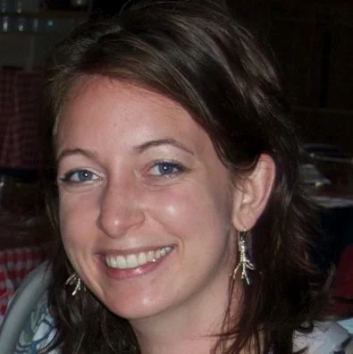
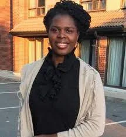

<head>
<meta charset="utf-8">
<link rel="apple-touch-icon" sizes="180x180" href="../apple-touch-icon.png">
<link rel="icon" type="image/png" sizes="32x32" href="../favicon-32x32.png">
<link rel="icon" type="image/png" sizes="16x16" href="../favicon-16x16.png">
<link rel="manifest" href="../site.webmanifest">
<link rel="mask-icon" href="../safari-pinned-tab.svg" color="#5bbad5">
<link rel="alternate" hreflang="fr-fr" href="../fr/news.html">
<meta name="msapplication-TileColor" content="#da532c">
<meta name="theme-color" content="#ffffff">
<meta name="viewport" content="width=device-width, initial-scale=1">

<link rel="stylesheet" href="column_text_style.css">
<link rel="stylesheet" href="symposium_style.css">
<link rel="stylesheet" href="slideshow.css">

</head>

  
  

  

<h1></h1>

Vous êtes-vous déjà demandé&middot;e&middot; ce que vous alliez faire après avoir terminé vos études supérieures ? 

Quelles sont les options possibles et comment tirer le meilleur parti des différents outils disponibles pour prendre de telles décisions ?

Le Centre SÈVE et le CPICS sont là pour vous aider avec une Journée Carrière en ligne.

Il y aura deux ateliers sur l'utilisation de LinkedIn comme outil de réseautage et sur les avantages que le réseautage offre dans l'environnement professionnel.

Vous aurez également l'occasion de parler à d'anciens étudiants et étudiantes du Centre SÈVE sur leur carrière et de leur parcours après leurs études supérieures. 

Cliquez [ici](https://event.fourwaves.com/fr/journeecarriere/inscription) pour vous inscrire ou regardez ci-dessous pour plus d'informations sur nos invités et les ateliers.

[Program](https://event.fourwaves.com/fr/journeecarriere/horaire)

<h2>Ateliers</h2>

<h3>**Le réseautage : approches à privilégier**</h3>

L'atelier vise à rappeler la diversité des approches possibles et l'importance d'une étape de préparation avant de se lancer à la recherche de différentes possibilités. Il s'agit de miser sur ses propres expériences et compétences et d'avoir une approche organisée pour trouver le stage ou l'emploi en adéquation avec ses aspirations.

<h3> **LinkedIn: outil de réseautage professionnel**</h3>

Vous terminez ou venez de terminer vos études? Vous êtes toujours a l'université et vous êtes en recherche de stage? LinkedIn, ce puissant outil de réseautage professionnel, pourrait bien vous permettre d'arriver à vos fins. A condition, bien sûr, de l'utiliser correctement!

Au cous de cet atelier, vous apprendrez comment optimiser votre profil pour être vu et reconnu, comment construire et élargir un réseau d'impact et, finalement, aborderez les stratégies qui pourraient vous permettre de trouver l'emploi ou le stage de vos rêves.

<h2>Invités</h2>

[Tony Savard](https://profils-profiles.science.gc.ca/fr/profil/tony-savard-phd) Chercheur scientifique Centre de recherche et de développement sur les aliments de Saint-Hyacinthe

[Lauriane Giroux](https://www.linkedin.com/in/lauriane-giroux-83b68b11a/) Professionelle de recherche Ulysse Biotech

 

 

[Tanya Copley](https://cerom.qc.ca/organisation/notre-equipe/chercheurs.html) Phytopathologist Centre de recherche sur les grains, inc.

 

 

[Jean-Philippe Légaré](https://www.linkedin.com/in/jean-phillippe-legare-29209368/?originalSubdomain=ca) Biologist-entomologist MAPAQ's Laboratory of expertise and diagnostic in en phytoprotection

 

 

[Ayooluwa Bolaji](https://www.linkedin.com/in/ayooluwa-bolaji-ph-d-2a9a64159/?originalSubdomain=ca) Research scientist at the Genomics Unit National Centre for Foreign Animal Disease (Canadian Food Inspection Agency)

 
 [<i class="fab fa-twitter"></i>](https://twitter.com/CPICSEVE) [<i class="fab fa-linkedin-in"></i>](https://www.linkedin.com/company/cpics/about/) [<i class="fab fa-facebook"></i>](https://www.facebook.com/CPICS-Comit%C3%A9-de-partenariat-international-du-Centre-S%C3%88VE-395275957711442) <a  href = "mailto:cpicseve@gmail.com"><i class="fas fa-envelope" align="center" style="font-size:24px"></i></a> 

<a class="twitter-timeline" data-height=1000px href="https://twitter.com/CPICSEVE?ref_src=twsrc%5Etfw">Tweets by CPICS</a> 

