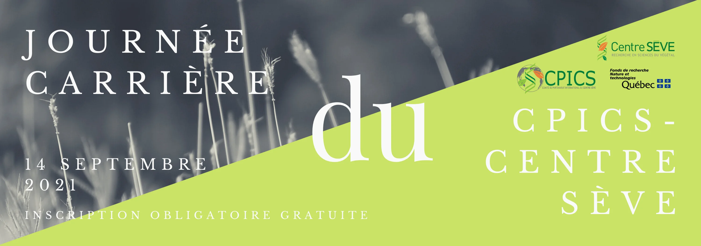
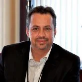
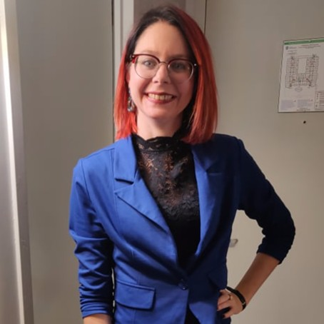
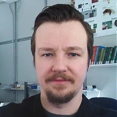

<head>
<link rel="alternate" hreflang="en-us" href="../en/carriere_2021.html">

```{r echo=FALSE, results='asis'}
source('header.R')
```

<section class="col-md-9 text" style="padding-right:2%">
<div class="row text">
<div id="section" class="section level1 tabset tabset-fade tabset-pills">
<h1></h1>



<p style="display:block; text-align: center; margin-left: auto; margin-right: auto">

Vous êtes-vous déjà demandé&middot;e&middot; ce que vous alliez faire après avoir terminé vos études supérieures ? 

Quelles sont les options possibles et comment tirer le meilleur parti des différents outils disponibles pour prendre de telles décisions ?

Le Centre SÈVE et le CPICS sont là pour vous aider avec une Journée Carrière en ligne.

Il y aura deux ateliers sur l'utilisation de LinkedIn comme outil de réseautage et sur les avantages que le réseautage offre dans l'environnement professionnel.

Vous aurez également l'occasion de parler à d'anciens étudiants et étudiantes du Centre SÈVE sur leur carrière et de leur parcours après leurs études supérieures. 

Cliquez [ici](https://event.fourwaves.com/fr/journeecarriere/inscription) pour vous inscrire ou regardez ci-dessous pour plus d'informations sur nos invités et les ateliers.

[Program](https://event.fourwaves.com/fr/journeecarriere/horaire)

</p>

<div id="section-2" class="section level2">
<h2>Ateliers</h2>

<h3>**Le réseautage : approches à privilégier**</h3>

L'atelier vise à rappeler la diversité des approches possibles et l'importance d'une étape de préparation avant de se lancer à la recherche de différentes possibilités. Il s'agit de miser sur ses propres expériences et compétences et d'avoir une approche organisée pour trouver le stage ou l'emploi en adéquation avec ses aspirations.


<h3> **LinkedIn: outil de réseautage professionnel**</h3>

Vous terminez ou venez de terminer vos études? Vous êtes toujours a l'université et vous êtes en recherche de stage? LinkedIn, ce puissant outil de réseautage professionnel, pourrait bien vous permettre d'arriver à vos fins. A condition, bien sûr, de l'utiliser correctement!

Au cous de cet atelier, vous apprendrez comment optimiser votre profil pour être vu et reconnu, comment construire et élargir un réseau d'impact et, finalement, aborderez les stratégies qui pourraient vous permettre de trouver l'emploi ou le stage de vos rêves.

</div>

<div id="section-1" class="section level2">
<h2>Invités</h2>

<div class="row">
<div class="col-md-6">


<center>[Tony Savard](https://profils-profiles.science.gc.ca/fr/profil/tony-savard-phd)<br>Chercheur scientifique<br>Centre de recherche et de développement sur les aliments de Saint-Hyacinthe</center>

</div>
<div class="col-md-6">

<center>[Lauriane Giroux](https://www.linkedin.com/in/lauriane-giroux-83b68b11a/)<br>Professionelle de recherche<br>Ulysse Biotech</center>

</div>
</div>
<div class="row">
<div class="col-md-6">
<br>

<br>
<center>[Tanya Copley](https://cerom.qc.ca/organisation/notre-equipe/chercheurs.html)<br>Phytopathologist<br>Centre de recherche sur les grains, inc.</center>
</div>

<div class="col-md-6">
<br>

<br>
<center>[Jean-Philippe Légaré](https://www.linkedin.com/in/jean-phillippe-legare-29209368/?originalSubdomain=ca)<br>Biologist-entomologist<br>MAPAQ's Laboratory of expertise and diagnostic in en phytoprotection</center>

</div>
</div>
<div class="row">
<div class="col-md-12">
<br>

<br>
<center><span style="color: white; font-weight: bold">[Ayooluwa Bolaji](https://www.linkedin.com/in/ayooluwa-bolaji-ph-d-2a9a64159/?originalSubdomain=ca)</span><br>Research scientist at the Genomics Unit<br>National Centre for Foreign Animal Disease (Canadian Food Inspection Agency)</center>
</div>


</div>
</div>


</div>

</div>

</section> 

<section class="col-md-3">

```{r echo=FALSE, message=FALSE, warning=FALSE, results='asis'}
source("sidebar.R", local = knitr::knit_global())

```
</section> 

<button onclick="topFunction()" id="myBtn" title="Go to top">Top</button>
```{r echo=FALSE, message=FALSE, warning=FALSE, results='asis'}
source("topFunctionJS.R", local = knitr::knit_global())

```
</div>
</main>