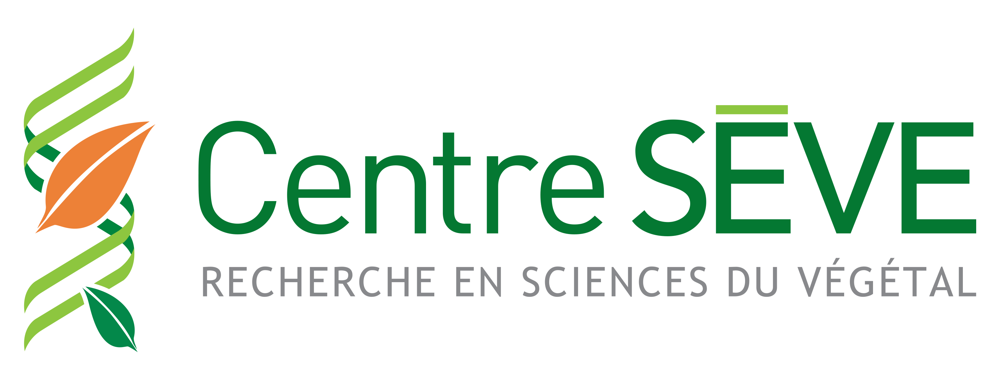
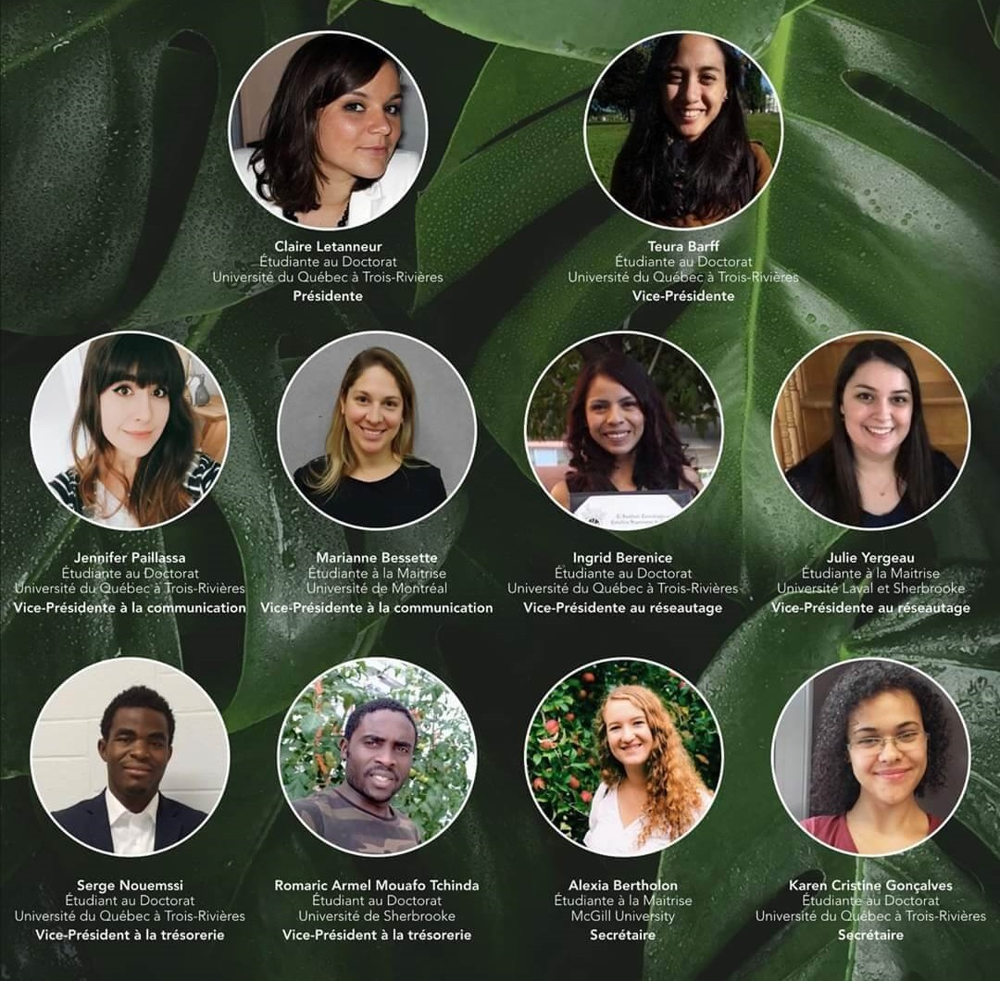

<head>
<link rel="apple-touch-icon" sizes="180x180" href="/apple-touch-icon.png">
<link rel="icon" type="image/png" sizes="32x32" href="/favicon-32x32.png">
<link rel="icon" type="image/png" sizes="16x16" href="/favicon-16x16.png">
<link rel="manifest" href="/site.webmanifest">
<link rel="mask-icon" href="/safari-pinned-tab.svg" color="#5bbad5">
<meta name="msapplication-TileColor" content="#da532c">
<meta name="theme-color" content="#ffffff">
<meta charset="utf-8">
<meta name="viewport" content="width=device-width, initial-scale=1">
<link rel="stylesheet" href="./column_text_style.css">

</head>

  
  

 
[<i class="fab fa-twitter"></i>](https://twitter.com/CPICSEVE) 
[<i class="fab fa-linkedin-in"></i>](https://www.linkedin.com/company/cpics/about/) 
[<i class="fab fa-facebook"></i>](https://www.facebook.com/CPICS-Comit%C3%A9-de-partenariat-international-du-Centre-S%C3%88VE-395275957711442) 
<a href = "mailto:cpicseve@gmail.com"><i class="fas fa-envelope" align="center" style="font-size:24px"></i></a> 

<a class="twitter-timeline" data-height=1800px href="https://twitter.com/CPICSEVE?ref_src=twsrc%5Etfw">Tweets by CPICS</a> 

# &nbsp; {.tabset .tabset-fade .tabset-pills} 

## Description des Fonctions

### **Présidence**

Le/a président(e) dirige les délibérations, maintient l'ordre et le décorum, reçoit les propositions et les soumet à l'assemblée. Il/Elle veille aussi au bon déroulement du calendrier du CPICS et aide chacun des autres secteurs en cas de nécessité. Cette personne représente le comité lors de chacune des activités auquel le CPICS participe. Le/a président(e) appelle le vote et en proclame le résultat, signe les documents officiels et confirme les procès-verbaux des séances antérieures approuvés par l'assemblée. Dans le cas de parité au dernier scrutin, on lui accorde généralement voix prépondérante afin de régler une situation qui semblerait autrement insoluble. Au cas d'appel d'une de ses décisions, il/elle a droit d'être entendu le premier sur les motifs de sa décision.
 
### **Vice-Présidence**

Le/a vice-président(e), avec le/a président(e), veille au bon déroulement du calendrier du CPICS et aide chacun des autres secteurs en cas de nécessité. Il/Elle remplit les fonctions du/de la président(e) dans les assemblées en cas d'absence ou autre empêchement de celui-ci/celle-ci; c'est lui qui est généralement appelé à présider les réunions de l'assemblée lorsqu'il/elle siège en comité plénier.

### **Secrétaires**

Le/a secrétaire rédige, dans les deux langues officielles du CPICS, et signe les procès-verbaux des assemblées générales, régulières, spéciales et du Conseil exécutif. Ces procès-verbaux sont soumises ensuite à l'approbation de l'assemblée. Le/a président(e) de la séance où ils sont adoptés les confirme avec signature en indiquant la date de cette confirmation. 

Le/a secrétaire doit aussi préparer l'ordre du jour qui sera accepté par la présidence et disponibilisé aux membres avant l’assemblée. Il/elle communiquera aux membres les rapports des comités, les propositions et autres documents officiels dont il/elle a la garde. Le/a secrétaire sera responsable aussi pour la gestion de ces documents.

### **Vice-Présidence aux Communications**

Il/elle sera en charge de la création et de la gestion des plateformes des médias sociaux, de la mise en place et de la gestion du moyen de communication officiel de l’association (boîte courriel). Dans le cas d’organisation d’évènement, il/elle contribuera à maximiser la visibilité de l’événement pour l’ensemble des membres du Centre SÈVE ainsi que pour tout public visé par le Comité.

### **Vice-Présidence aux Réseautage**

Il/elle sera en charge de la création, de la gestion et de la mise à jour de la base de données. Dans ces démarches, il/elle devra contacter les chercheurs, les anciens membres et les étudiants actuellement membres du Centre SÈVE pour obtenir les renseignements ainsi que les autorisations d’utilisation de ces informations.
 
### **Vice-Présidence à la Trésorerie**

Il/elle sera en charge de la gestion du budget alloué au CPICS et de présenter un rapport des finances lorsqu'il y a lieu de prélever des fonds et d'en disposer. En cas de nécessité, il/elle sera responsable de rechercher et contacter des partenaires potentiels pour obtenir des fonds supplémentaires lors d’activité du CPICS. Il/elle doit collaborer étroitement avec le/a vice-président(e) aux communications, le président et le/a vice-président(e).

## Actuel

 

 

<table>
<thead>
<tr>
<td scope="col">Fonction</td>
<td scope="col">Nom</td>
<td scope="col">Université</td>
</tr>
</thead>
<tbody>
<tr>
<th scope="row">Présidence</th><td>[Claire Letanneur]</td><td rowspan="3">Université du Québec à Trois-Rivières</td>
</tr>
<tr>
<th scope="row">Vice-Présidence</th><td>[Teura Barff]</td>
</tr>
<tr>
<th scope="row" rowspan="2">Vice-Présidence aux Communications</th><td>[Jennifer Paillassa]</td>
</tr>
<tr>
<td>[Marianne Bessette]</td><td>Université de Montréal</td>
</tr>
<tr>
<th scope="row" rowspan="2">Vice-Présidence aux Réseautage</th><td>[Ingrid Berenice Sanchez Carrillo]</td><td>Université du Québec à Trois-Rivières</td>
</tr>
<tr>
<td>[Julie Yergeau]</td><td>Université de Sherbrooke Université Laval</td>
</tr>
<tr>
<th scope="row" rowspan="2">Vice-Présidence à la Trésorerie</th><td>[Serge Nouemssi]</td><td>Université du Québec à Trois-Rivières</td>
</tr>
<tr>
<td>[Romaric Armel Mouafo Tchinda]</td><td>Université de Sherbrooke</td>
</tr>
<tr>
<th scope="row" rowspan="3"> Secrétaires</th><td>[Karen Cristine Goncalves dos Santos]</td><td rowspan="2">Université du Québec à Trois-Rivières</td>
</tr>
<tr>
<td>[Aracely Maribel Diaz Garza]</td>
</tr>
<tr>
<td>[Vincent Charron-Lamoureux]</td><td>Université de Sherbrooke</td>
</tr>
</tbody>
</table>

## Passé {.tabset .tabset-pill}

### 2020

#### 2020-01-10

 

 

<table>
<thead>
<tr>
<td>Fonction</td>
<td>Nom</td>
<td>Université</td>
</tr>
</thead>
<tbody>
<tr>
<th scope="row">Présidence</td><td>[Claire Letanneur]</th><td rowspan="3">Université du Québec à Trois-Rivières</td>
</tr>
<tr>
<th scope="row">Vice-Présidence</td><td>[Teura Barff]</th>
</tr>
<tr>
<th scope="row" rowspan="2">Vice-Présidence aux Communications</th><td>[Jennifer Paillassa]</td>
</tr>
<tr>
<td>[Marianne Bessette]</td><td>Université de Montréal</td>
</tr>
<tr>
<th scope="row" rowspan="2">Vice-Présidence aux Réseautage</th><td>[Ingrid Berenice Sanchez Carrillo]</td><td>Université du Québec à Trois-Rivières</td>
</tr>
<tr>
<td>[Julie Yergeau]</td><td>Université de Sherbrooke, Université Laval</td>
</tr>
<tr>
<th scope="row" rowspan="2">Vice-Présidence à la Trésorerie</th><td>[Serge Nouemssi]</td><td>Université du Québec à Trois-Rivières</td>
</tr>
<tr>
<td>[Romaric Armel Mouafo Tchinda]</td><td>Université de Sherbrooke</td>
</tr>
<tr>
<th scope="row" rowspan="2">Secrétaires</th><td>[Karen Cristine Goncalves dos Santos]</td><td>Université du Québec à Trois-Rivières</td>
</tr>
<tr>
<td>[Alexia Bertholon]</td>
<td>McGill University</td>
</tr>
</tbody>
</table>

###  2019

 

<table>
<thead>
<tr>
<td>Fonction</td><td>Nom</td><td>Université</td>
</tr>
</thead>
<tbody>
<tr>
<th scope="row" rowspan="1">Présidence</th><td>[Guilherme Silva Martins]</td><td>Université de Sherbrooke</td>
</tr>
<tr>
<th scope="row" rowspan="1">Vice-Présidence</th><td>[Claire Letanneur]</td><td rowspan="2">Université du Québec à Trois-Rivières</td>
</tr>
<tr>
<th scope="row" rowspan="2">Vice-Présidence aux Communications</th><td>[Teura Barff]</td>
</tr>
<tr>
<td>[Matthieu Glanowski]</td><td>Université de Sherbrooke</td>
</tr>
<tr>
<th scope="row" rowspan="2">Vice-Présidence aux Réseautage</th><td>[Ingrid Berenice Sanchez Carrillo]</td><td>Université du Québec à Trois-Rivières</td>
</tr>
<tr>
<td>[Romaric Armel Mouafo Tchinda]</td><td rowspan="2">Université de Sherbrooke</td>
</tr>
<tr>
<th scope="row" rowspan="2">Vice-Présidence à la Trésorerie</th><td>[Safa Labidi]</td>
</tr>
<tr>
<td>Amadou Sibide</td><td>Agriculture et Agrolimentaire Canada</td>
</tr>
<tr>
<th scope="row" rowspan="2">Secrétaires</th><td>[Karen Cristine Goncalves dos Santos]</td><td>Université du Québec à Trois-Rivières</td>
</tr>
<tr>
<td>[Alexia Bertholon]</td>
<td>McGill University</td>
</tr>
</tbody>
</table>

[Aracely Maribel Diaz Garza]: https://www.linkedin.com/in/aracely-maribel-diaz-garza-6989b5169/
[Vincent Charron-Lamoureux]: https://www.researchgate.net/profile/Vincent_Charron-Lamoureux
[Jennifer Paillassa]: https://www.linkedin.com/in/jennifer-paillassa-087600a3/
[Marianne Bessette]: https://www.linkedin.com/in/marianne-bessette-b16287146/
[Julie Yergeau]: https://www.linkedin.com/in/julie-yergeau-b58508186/
[Serge Nouemssi]: https://www.linkedin.com/in/serge-basile-nouemssi-a95913121/
[Guilherme Silva Martins]: https://www.linkedin.com/in/guilherme-martins-1268202b/
[Claire Letanneur]: https://www.researchgate.net/profile/Claire_Letanneur
[Teura Barff]: https://www.linkedin.com/in/teura-barff-66526647/
[Matthieu Glanowski]: https://www.linkedin.com/in/matthieu-glanowski-585254116/
[Ingrid Berenice Sanchez Carrillo]: https://www.linkedin.com/in/ingrid-sanchez/
[Romaric Armel Mouafo Tchinda]: https://www.linkedin.com/in/romaric-armel-mouafo-tchinda-ba266185/
[Safa Labidi]: https://www.linkedin.com/in/safa-labidi-41749b73/
[Karen Cristine Goncalves dos Santos]: https://www.linkedin.com/in/karen-cristine-gon%C3%A7alves-dos-santos-05847a113/
[Alexia Bertholon]: https://www.linkedin.com/in/alexiabertholon/
