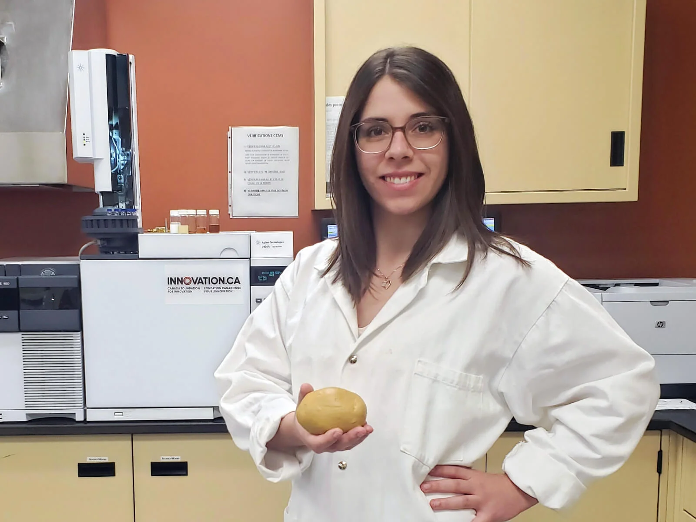

<meta charset="utf-8">
<link rel="apple-touch-icon" sizes="180x180" href="/apple-touch-icon.png">
<link rel="icon" type="image/png" sizes="32x32" href="/favicon-32x32.png">
<link rel="icon" type="image/png" sizes="16x16" href="/favicon-16x16.png">
<link rel="manifest" href="/site.webmanifest">
<link rel="mask-icon" href="/safari-pinned-tab.svg" color="#5bbad5">
<link rel="alternate" hreflang="en-us" href="../en/news.html">
<meta name="msapplication-TileColor" content="#da532c">
<meta name="theme-color" content="#ffffff">
<meta name="viewport" content="width=device-width, initial-scale=1">

<link rel="stylesheet" href="column_text_style.css">

     

 
 [<i class="fab fa-twitter"></i>](https://twitter.com/CPICSEVE) [<i class="fab fa-linkedin-in"></i>](https://www.linkedin.com/company/cpics/about/) [<i class="fab fa-facebook"></i>](https://www.facebook.com/CPICS-Comit%C3%A9-de-partenariat-international-du-Centre-S%C3%88VE-395275957711442) <a  href = "mailto:cpicseve@gmail.com"><i class="fas fa-envelope" align="center" style="font-size:24px"></i></a> 

<a class="twitter-timeline" data-height=1700px href="https://twitter.com/CPICSEVE?ref_src=twsrc%5Etfw">Tweets by CPICS</a> 

# {.tabset .tabset-fade .tabset-pills}

## 2021

### **2021-01-29**

Bienvenue à nos deux nouvelles membres de la CIPCS, Snehi Gazal (VP Communications) and Valeria Parra (VP Réseautage)!

Nous remercions [Claire Lettaneur], [Teura Barff] et [Marianne Bessette] pour leur travail. Elles ne feront plus partie du comité exécutif, mais elles seront toujours invitées à nos réunions et nos événements.

  

### **2021-01-27**

Félicitation à Michelle Boivin (UQTR), étudiante du centre SÈVE pour son intriguant projet de revalorisation de matière organique

  

## 2020

### **2020-11-06**

Felicitations à [Aracely Maribel Diaz Garza], notre secrétaire, pour son article sur la [dynamique temporelle des rhizobactéries dans les cultures cultivées dans un écosystème semi-aride](https://doi.org/10.3389/fsufs.2020.602283).

Bravo!

  

### **2020-11-10**

Prochain webinar Synbio Canada, organisé par une de nos membres, [Fatima Awwad].

[Inscriptions](https://www.synbiocanada.org/webinar?fbclid=IwAR0UzO2pRipx5sGNU_XaTmMth2y2Ie36ga0YuB1FaoL6MGCdlH2WdkbLL0k)

  

### **2020-11-06**

Felicitations à [Karen Cristine Goncalves], notre secrétaire, pour son preprint sur des effecteurs candidates des champignons. 

Bon travail!

Preprint: [Differential alteration of plant functions by homologous fungal candidate effectors](https://www.biorxiv.org/content/10.1101/2020.10.30.363010v1)

  

### **2020-11-05** 

Félicitations à [Fadoua Dhaouadi], [Fatima Awwad] et [Andrew Diamond] pour la publication de cette review scientifique sur les Diatomées.

Premier papier pour Fadoua Dhaouadi, ça se fête!

Papier: [Diatoms' breakthroughs in biotechnology: <i>Phaeodactylum tricornutum</i> as a model for producing high-added value molecules](https://doi.org/10.4236/ajps.2020.1110118)

  

### **2020-10-27**

Aujourd'hui, [Romaric Armel Mouafo Tchinda] a pratiqué sa présentation pour [Ma thèse en 180s de l'ACFAS](https://www.acfas.ca/prix-concours/ma-these-en-180-secondes/a-propos), où il représentera l'Université de Sherbrooke.

Suivez la [finale](https://www.facebook.com/events/662935087680358/?__cft__[0]=AZXNWtUJCyabQaszn7XJsgAxsRqUxaDbIQDJgpYKHlppwZhK9ObJmIhVBBh8JEnGpfa1fqzZZDRt1vBboYo7xpZxCB7OuQUAeMohCwbNwSpP1D6W-Qb-eHGUd3RXaiYHPt1GhsTbOt20HDDoREZBi7sP&__tn__=-UK-R) le 19 novembre.

  

### **2020-10-24**

Soumis par ses étudiants, les laboratoires des [Pr. Desgagné-Penix](https://www.linkedin.com/in/isabel-desgagn%C3%A9-penix-86081aa6/) et [Pr. Germain](https://www.researchgate.net/profile/Hugo_Germain) ont obtenu le [Prix d'excellence](https://cbie.ca/fr/laureat-e-s-prix-excellence-2020/) du [Bureau Canadien de l'Éducation Internationale](https://cbie.ca/fr/) pour les [politiques d'équité, de diversité et d'inclusion](https://www.youtube.com/watch?v=QPqd4jLihyU&t=3s&ab_channel=uqtr) menées au quotidien.

Félicitations!
<!-- blank line -->
<figure class="video_container">
<iframe src="https://www.youtube.com/embed/QPqd4jLihyU" frameborder="0" allow="accelerometer; autoplay; clipboard-write; encrypted-media; gyroscope; picture-in-picture" allowfullscreen></iframe>
</figure>
<!-- blank line -->

  

### **2020-10-02**

Nous sommes heureux de vous inviter au Concours d'affiches scientifiques étudiantes 2020 du Centre SÈVE. Cet événement virtuel aura lieu les 25 et 26 novembre 2020.
Le [portail d’inscription](https://event.fourwaves.com/fr/a6183e12-d9e0-420a-8038-0209e3bc0682/registration/) pour les participants et pour soumettre une communication par affiche est maintenant en ligne. Vous y trouverez aussi toutes les [informations sur l’événement](https://event.fourwaves.com/fr/a6183e12-d9e0-420a-8038-0209e3bc0682/pages).

Au plaisir de vous y voir en grand nombre !

  

### **2020-09-22**

Conférence Web du Centre SÈVE aujourd'hui, avec [Charles Roussin-Léveillée] de l'Université de Sherbrooke. Merci à tous les participants!

Source: [Centre SÈVE](https://www.facebook.com/centreseve/posts/1511546979039577)

  

### **2020-08-17**

Vous souhaitez en savoir plus sur notre invitée [Isabelle Laforest-Lapointe](https://twitter.com/Isabel_Laforest), de l'[USherbrooke](https://twitter.com/USherbrooke) pour le [25 août](whats_up.html#inscriptions)? 

Lisez cet [article](https://www.quebecscience.qc.ca/sciences/les-10-decouvertes-de-2017/4-probiotiques-forestiers/) sur son travail !! 

 

 

 [#whatsupconferences](https://twitter.com/hashtag/whatsupconferences?src=hashtag_click)  [#plantscience](https://twitter.com/hashtag/plantscience?src=hashtag_click) [#SEVE](https://twitter.com/hashtag/SEVE?src=hashtag_click) [#CPICS](https://twitter.com/hashtag/CPICS?src=hashtag_click)

  

### **2020-08-14**

Vous souhaitez en savoir plus sur notre invitée [Leena Tripathi](https://twitter.com/Leena_Tripathi) pour le [25 août](whats_up.html#inscriptions)?

Regardez cette vidéo de [IITA CGIAR](https://twitter.com/IITA_CGIAR) sur son travail !!  

 

<!-- blank line -->
<figure class="video_container">
<iframe src="https://www.youtube.com/embed/QBdYOA0dvRY" frameborder="0" allow="accelerometer; autoplay; encrypted-media; gyroscope; picture-in-picture" allowfullscreen style="display: block;margin-left: auto;  margin-right: auto;"></iframe>
</figure>
<!-- blank line -->
  
 
 [#whatsupconferences](https://twitter.com/hashtag/whatsupconferences?src=hashtag_click)  [#plantscience](https://twitter.com/hashtag/plantscience?src=hashtag_click) [#SEVE](https://twitter.com/hashtag/SEVE?src=hashtag_click) [#CPICS](https://twitter.com/hashtag/CPICS?src=hashtag_click)

  

### **2020-08-10**

**Le Centre SÈVE annonce une nouvelle série de Conferences web qui commence le 15 septembre!**

  
<table class="center">
<colgroup>
<col width="10%" />
<col width="17%" />
<col width="73%" />
</colgroup>
<tbody>
<tr>
<td> 15 Septembre</td><td>[François Belzile]</td><td>Aventures dans l’univers des SNP : un premier bilan de SoyaGen, un projet de grande envergure en génomique du soya</td>
</tr>
<tr>
<td>22 Septembre</td><td>[Charles Roussin-Léveillée]</td><td>The Apoplastic Battleground in Plant-Pathogen Interactions</td>
</tr><tr>
<td>29 Septembre</td><td>[Vicky Lévesque]</td><td>L’amendement en biochar: Une approche durable pour améliorer la santé du sol et la croissance de la plante en horticulture</td>
</tr><tr>
<td>13 Octobre</td><td>[Hamid Akbarzadeh]</td><td>Sustainable Bio-inspired Metamaterials</td>
</tr><tr>
<td>20  Octobre</td><td>[Valerio Hoyos-Villegas]</td><td>The McGill Field Phenomics Platform: Increasing Resolution for Complex Trait Improvement</td>
</tr><tr>
<td>27 Octobre</td><td>[Tagnon Missihoun]</td><td></td>
</tr>
</tbody>
</table>
 
<b>
 [Inscriptions](http://centreseve.recherche.usherbrooke.ca/fr/node/226#overlay-context=fr/node/223) 
</b>
  

### **2020-07-29**

Felicitations aux etudiants du Centre SEVE qui presentent dans le Worldwide Plant Biology Summit 2020.

Vous pouvez voir leurs affiches sur notre twitter (link en bas).

[<i class="fab fa-twitter"></i> Karuna Kapoor <i class="fab fa-twitter"></i>][1]
 

[<i class="fab fa-twitter"></i> Amir Bidhendi, Francisco Campos, Gaële Lajeunesse, and Julian Henao-Martinez <i class="fab fa-twitter"></i>][2]
 

[<i class="fab fa-twitter"></i> Adrien Fremont, Charles Roussin-Léveillée, Eszter Sas and Guilherme Silva-Martins <i class="fab fa-twitter"></i>][3]

[1]: https://twitter.com/CPICSEVE/status/1289294256281022465  "Tweet avec l'affiche de Karuna Kapoor"
[2]: https://twitter.com/CPICSEVE/status/1288906455446364160 "Tweet avec les affiches d'Amir Bidhendi, Francisco Campos, Gaële Lajeunesse, et Julian Henao-Martinez"
[3]: https://twitter.com/CPICSEVE/status/1288912736412405763 "Tweet avec les affiches d'Adrien Fremont, Charles Roussin-Léveillée, Eszter Sas et Guilherme Silva-Martins"

<table>
<colgroup>
<col width="15%" />
<col width="15%" />
<col width="15%" />
<col width="15%" />
<col width="15%" />
</colgroup>
<thead>
<tr class="header">
<th><b>IRBV</b></th><th><b>McGill University</b></th><th><b>Université de Laval</b></th><th><b>Université de Montréal</b></th><th><b>Université de Sherbrooke</b></th>
</tr>
</thead>
<tbody>
<tr>
<td>Camille Auger</td><td>[Amir Bidhendi]</td><td>[Francisco Campos]</td><td>[Eszter Sas]</td><td>[Charles Roussin-Léveillée]</td>
</tr>
<tr class="even">
<td>[Adrien Fremont]</td><td>[Karuna Kapoor]</td><td></td><td></td><td>Gaële Lajeunesse</td>
</tr>
<tr class="odd">
<td></td><td>[Meha Sharma]</td><td></td><td></td><td>[Guilherme Silva-Martins]</td>
</tr>
<tr class="even">
<td></td><td>[Julian Henao-Martinez]</td><td></td><td></td><td>[Iauhenia Isayenka]</td>
</tr>
</tbody>
</table>

  

### **2020-07-07**

**[Fatima Awwad]**, postdoc de l'_UQTR_, nous a presenté aujourd'hui le potentiel des microalgues dans les conférences Web du Centre SÈVE. Merci à tous les participants!

Source: [Centre SEVE](https://www.facebook.com/centreseve/photos/a.445334158994203/1444690485725227/)

  

### **2020-06-16**

Une autre captivante conférence Web du Centre SÈVE aujourd'hui, avec **[Karen Cristine Gonçalves]** de l'_UQTR_. Merci à tous les participants!

Source: [Centre SEVE](https://www.facebook.com/centreseve/photos/a.445334158994203/1427129864147956/)

  

### **2020-05-09**

Bienvenue à **[Aracely Maribel Diaz Garza]** et **[Vincent Charron-Lamoureux]** à l'administration du CPICS à titre de secrétaire en remplacement de **[Alexia Bertholon]**, qui a dû se retirer du comité.

**_Félicitation à vous deux !_**

  

### **2020-03-02**

Félicitations à **[Claire Letanneur]**, doctorante à l'_UQTR_, pour l'octroi d'une subvention au premier concours du programme DIALOGUE - volet relève étudiante! Seulement quatre projets étaient sélectionnés pour chaque secteur de recherche des FRQ.

  

## 2019

### **2019-09-30**

Nous rémercions Rose-Marie Bell, étudiante à la maitrise en biologie vegetale à l'Université Laval, pour avoir partagé son experience au **[SYMPOSIUM INTERNATIONAL DU CENTRE SÈVE] 2019** dans le journal étudiant [**_L'Agral_**](https://journalagral.wordpress.com/).

[**_OGM, tabou démystifié : topo sur le symposium international annuel du centre SÈVE_**](https://journalagral.wordpress.com/2019/09/29/ogm-tabou-demystifie-topo-sur-le-symposium-international-annuel-du-centre-seve/) 

  

### **2019-08-29**

Quelques souvenirs du **[SYMPOSIUM INTERNATIONAL DU CENTRE SÈVE] 2019**

[Département de biologie - Université de Sherbrooke](https://www.facebook.com/biologie.USherbrooke/?__cft__[0]=AZUmaWk-zvwOikcNCt0OcvfmvkrKzFs2buKKe4i7TbO_wFdba43AV9Qkt9jzIiuCnPC89OojsapHhjomKzSxYirPALxNNf7i4_xczXp8scgjmlGSvsz9PaAH1Qe_K_5T7UAoQv0hGdhOZyfVEP-t370IioP1WMCoLP79KMgzfiSfAQ&__tn__=kK-R)

Une soixantaine de participant(e)s et de conférencier(ière)s ont pu partager leurs connaissances, échanger et tisser des liens sur le thème de _« La biotechnologie au service de la sécurité alimentaire »_.

Objectif atteint pour ce premier symposium organisé par les étudiants du CPICS !

Merci encore une fois aux commanditaires de l’événement :

- [Fonds d’appui à l’engagement étudiant (FAEE) de l’UdeS](https://www.usherbrooke.ca/etudiants/vie-etudiante/financement-pour-les-activites-etudiantes/fonds-dappui-a-lengagement-etudiant/)

- [Faculté des sciences](https://www.usherbrooke.ca/sciences/)

- [Regroupement des étudiantes et des étudiants de maîtrise, de diplôme et de doctorat de l’UdeS (REMDUS)](http://www.remdus.qc.ca/fr/)

- [Regroupement étudiant des chercheurs et chercheuses en sciences de l’UdeS (RECSUS)](https://www.recsus.org/)

- [VWR](https://www.vwr.com/)

- [Sarstedt](https://www.sarstedt.com/en/home/)

  

### **2019-06-11**

Les inscriptions, pour la première édition du **[SYMPOSIUM INTERNATIONAL DU CENTRE SÈVE] 2019** qui aura lieu le **_23 août prochain_**, sont maintenant ouvertes!

Les étudiants ont la possibilité de soumettre un résumé afin d’être sélectionnés pour une présentation orale. 

Voici les informations à savoir: 

- La date limite pour soumettre un résumé est le **lundi 22 juillet**.

- Le résumé doit être d’un **maximum de 200 mots**.

- Il devra être envoyé à l’adresse: _cpicseve@gmail.com_, en mettant en cc. _chantal.binda@usherbrooke.ca_ et _mina.zitouni@usherbrooke.ca_.

- La durée prévue par présentation est de *10 minutes*, suivi de 5 minutes de questions.

- Compte tenu de la portée internationale du symposium, l'anglais sera priorisé comme langue de présentation et de soumission des résumés. Cependant le français sera aussi accepté.

- La décision prise par le Comité sera communiquée à chaque auteur au plus tard le lundi 2 août 2019.

Pour vous inscrire, rendez-vous sur le site [web du Centre SÈVE](http://tiny.cc/ugt47y).

Vous y trouverez aussi le planning de la journée et bien plus, alors ne tardez plus. 

Nous avons hâte de vous y voir. 

  

### **2019-03-14**

Après une longue période d’attente, nous avons enfin le plaisir de vous présenter le **Comité de Partenariat du Centre SÈVE (CPICS)**. Comme vous le savez nous aspirons à l'établissement de partenariats avec des chercheurs du monde entier. Nous sommes d’ailleurs en pleine préparation du **[SYMPOSIUM INTERNATIONAL DU CENTRE SÈVE] 2019** qui portera cette année sur **« La biotechnologie au service de la sécurité alimentaire »**.

Restez à l’affût pour plus d’informations sur le symposium, mais aussi pour en savoir plus sur les recherches menées au sein du Centre SÈVE ainsi qu’à l’extérieur du Québec et d’autre nouvelles palpitantes dans le monde de la science. 

En attendant nous vous laissons avec cette belle photo qui liste tous les membres du bureau exécutif du CPICS de cette année.

[Charles Roussin-Léveillée]: https://www.linkedin.com/in/charles-roussin-l%C3%A9veill%C3%A9e-075851a6/?originalSubdomain=ca/
[Amir Bidhendi]: https://www.researchgate.net/profile/Amir_Bidhendi/experience/
[Francisco Campos]: https://www.researchgate.net/profile/Francisco_Campos23/
[Eszter Sas]: https://www.linkedin.com/in/eszter-sas-1b907141/?originalSubdomain=ca/
[Adrien Fremont]: https://bio.umontreal.ca/repertoire-departement/etudiants-aux-cycles-superieurs/adrien-fremont/
[Karuna Kapoor]: https://scholar.google.ca/citations?user=gHKRIVEAAAAJ&hl=en/
[Meha Sharma]: https://www.researchgate.net/profile/Meha_Sharma5/
[Guilherme Silva-Martins]: https://www.linkedin.com/in/guilherme-martins-1268202b/
[Julian Henao-Martinez]: https://www.linkedin.com/in/julian-martinez-henao/?originalSubdomain=ca/
[Iauhenia Isayenka]: https://www.researchgate.net/profile/Iauhenia_Isayenka/
[François Belzile]: http://www.ibis.ulaval.ca/en/research/francois-belzile/
[Vicky Lévesque]: https://www.linkedin.com/in/vickylevesque/
[Hamid Akbarzadeh]: https://www.mcgill.ca/macdonald/abdolhamid-akbarzadeh-shafaroudi/
[Valerio Hoyos-Villegas]: https://www.mcgill.ca/plant/faculty/valerio-hoyos-villegas/
[Tagnon Missihoun]: https://www.researchgate.net/profile/Tagnon_M
[Fadoua Dhaouadi]: https://www.linkedin.com/in/dhaouadi-fadoua-276b191a3/
[Fatima Awwad]: https://www.linkedin.com/in/fatima-awwad-06553a29/
[Andrew Diamond]: https://www.linkedin.com/in/andrew-diamond-74390b137/) 
[Karen Cristine Goncalves]: https://www.linkedin.com/in/karen-cristine-gon%C3%A7alves-dos-santos-05847a113/
[Aracely Maribel Diaz Garza]: https://www.linkedin.com/in/aracely-maribel-diaz-garza-6989b5169/
[Vincent Charron-Lamoureux]: https://www.researchgate.net/profile/Vincent_Charron-Lamoureux
[Jennifer Paillassa]: https://www.linkedin.com/in/jennifer-paillassa-087600a3/
[Marianne Bessette]: https://www.linkedin.com/in/marianne-bessette-b16287146/
[Julie Yergeau]: https://www.linkedin.com/in/julie-yergeau-b58508186/
[Serge Nouemssi]: https://www.linkedin.com/in/serge-basile-nouemssi-a95913121/
[Guilherme Silva Martins]: https://www.linkedin.com/in/guilherme-martins-1268202b/
[Claire Letanneur]: https://www.researchgate.net/profile/Claire_Letanneur
[Teura Barff]: https://www.linkedin.com/in/teura-barff-66526647/
[Matthieu Glanowski]: https://www.linkedin.com/in/matthieu-glanowski-585254116/
[Ingrid Berenice Sanchez Carrillo]: https://www.linkedin.com/in/ingrid-sanchez/
[Romaric Armel Mouafo Tchinda]: https://www.linkedin.com/in/romaric-armel-mouafo-tchinda-ba266185/
[Safa Labidi]: https://www.linkedin.com/in/safa-labidi-41749b73/
[Alexia Bertholon]: https://www.linkedin.com/in/alexiabertholon/
[SYMPOSIUM INTERNATIONAL DU CENTRE SÈVE]: https://cpics.netlify.app/fr/symposia.html
