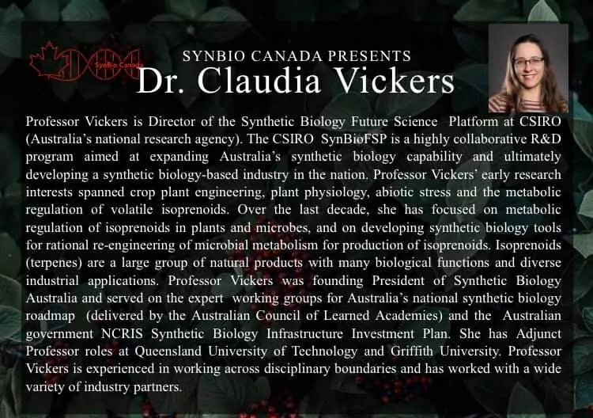
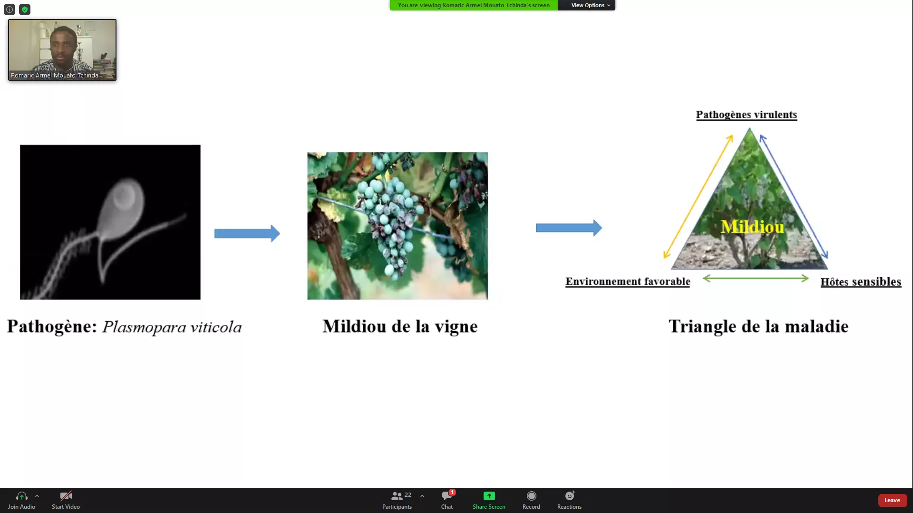

<meta charset="utf-8">
<link rel="apple-touch-icon" sizes="180x180" href="/apple-touch-icon.png">
<link rel="icon" type="image/png" sizes="32x32" href="/favicon-32x32.png">
<link rel="icon" type="image/png" sizes="16x16" href="/favicon-16x16.png">
<link rel="manifest" href="/site.webmanifest">
<link rel="mask-icon" href="/safari-pinned-tab.svg" color="#5bbad5">
<link rel="alternate" hreflang="en-us" href="../en/news.html">
<meta name="msapplication-TileColor" content="#da532c">
<meta name="theme-color" content="#ffffff">
<meta name="viewport" content="width=device-width, initial-scale=1">

<link rel="stylesheet" href="column_text_style.css">

     

 
 [<i class="fab fa-twitter"></i>](https://twitter.com/CPICSEVE) [<i class="fab fa-linkedin-in"></i>](https://www.linkedin.com/company/cpics/about/) [<i class="fab fa-facebook"></i>](https://www.facebook.com/CPICS-Comit%C3%A9-de-partenariat-international-du-Centre-S%C3%88VE-395275957711442) <a  href = "mailto:cpicseve@gmail.com"><i class="fas fa-envelope" align="center" style="font-size:24px"></i></a> 

<a class="twitter-timeline" data-height=1700px href="https://twitter.com/CPICSEVE?ref_src=twsrc%5Etfw">Tweets by CPICS</a> 

# {.tabset .tabset-fade .tabset-pills}

## 2021

### **2021-08-30**

Voulez vous savoir plus sur les defis des postdocs, la vie d'une bioinformaticienne, ou le parcours academique de notre présidente, Dre [Karen Cristine Goncalves]?

Regardez son entrevue par le doctorant Nikunj Sharma, de l'Université du Québec à Trois-Rivières!

<!-- blank line -->
<figure class="video_container">
<iframe src="https://www.youtube.com/embed/2Xx9Anv2nqY" frameborder="0" allow="accelerometer; autoplay; clipboard-write; encrypted-media; gyroscope; picture-in-picture" allowfullscreen></iframe>
</figure>
<!-- blank line -->

  

### **2021-05-05**

Felicitations à [Karen Cristine Goncalves], notre présidente, pour avoir soutenu sa thèse de doctorat et pour son article publié en MDPI Microorganisms:
[Unrelated Fungal Rust Candidate Effectors Act on Overlapping Plant Functions](https://doi.org/10.3390/microorganisms9050996).

Bravo!

  

### **2021-04-06**{.tabset .tabset-fade .tabset-pills}

Bien que l'année 2021 ne fasse que commencer, les chercheur(euse)s membres du Centre SÈVE ont été très occupé(e)s.
Félicitations pour leur excellent travail durant cette pandémie !

Jetez un coup d'œil à leurs publications ici :

#### Jacqueline C Bede

__Jacqueline C Bede__

- <a href='https://www.intechopen.com/online-first/the-endangered-species-dioon-edule-in-the-sierra-madre-oriental-in-san-luis-potos-demography-and-gen'>The Endangered Species _Dioon edule_ in the Sierra Madre Oriental in San Luis Potosí: Demography and Genetic Diversity</a>
- <a href='https://apsjournals.apsnet.org/doi/abs/10.1094/PHYTOFR-07-20-0002-R'>Distinct _Arabidopsis_ Responses to Two Generalist Caterpillar Species Differing in Host Breadth</a>

  

#### Richard Bélanger

__Richard Bélanger__

- <a href='https://apsjournals.apsnet.org/doi/abs/10.1094/PHYTO-08-20-0348-FI'>Genomic profiling of virulence in the soybean cyst nematode using single-nematode sequencing</a>

  

#### Francois Belzile

__Francois Belzile__

- <a href='https://www.researchsquare.com/article/rs-244194/latest.pdf'>GWAS identifies a wheat orthologue of the rice D11 gene as an important contributor to grain size in an international collection of hexaploid wheat</a>
- <a href='https://cdnsciencepub.com/doi/abs/10.1139/CJPS-2020-0187'>Genome-wide association study (GWAS) to identify soybean stem pushing resistance and lodging resistance loci</a>
- <a href='https://academic.oup.com/g3journal/advance-article-abstract/doi/10.1093/g3journal/jkab031/6128399'>Genome Assembly of the Canadian Two-row Malting Barley Cultivar AAC Synergy</a>
- <a href='https://onlinelibrary.wiley.com/doi/abs/10.1111/pbi.13466'>Soybean ( _Glycine max_ ) Haplotype Map (GmHapMap): a universal resource for soybean translational and functional genomics</a>
- <a href='https://onlinelibrary.wiley.com/doi/abs/10.1111/pbi.13551'>A bumper crop of SNPs in soybean through high‐density genotyping‐by‐sequencing (HD‐GBS)</a>
- <a href='https://europepmc.org/article/med/33606262'>Accurate Imputation of Untyped Variants from Deep Sequencing Data.</a>

  

#### Jean-Philippe Bellenger

__Jean-Philippe Bellenger__

- <a href='https://www.cambridge.org/core/journals/lichenologist/article/stigonema-associated-with-boreal-stereocaulon-possesses-the-alternative-vanadium-nitrogenase/4AB78369AB598919146F33D31C9A4063'> _Stigonema_ associated with boreal _Stereocaulon_ possesses the alternative vanadium nitrogenase</a>
- <a href='https://www.frontiersin.org/articles/10.3389/fmicb.2020.611792/full'>Quantification of Moss-Associated Cyanobacteria Using Phycocyanin Pigment Extraction</a>

  

#### Marc Bélisle

__Marc Bélisle__

- <a href='https://www.biorxiv.org/content/10.1101/2021.03.24.436831v1.abstract'>Negative effects of agricultural intensification on energetic gain rates of a declining aerial insectivore</a>
- <a href='https://www.biorxiv.org/content/10.1101/2021.02.02.427782v1.abstract'>Combined influence of food availability and agricultural intensification on a declining aerial insectivore</a>

  

#### Robert L Bradley

__Robert L Bradley__

- <a href='https://www.sciencedirect.com/science/article/abs/pii/S0031405621000214?via%3Dihub'>Earthworms did not increase long-term nitrous oxide fluxes in perennial forage and riparian buffer ecosystems</a>

  

#### Laurent Cappadocia

__Laurent Cappadocia__

- <a href='https://www.researchgate.net/profile/Marc-Lussier/publication/349735800_Functional_interaction_of_ubiquitin_ligase_RNF167_with_UBE2D1_and_UBE2N_promotes_ubiquitination_of_AMPA_receptor/links/60445089a6fdcc9c781ade9f/Functional-interaction-of-ubiquitin-ligase-RNF167-with-UBE2D1-and-UBE2N-promotes-ubiquitination-of-AMPA-receptor.pdf'>Functional interaction of ubiquitin ligase RNF167 with UBE2D1 and UBE2N promotes ubiquitination of AMPA receptor</a>
- <a href='https://www.sciencedirect.com/science/article/pii/S0955286320305507'>Functional targeting of the TGF-βR1 kinase domain and downstream signaling: A role for the galloyl moiety of green tea-derived catechins in ES-2 ovarian clear cell carcinoma</a>

  

#### Jean-Benoit Charron

__Jean-Benoit Charron__

- <a href='https://nph.onlinelibrary.wiley.com/doi/abs/10.1111/nph.16945'>Transcriptional memories mediate the plasticity of cold stress responses to enable morphological acclimation in _Brachypodium distachyon_</a>

  

#### Gerald Chouinard

__Gerald Chouinard__

- <a href='https://www.mdpi.com/2075-4450/12/3/197'>Pest Activity and Protection Practices: Four Decades of Transformation in Quebec Apple Orchards</a>

  

#### Isabel Desgagne-Penix

__Isabel Desgagne-Penix__

- <a href='https://www.frontiersin.org/articles/10.3389/fmars.2021.636613/full?&utm_source=Email_to_authors_&utm_medium=Email&utm_content=T1_11.5e1_author&utm_campaign=Email_publication&field&journalName=Frontiers_in_Marine_Science&id=636613&fbclid=IwAR2v-e12Zt4B8vFqMAJWjb56j-82_4gLvGDd69Up_jmCFw73k3-YwJ8F4uQ'>Diatoms Biotechnology: Various Industrial Applications for a Greener Tomorrow</a>

  

#### Martine Dorais

__Martine Dorais__

- <a href='https://cdnsciencepub.com/doi/abs/10.1139/CJSS-2020-0147'>Reducing peat in growing media: impact on N content, microbial activity and CO2 and N2O emissions</a>

  

#### Pierre Dutilleul

__Pierre Dutilleul__

- <a href='https://agupubs.onlinelibrary.wiley.com/doi/abs/10.1029/2020GL089673'>Periodicity analysis of earthquake occurrence and hypocenter depth near Parkfield, California, 1994-2002 versus 2006-2014</a>
- <a href='https://www.sciencedirect.com/science/article/pii/S0016706121001762'>Macroaggregate persistence: definition and applications to describe soil surface dynamics</a>

  

#### Valérie Fournier

__Valérie Fournier__

- <a href='https://scholar.google.com/scholar?oi=bibs&cluster=560255130753671258&btnI=1&hl=fr'>Overwintering survival of _Drosophila suzukii_ (Diptera: Drosophilidae) in temperature regimes emulating partly protected winter conditions in a cold–temperate climate of Québec, Canada</a>

  

#### Anja Geitmann

__Anja Geitmann__

- <a href='https://scholar.google.co.uk/scholar?oi=bibs&cluster=13339576317686526099&btnI=1&hl=en'>Biomechanics of hair fibre growth: A multi-scale modeling approach</a>

  

#### Valerio Hoyos-Villegas

__Valerio Hoyos-Villegas__

- <a href='https://scholar.google.com/scholar?oi=bibs&cluster=14849547404776337262&btnI=1&hl=en'>Transpiration rate of white clover (_Trifolium repens_ L.) cultivars in drying soil</a>

  

#### Hugo Germain

__Hugo Germain__

- <a href='https://scholar.google.com/scholar?oi=bibs&cluster=1838276166457437533&btnI=1&hl=en'>Diatoms Biotechnology: Various Industrial Applications for a Greener Tomorrow</a>
- <a href='https://scholar.google.com/scholar?oi=bibs&cluster=5452494446004638908&btnI=1&hl=en'>Recent Development on Plant Aldehyde Dehydrogenase Enzymes and Their Functions in Plant Development and Stress Signaling</a>
- <a href='https://scholar.google.com/scholar?oi=bibs&cluster=11426209543910114205&btnI=1&hl=en'>Asymptomatic carriers of COVID-19 in a confined adult community population in Quebec: a cross-sectional study</a>

  

#### Isabelle Laforest-Lapointe

__Isabelle Laforest-Lapointe__

- <a href='https://www.mdpi.com/2227-9059/9/1/66'>Concurrent Prebiotic Intake Reverses Insulin Resistance Induced by Early-Life Pulsed Antibiotic in Rats</a>
- <a href='https://www.tandfonline.com/doi/abs/10.1080/19490976.2020.1857513'>Maternal consumption of artificially sweetened beverages during pregnancy is associated with infant gut microbiota and metabolic modifications and increased infant body mass index</a>

  

#### Daniel Kierzkowski

__Daniel Kierzkowski__

- <a href='https://www.sciencedirect.com/science/article/pii/S0960982220318364'>Mechanochemical feedback mediates tissue bending required for seedling emergence</a>

#### Damase Khasa

__Damase Khasa__

- <a href='https://journals.plos.org/plosone/article?id=10.1371/journal.pone.0248485'>16S rRNA gene amplicon-based metagenomic analysis of bacterial communities in the rhizospheres of selected mangrove species from Mida Creek and Gazi Bay, Kenya</a>
- <a href='https://www.mdpi.com/969402'>Early Selection of Tree Species for Regeneration in Degraded Woodland of Southeastern Congo Basin</a>
- <a href='https://popups.uliege.be/2295-8010/index.php?id=1740'>Evaluation of an _Acacia mangium_ Provenance Trial after Seven Years, on the Ibi-Batéké Plateau, Democratic Republic of the Congo</a>
- <a href='https://search.proquest.com/openview/7467a2cccd51af57bb8a25ef94af4430/1?pq-origsite=gscholar&cbl=2032398'>Early Selection of Tree Species for Regeneration in Degraded Woodland of Southeastern Congo Basin</a>

  

#### Vincent Maire

__Vincent Maire__

- <a href='https://www.pnas.org/content/118/7/e2019355118.short'>Functional rarity and evenness are key facets of biodiversity to boost multifunctionality</a>

  

#### Dominique Michaud

__Dominique Michaud__

- <a href='https://patents.google.com/patent/US10907168B2/en'>Jasmonic acid pathway activator</a>

  

#### Benjamin Mimee

__Benjamin Mimee__

- <a href='https://www.frontiersin.org/articles/10.3389/fmicb.2020.619827/full'>Neonicotinoid Seed Treatments Have Significant Non-target Effects on Phyllosphere and Soil Bacterial Communities</a>
- <a href='https://apsjournals.apsnet.org/doi/abs/10.1094/PHYTO-09-20-0418-RVW'>Recent advances in population genomics of plant-parasitic nematodes</a>
- <a href='https://apsjournals.apsnet.org/doi/abs/10.1094/PHYTO-08-20-0348-FI'>Genomic profiling of virulence in the soybean cyst nematode using single-nematode sequencing</a>

  

#### Maxime Paré

__Maxime Paré__

- <a href='https://www.sciencedirect.com/science/article/pii/S0168192321000320'>Cold acclimation and deacclimation in wild blueberry: Direct and indirect influence of environmental factors and non-structural carbohydrates</a>

  

#### Steeve Pepin

__Steeve Pepin__

- <a href='https://www.sciencedirect.com/science/article/pii/S0168192321000939'>Can a physically-based land surface model accurately represent evapotranspiration partitioning? A case study in a humid boreal forest</a>
- <a href='https://onlinelibrary.wiley.com/doi/abs/10.1002/hyp.14021'>Observations of canopy storage capacity and wet canopy evaporation in a humid boreal forest</a>

  

#### Edel Pérez-López

__Edel Pérez-López__

- <a href='https://link.springer.com/article/10.1007/s13314-020-00415-7'>Molecular characterization of a 'Candidatus Phytoplasma asteris'-related strain (16SrI-B/cpn60UT I-IB) affecting daisies ( _Argyranthemum_ spp.) in Mexico</a>

  

#### Anne-Lise Routier-Kierzkowska

__Anne-Lise Routier-Kierzkowska__

- <a href='https://www.sciencedirect.com/science/article/pii/S0960982220318364'>Mechanochemical feedback mediates tissue bending required for seedling emergence</a>

  

#### Philippe Seguin

__Philippe Seguin__

- <a href='http://scholar.google.com/scholar?cluster=10382021517732928995&hl=en&oi=scholarr'>Validation in Quebec of equations to predict the nutritional value of alfalfa in the field before harvest</a>

  

#### Jaswinder Singh

__Jaswinder Singh__

- <a href='https://journals.plos.org/plosone/article?id=10.1371/journal.pone.0247380'>The effect of light quality on plant physiology, photosynthetic, and stress response in _Arabidopsis thaliana_ leaves</a>
- <a href='https://academic.oup.com/g3journal/advance-article-abstract/doi/10.1093/g3journal/jkab031/6128399'>Genome Assembly of the Canadian Two-row Malting Barley Cultivar AAC Synergy</a>

  

#### Donald Smith

__Donald Smith__

- <a href='https://www.mdpi.com/1047014'>Plant Holobiont Theory: The Phytomicrobiome Plays a Central Role in Evolution and Success</a>
- <a href='https://www.sciencedirect.com/science/article/pii/S1364032120309758'>Biomass for a sustainable bioeconomy: An overview of world biomass production and utilization</a>
- <a href='https://www.frontiersin.org/articles/10.3389/fsufs.2021.630628/full'>Thuricin17 Production and Proteome Differences in _Bacillus thuringiensis_ NEB17 Cell-Free Supernatant Under NaCl Stress</a>
- <a href='https://www.frontiersin.org/articles/10.3389/fmicb.2021.634807/full'>Microbial Derived Compounds, a Step Toward Enhancing Microbial Inoculants Technology for Sustainable Agriculture</a>
- <a href='https://doi.org/10.3389/fsufs.2020.617978'>Rhizobacteria from root nodules of an indigenous legume enhance salinity stress tolerance in Soybean</a>
- <a href='https://www.ncbi.nlm.nih.gov/pmc/articles/PMC8009966/'>Plant associated rhizobacteria for biocontrol and plant growth enhancement</a>
- <a href='https://link.springer.com/chapter/10.1007/978-981-15-6125-2_13'>Inter-organismal signaling in the rhizosphere</a>

  

#### Martina Stromvik

__Martina Stromvik__

- <a href='https://www.tandfonline.com/doi/abs/10.1080/23802359.2021.1883486'>The complete plastome sequences of nine diploid potato clones</a>
- <a href='https://www.tandfonline.com/doi/abs/10.1080/23802359.2021.1886016'>Complete mitogenome assemblies from a panel of 13 diverse potato taxa</a>

  

#### Joann Whalen

__Joann Whalen__

- <a href='https://www.sciencedirect.com/science/article/pii/S0016706121001762'>Macroaggregate persistence: Definition and applications to describe soil surface dynamics</a>
- <a href='https://www.sciencedirect.com/science/article/pii/S0045653521002502'>Quantitative screening for cyanotoxins in soil and groundwater of agricultural watersheds in Quebec, Canada</a>
- <a href='http://scholar.google.com/scholar?cluster=17221476388349032923&hl=en&oi=scholarr'>Earthworms in soil ecology and organic waste management (Preface)</a>
- <a href='https://link.springer.com/article/10.1007/s00374-020-01537-x'>Freeze-thaw cycles release nitrous oxide produced in frozen agricultural soils</a>
- <a href='https://www.sciencedirect.com/science/article/pii/S1002016020600868'>Earthworm contributions to soil nitrogen supply in corn-soybean agroecosystems in Quebec, Canada</a>
- <a href='https://link.springer.com/chapter/10.1007/978-3-030-49244-1_3'>Perspectives to Increase the Precision of Soil Fertility Management on Farms</a>
- <a href='https://www.sciencedirect.com/science/article/pii/S135223102030529X'>Seasonal variation of aerosol composition in Orange County, Southern California</a>
- <a href='https://www.sciencedirect.com/science/article/pii/S0929139320307150'>Fall-applied manure with cover crop did not increase nitrous oxide emissions during spring freeze-thaw periods</a>
- <a href='https://cdnsciencepub.com/doi/abs/10.1139/cjss-2020-0126'>Fall-applied cattle manure did not provide nitrogen fertilizer value to spring cereal crops</a>
- <a href='https://besjournals.onlinelibrary.wiley.com/doi/abs/10.1111/1365-2745.13548'>Functional diversity of decomposers modulates litter decomposition affected by plant invasion along a climate gradient</a>
- <a href='https://www.sciencedirect.com/science/article/pii/S0045653521007451'>Characteristics and health risk assessment of heavy metal contamination from dust collected on household HVAC air filters</a>
- <a href='https://www.sciencedirect.com/science/article/pii/S0031405621000214'>Earthworms did not increase long-term nitrous oxide fluxes in perennial forage and riparian buffer ecosystems</a>
- <a href='https://www.sciencedirect.com/science/article/pii/S1002016020600807'>Earthworm populations are stable in temperate agricultural soils receiving wood-based biochar</a>
- <a href='https://www.sciencedirect.com/science/article/pii/S1002016020600844'>Earthworm functional groups are related to denitrifier activity in riparian soils</a>

	

  

### **2021-01-29**

Bienvenue à nos deux nouvelles membres de la CIPCS, [Snehi Gazal] (VP Communications) and [Valeria Parra] (VP Réseautage)!

Nous remercions [Claire Lettaneur], [Teura Barff] et [Marianne Bessette] pour leur travail. Elles ne feront plus partie du comité exécutif, mais elles seront toujours invitées à nos réunions et nos événements.

  

### **2021-01-27**

Félicitation à Michelle Boivin (UQTR), étudiante du centre SÈVE pour son intriguant projet de revalorisation de matière organique.

  

## 2020

### **2020-11-06**

Felicitations à [Aracely Maribel Diaz Garza], notre secrétaire, pour son article sur la [dynamique temporelle des rhizobactéries dans les cultures cultivées dans un écosystème semi-aride](https://doi.org/10.3389/fsufs.2020.602283).

Bravo!

  

### **2020-11-10**

Prochain webinar Synbio Canada, organisé par une de nos membres, [Fatima Awwad].

[Inscriptions](https://www.synbiocanada.org/webinar?fbclid=IwAR0UzO2pRipx5sGNU_XaTmMth2y2Ie36ga0YuB1FaoL6MGCdlH2WdkbLL0k)

  

### **2020-11-06**

Felicitations à [Karen Cristine Goncalves], notre secrétaire, pour son preprint sur des effecteurs candidates des champignons. 

Bon travail!

Preprint: [Differential alteration of plant functions by homologous fungal candidate effectors](https://www.biorxiv.org/content/10.1101/2020.10.30.363010v1)

  

### **2020-11-05** 

Félicitations à [Fadoua Dhaouadi], [Fatima Awwad] et [Andrew Diamond] pour la publication de cette review scientifique sur les Diatomées.

Premier papier pour Fadoua Dhaouadi, ça se fête!

Papier: [Diatoms' breakthroughs in biotechnology: <i>Phaeodactylum tricornutum</i> as a model for producing high-added value molecules](https://doi.org/10.4236/ajps.2020.1110118)

  

### **2020-10-27**

Aujourd'hui, [Romaric Armel Mouafo Tchinda] a pratiqué sa présentation pour [Ma thèse en 180s de l'ACFAS](https://www.acfas.ca/prix-concours/ma-these-en-180-secondes/a-propos), où il représentera l'Université de Sherbrooke.

Suivez la [finale](https://www.facebook.com/events/662935087680358/?__cft__[0]=AZXNWtUJCyabQaszn7XJsgAxsRqUxaDbIQDJgpYKHlppwZhK9ObJmIhVBBh8JEnGpfa1fqzZZDRt1vBboYo7xpZxCB7OuQUAeMohCwbNwSpP1D6W-Qb-eHGUd3RXaiYHPt1GhsTbOt20HDDoREZBi7sP&__tn__=-UK-R) le 19 novembre.

  

### **2020-10-24**

Soumis par ses étudiants, les laboratoires des [Pr. Desgagné-Penix](https://www.linkedin.com/in/isabel-desgagn%C3%A9-penix-86081aa6/) et [Pr. Germain](https://www.researchgate.net/profile/Hugo_Germain) ont obtenu le [Prix d'excellence](https://cbie.ca/fr/laureat-e-s-prix-excellence-2020/) du [Bureau Canadien de l'Éducation Internationale](https://cbie.ca/fr/) pour les [politiques d'équité, de diversité et d'inclusion](https://www.youtube.com/watch?v=QPqd4jLihyU&t=3s&ab_channel=uqtr) menées au quotidien.

Félicitations!
<!-- blank line -->
<figure class="video_container">
<iframe src="https://www.youtube.com/embed/QPqd4jLihyU" frameborder="0" allow="accelerometer; autoplay; clipboard-write; encrypted-media; gyroscope; picture-in-picture" allowfullscreen></iframe>
</figure>
<!-- blank line -->

  

### **2020-10-02**

Nous sommes heureux de vous inviter au Concours d'affiches scientifiques étudiantes 2020 du Centre SÈVE. Cet événement virtuel aura lieu les 25 et 26 novembre 2020.
Le [portail d’inscription](https://event.fourwaves.com/fr/a6183e12-d9e0-420a-8038-0209e3bc0682/registration/) pour les participants et pour soumettre une communication par affiche est maintenant en ligne. Vous y trouverez aussi toutes les [informations sur l’événement](https://event.fourwaves.com/fr/a6183e12-d9e0-420a-8038-0209e3bc0682/pages).

Au plaisir de vous y voir en grand nombre !

  

### **2020-09-22**

Conférence Web du Centre SÈVE aujourd'hui, avec [Charles Roussin-Léveillée] de l'Université de Sherbrooke. Merci à tous les participants!

Source: [Centre SÈVE](https://www.facebook.com/centreseve/posts/1511546979039577)

  

### **2020-08-17**

Vous souhaitez en savoir plus sur notre invitée [Isabelle Laforest-Lapointe](https://twitter.com/Isabel_Laforest), de l'[USherbrooke](https://twitter.com/USherbrooke) pour le [25 août](whats_up.html#inscriptions)? 

Lisez cet [article](https://www.quebecscience.qc.ca/sciences/les-10-decouvertes-de-2017/4-probiotiques-forestiers/) sur son travail !! 

 

 

 [#whatsupconferences](https://twitter.com/hashtag/whatsupconferences?src=hashtag_click)  [#plantscience](https://twitter.com/hashtag/plantscience?src=hashtag_click) [#SEVE](https://twitter.com/hashtag/SEVE?src=hashtag_click) [#CPICS](https://twitter.com/hashtag/CPICS?src=hashtag_click)

  

### **2020-08-14**

Vous souhaitez en savoir plus sur notre invitée [Leena Tripathi](https://twitter.com/Leena_Tripathi) pour le [25 août](whats_up.html#inscriptions)?

Regardez cette vidéo de [IITA CGIAR](https://twitter.com/IITA_CGIAR) sur son travail !!  

 

<!-- blank line -->
<figure class="video_container">
<iframe src="https://www.youtube.com/embed/QBdYOA0dvRY" frameborder="0" allow="accelerometer; autoplay; encrypted-media; gyroscope; picture-in-picture" allowfullscreen style="display: block;margin-left: auto;  margin-right: auto;"></iframe>
</figure>
<!-- blank line -->
  
 
 [#whatsupconferences](https://twitter.com/hashtag/whatsupconferences?src=hashtag_click)  [#plantscience](https://twitter.com/hashtag/plantscience?src=hashtag_click) [#SEVE](https://twitter.com/hashtag/SEVE?src=hashtag_click) [#CPICS](https://twitter.com/hashtag/CPICS?src=hashtag_click)

  

### **2020-08-10**

**Le Centre SÈVE annonce une nouvelle série de Conferences web qui commence le 15 septembre!**

  
<table class="center">
<colgroup>
<col width="10%" />
<col width="17%" />
<col width="73%" />
</colgroup>
<tbody>
<tr>
<td> 15 Septembre</td><td>[François Belzile]</td><td>Aventures dans l’univers des SNP : un premier bilan de SoyaGen, un projet de grande envergure en génomique du soya</td>
</tr>
<tr>
<td>22 Septembre</td><td>[Charles Roussin-Léveillée]</td><td>The Apoplastic Battleground in Plant-Pathogen Interactions</td>
</tr><tr>
<td>29 Septembre</td><td>[Vicky Lévesque]</td><td>L’amendement en biochar: Une approche durable pour améliorer la santé du sol et la croissance de la plante en horticulture</td>
</tr><tr>
<td>13 Octobre</td><td>[Hamid Akbarzadeh]</td><td>Sustainable Bio-inspired Metamaterials</td>
</tr><tr>
<td>20  Octobre</td><td>[Valerio Hoyos-Villegas]</td><td>The McGill Field Phenomics Platform: Increasing Resolution for Complex Trait Improvement</td>
</tr><tr>
<td>27 Octobre</td><td>[Tagnon Missihoun]</td><td></td>
</tr>
</tbody>
</table>
 
<b>
 [Inscriptions](http://centreseve.recherche.usherbrooke.ca/fr/node/226#overlay-context=fr/node/223) 
</b>
  

### **2020-07-29**

Felicitations aux etudiants du Centre SEVE qui presentent dans le Worldwide Plant Biology Summit 2020.

Vous pouvez voir leurs affiches sur notre twitter (link en bas).

[<i class="fab fa-twitter"></i> Karuna Kapoor <i class="fab fa-twitter"></i>][1]
 

[<i class="fab fa-twitter"></i> Amir Bidhendi, Francisco Campos, Gaële Lajeunesse, and Julian Henao-Martinez <i class="fab fa-twitter"></i>][2]
 

[<i class="fab fa-twitter"></i> Adrien Fremont, Charles Roussin-Léveillée, Eszter Sas and Guilherme Silva-Martins <i class="fab fa-twitter"></i>][3]

[1]: https://twitter.com/CPICSEVE/status/1289294256281022465  "Tweet avec l'affiche de Karuna Kapoor"
[2]: https://twitter.com/CPICSEVE/status/1288906455446364160 "Tweet avec les affiches d'Amir Bidhendi, Francisco Campos, Gaële Lajeunesse, et Julian Henao-Martinez"
[3]: https://twitter.com/CPICSEVE/status/1288912736412405763 "Tweet avec les affiches d'Adrien Fremont, Charles Roussin-Léveillée, Eszter Sas et Guilherme Silva-Martins"

<table>
<colgroup>
<col width="15%" />
<col width="15%" />
<col width="15%" />
<col width="15%" />
<col width="15%" />
</colgroup>
<thead>
<tr class="header">
<th><b>IRBV</b></th><th><b>McGill University</b></th><th><b>Université de Laval</b></th><th><b>Université de Montréal</b></th><th><b>Université de Sherbrooke</b></th>
</tr>
</thead>
<tbody>
<tr>
<td>Camille Auger</td><td>[Amir Bidhendi]</td><td>[Francisco Campos]</td><td>[Eszter Sas]</td><td>[Charles Roussin-Léveillée]</td>
</tr>
<tr class="even">
<td>[Adrien Fremont]</td><td>[Karuna Kapoor]</td><td></td><td></td><td>Gaële Lajeunesse</td>
</tr>
<tr class="odd">
<td></td><td>[Meha Sharma]</td><td></td><td></td><td>[Guilherme Silva-Martins]</td>
</tr>
<tr class="even">
<td></td><td>[Julian Henao-Martinez]</td><td></td><td></td><td>[Iauhenia Isayenka]</td>
</tr>
</tbody>
</table>

  

### **2020-07-07**

**[Fatima Awwad]**, postdoc de l'_UQTR_, nous a presenté aujourd'hui le potentiel des microalgues dans les conférences Web du Centre SÈVE. Merci à tous les participants!

Source: [Centre SEVE](https://www.facebook.com/centreseve/photos/a.445334158994203/1444690485725227/)

  

### **2020-06-16**

Une autre captivante conférence Web du Centre SÈVE aujourd'hui, avec **[Karen Cristine Gonçalves]** de l'_UQTR_. Merci à tous les participants!

Source: [Centre SEVE](https://www.facebook.com/centreseve/photos/a.445334158994203/1427129864147956/)

  

### **2020-05-09**

Bienvenue à **[Aracely Maribel Diaz Garza]** et **[Vincent Charron-Lamoureux]** à l'administration du CPICS à titre de secrétaire en remplacement de **[Alexia Bertholon]**, qui a dû se retirer du comité.

**_Félicitation à vous deux !_**

  

### **2020-03-02**

Félicitations à **[Claire Letanneur]**, doctorante à l'_UQTR_, pour l'octroi d'une subvention au premier concours du programme DIALOGUE - volet relève étudiante! Seulement quatre projets étaient sélectionnés pour chaque secteur de recherche des FRQ.

  

## 2019

### **2019-09-30**

Nous rémercions Rose-Marie Bell, étudiante à la maitrise en biologie vegetale à l'Université Laval, pour avoir partagé son experience au **[SYMPOSIUM INTERNATIONAL DU CENTRE SÈVE] 2019** dans le journal étudiant [**_L'Agral_**](https://journalagral.wordpress.com/).

[**_OGM, tabou démystifié : topo sur le symposium international annuel du centre SÈVE_**](https://journalagral.wordpress.com/2019/09/29/ogm-tabou-demystifie-topo-sur-le-symposium-international-annuel-du-centre-seve/) 

  

### **2019-08-29**

Quelques souvenirs du **[SYMPOSIUM INTERNATIONAL DU CENTRE SÈVE] 2019**

[Département de biologie - Université de Sherbrooke](https://www.facebook.com/biologie.USherbrooke/?__cft__[0]=AZUmaWk-zvwOikcNCt0OcvfmvkrKzFs2buKKe4i7TbO_wFdba43AV9Qkt9jzIiuCnPC89OojsapHhjomKzSxYirPALxNNf7i4_xczXp8scgjmlGSvsz9PaAH1Qe_K_5T7UAoQv0hGdhOZyfVEP-t370IioP1WMCoLP79KMgzfiSfAQ&__tn__=kK-R)

Une soixantaine de participant(e)s et de conférencier(ière)s ont pu partager leurs connaissances, échanger et tisser des liens sur le thème de _« La biotechnologie au service de la sécurité alimentaire »_.

Objectif atteint pour ce premier symposium organisé par les étudiants du CPICS !

Merci encore une fois aux commanditaires de l’événement :

- [Fonds d’appui à l’engagement étudiant (FAEE) de l’UdeS](https://www.usherbrooke.ca/etudiants/vie-etudiante/financement-pour-les-activites-etudiantes/fonds-dappui-a-lengagement-etudiant/)

- [Faculté des sciences](https://www.usherbrooke.ca/sciences/)

- [Regroupement des étudiantes et des étudiants de maîtrise, de diplôme et de doctorat de l’UdeS (REMDUS)](http://www.remdus.qc.ca/fr/)

- [Regroupement étudiant des chercheurs et chercheuses en sciences de l’UdeS (RECSUS)](https://www.recsus.org/)

- [VWR](https://www.vwr.com/)

- [Sarstedt](https://www.sarstedt.com/en/home/)

  

### **2019-06-11**

Les inscriptions, pour la première édition du **[SYMPOSIUM INTERNATIONAL DU CENTRE SÈVE] 2019** qui aura lieu le **_23 août prochain_**, sont maintenant ouvertes!

Les étudiants ont la possibilité de soumettre un résumé afin d’être sélectionnés pour une présentation orale. 

Voici les informations à savoir: 

- La date limite pour soumettre un résumé est le **lundi 22 juillet**.

- Le résumé doit être d’un **maximum de 200 mots**.

- Il devra être envoyé à l’adresse: _cpicseve@gmail.com_, en mettant en cc. _chantal.binda@usherbrooke.ca_ et _mina.zitouni@usherbrooke.ca_.

- La durée prévue par présentation est de *10 minutes*, suivi de 5 minutes de questions.

- Compte tenu de la portée internationale du symposium, l'anglais sera priorisé comme langue de présentation et de soumission des résumés. Cependant le français sera aussi accepté.

- La décision prise par le Comité sera communiquée à chaque auteur au plus tard le lundi 2 août 2019.

Pour vous inscrire, rendez-vous sur le site [web du Centre SÈVE](http://tiny.cc/ugt47y).

Vous y trouverez aussi le planning de la journée et bien plus, alors ne tardez plus. 

Nous avons hâte de vous y voir. 

  

### **2019-03-14**

Après une longue période d’attente, nous avons enfin le plaisir de vous présenter le **Comité de Partenariat du Centre SÈVE (CPICS)**. Comme vous le savez nous aspirons à l'établissement de partenariats avec des chercheurs du monde entier. Nous sommes d’ailleurs en pleine préparation du **[SYMPOSIUM INTERNATIONAL DU CENTRE SÈVE] 2019** qui portera cette année sur **« La biotechnologie au service de la sécurité alimentaire »**.

Restez à l’affût pour plus d’informations sur le symposium, mais aussi pour en savoir plus sur les recherches menées au sein du Centre SÈVE ainsi qu’à l’extérieur du Québec et d’autre nouvelles palpitantes dans le monde de la science. 

En attendant nous vous laissons avec cette belle photo qui liste tous les membres du bureau exécutif du CPICS de cette année.

[Charles Roussin-Léveillée]: https://www.linkedin.com/in/charles-roussin-l%C3%A9veill%C3%A9e-075851a6/?originalSubdomain=ca/
[Amir Bidhendi]: https://www.researchgate.net/profile/Amir_Bidhendi/experience/
[Francisco Campos]: https://www.researchgate.net/profile/Francisco_Campos23/
[Eszter Sas]: https://www.linkedin.com/in/eszter-sas-1b907141/?originalSubdomain=ca/
[Adrien Fremont]: https://bio.umontreal.ca/repertoire-departement/etudiants-aux-cycles-superieurs/adrien-fremont/
[Karuna Kapoor]: https://scholar.google.ca/citations?user=gHKRIVEAAAAJ&hl=en/
[Meha Sharma]: https://www.researchgate.net/profile/Meha_Sharma5/
[Guilherme Silva-Martins]: https://www.linkedin.com/in/guilherme-martins-1268202b/
[Julian Henao-Martinez]: https://www.linkedin.com/in/julian-martinez-henao/?originalSubdomain=ca/
[Iauhenia Isayenka]: https://www.researchgate.net/profile/Iauhenia_Isayenka/
[François Belzile]: http://www.ibis.ulaval.ca/en/research/francois-belzile/
[Vicky Lévesque]: https://www.linkedin.com/in/vickylevesque/
[Hamid Akbarzadeh]: https://www.mcgill.ca/macdonald/abdolhamid-akbarzadeh-shafaroudi/
[Valerio Hoyos-Villegas]: https://www.mcgill.ca/plant/faculty/valerio-hoyos-villegas/
[Tagnon Missihoun]: https://www.researchgate.net/profile/Tagnon_M
[Fadoua Dhaouadi]: https://www.linkedin.com/in/dhaouadi-fadoua-276b191a3/
[Fatima Awwad]: https://www.linkedin.com/in/fatima-awwad-06553a29/
[Andrew Diamond]: https://www.linkedin.com/in/andrew-diamond-74390b137/) 
[Karen Cristine Goncalves]: https://www.linkedin.com/in/karen-cristine-gon%C3%A7alves-dos-santos-05847a113/
[Aracely Maribel Diaz Garza]: https://www.linkedin.com/in/aracely-maribel-diaz-garza-6989b5169/
[Vincent Charron-Lamoureux]: https://www.researchgate.net/profile/Vincent_Charron-Lamoureux
[Jennifer Paillassa]: https://www.linkedin.com/in/jennifer-paillassa-087600a3/
[Marianne Bessette]: https://www.linkedin.com/in/marianne-bessette-b16287146/
[Julie Yergeau]: https://www.linkedin.com/in/julie-yergeau-b58508186/
[Serge Nouemssi]: https://www.linkedin.com/in/serge-basile-nouemssi-a95913121/
[Guilherme Silva Martins]: https://www.linkedin.com/in/guilherme-martins-1268202b/
[Claire Letanneur]: https://www.researchgate.net/profile/Claire_Letanneur
[Teura Barff]: https://www.linkedin.com/in/teura-barff-66526647/
[Matthieu Glanowski]: https://www.linkedin.com/in/matthieu-glanowski-585254116/
[Ingrid Berenice Sanchez Carrillo]: https://www.linkedin.com/in/ingrid-sanchez/
[Romaric Armel Mouafo Tchinda]: https://www.linkedin.com/in/romaric-armel-mouafo-tchinda-ba266185/
[Safa Labidi]: https://www.linkedin.com/in/safa-labidi-41749b73/
[Alexia Bertholon]: https://www.linkedin.com/in/alexiabertholon/
[SYMPOSIUM INTERNATIONAL DU CENTRE SÈVE]: https://cpics.netlify.app/fr/symposia.html
[Snehi Gazal]: https://www.linkedin.com/in/snehi-gazal-9172856b/
[Valeria Parra]: 
