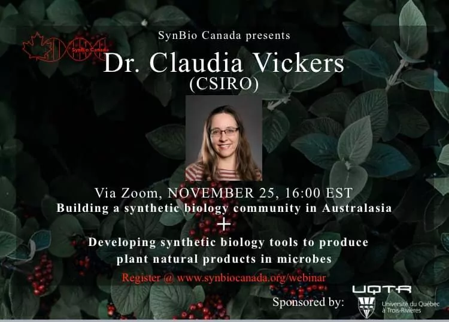
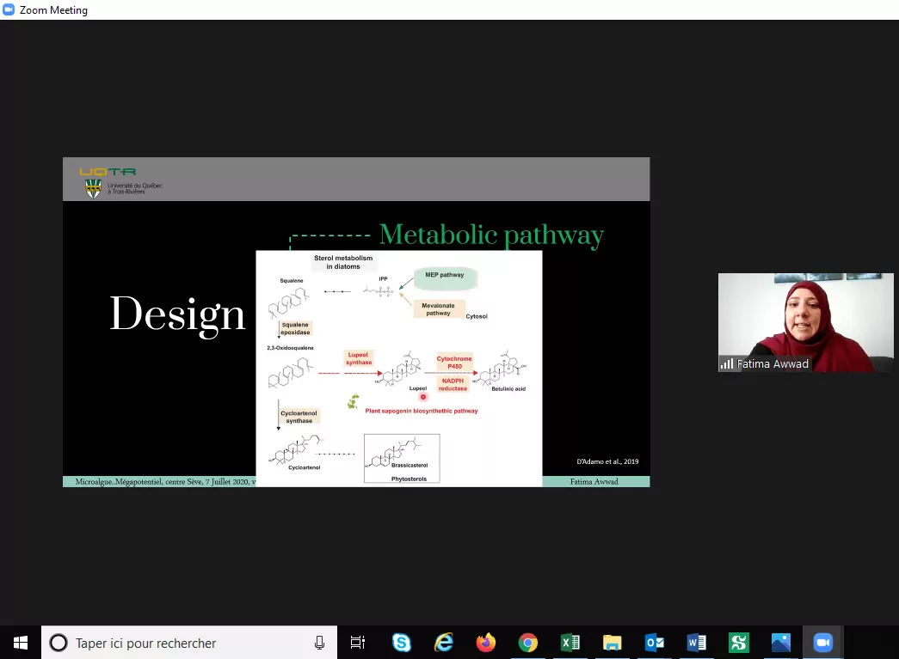

<head>
<meta charset="utf-8">
<link rel="apple-touch-icon" sizes="180x180" href="/apple-touch-icon.png">
<link rel="icon" type="image/png" sizes="32x32" href="/favicon-32x32.png">
<link rel="icon" type="image/png" sizes="16x16" href="/favicon-16x16.png">
<link rel="manifest" href="/site.webmanifest">
<link rel="mask-icon" href="/safari-pinned-tab.svg" color="#5bbad5">
<link rel="alternate" hreflang="en-us" href="../en/news_2020.html">
<meta name="msapplication-TileColor" content="#da532c">
<meta name="theme-color" content="#ffffff">
<meta name="viewport" content="width=device-width, initial-scale=1">

<!-- scripts -->
<script src="https://kit.fontawesome.com/0af1a424a5.js" crossorigin="anonymous"></script>

<!-- stylesheets -->
<link rel="stylesheet" href="column_text_style.css">
<link rel="stylesheet" href="news_style.css">
</head>

<main class="container-fluid">

<div class="row">

<section class="cpics-logo"></div>
<br><br><br>

<section class="col-md-9" style="padding-right:2%">

<div class="row text">

<section class="col-md-3 news_links" id="news_links">
<div class="row">


```{r echo=FALSE, message=FALSE, warning=FALSE, results='asis'}
source("create_news_links.R", local = knitr::knit_global())

```


</div><!-- row under sidebar with news links -->
</section> 

<section class="col-md-9" id="main_news">

<div class="row">


Etes-vous un membre du Centre SEVE ? <br>

Si vous ne le savez pas encore, consultez le lien ci-dessous pour le découvrir<br>

Enregistrez votre adresse e-mail pour recevoir les alertes des événements du CPICS.<br>

https://cpics.netlify.app/en/participate.html
<br><br>

<article>
<strong>2022-05-04</strong>

Félicitations à notre ex-vice président Networking, [Romaric Armel Mouafo Tchinda] pour avoir obtenu un poste de post-doctorat à l'University of Florida au laboratoire de la Dre. [Karen Garrett] (qui était notre invitée dans la [What's up Conference de l'annéee passée](./wup_may2021.html)).

Nous vous souhaitons le meilleur pour vos projets futurs !
</article>

<br><br>

<article>
<strong>2022-04-26</strong>

Félicitations au [Groupe de recherche en biologie végétale (GRBV)](https://oraprdnt.uqtr.uquebec.ca/pls/public/gscw031?owa_no_site=4210) pour son 20e anniversaire. Aussi, félicitations aux présentateurs et aux organisateurs du colloque annuel du GRBV. 

<center>

</center>
</article>
<br><br>

<article>
<strong>2020-11-06</strong>

Felicitations à [Aracely Maribel Diaz Garza], notre secrétaire, pour son article sur la [dynamique temporelle des rhizobactéries dans les cultures cultivées dans un écosystème semi-aride](https://doi.org/10.3389/fsufs.2020.602283).

Bravo!
</article>
<br><br>

<article>
<strong>2020-11-10</strong>

Prochain webinar Synbio Canada, organisé par une de nos membres, [Fatima Awwad].

[Inscriptions](https://www.synbiocanada.org/webinar?fbclid=IwAR0UzO2pRipx5sGNU_XaTmMth2y2Ie36ga0YuB1FaoL6MGCdlH2WdkbLL0k)

<center>


</center>
</article>
<br><br>

<article>
<strong>2020-11-06</strong>

Felicitations à [Karen Cristine Goncalves], notre secrétaire, pour son preprint sur des effecteurs candidates des champignons. 

Bon travail!

Preprint: [Differential alteration of plant functions by homologous fungal candidate effectors](https://www.biorxiv.org/content/10.1101/2020.10.30.363010v1)
</article>
<br><br>

<article>
<strong>2020-11-05</strong> 

Félicitations à [Fadoua Dhaouadi], [Fatima Awwad] et [Andrew Diamond] pour la publication de cette review scientifique sur les Diatomées.

Premier papier pour Fadoua Dhaouadi, ça se fête!

Papier: [Diatoms' breakthroughs in biotechnology: <i>Phaeodactylum tricornutum</i> as a model for producing high-added value molecules](https://doi.org/10.4236/ajps.2020.1110118)
</article>
<br><br>

<article>
<strong>2020-10-27</strong>

Aujourd'hui, [Romaric Armel Mouafo Tchinda] a pratiqué sa présentation pour [Ma thèse en 180s de l'ACFAS](https://www.acfas.ca/prix-concours/ma-these-en-180-secondes/a-propos), où il représentera l'Université de Sherbrooke.

Suivez la [finale](https://www.facebook.com/events/662935087680358/?__cft__[0]=AZXNWtUJCyabQaszn7XJsgAxsRqUxaDbIQDJgpYKHlppwZhK9ObJmIhVBBh8JEnGpfa1fqzZZDRt1vBboYo7xpZxCB7OuQUAeMohCwbNwSpP1D6W-Qb-eHGUd3RXaiYHPt1GhsTbOt20HDDoREZBi7sP&__tn__=-UK-R) le 19 novembre.


</article>
<br><br>

<article>
<strong>2020-10-24</strong>

Soumis par ses étudiants, les laboratoires des Dre [Isabel Desgagné-Penix] et Dr. [Hugo Germain](https://www.researchgate.net/profile/Hugo_Germain) ont obtenu le [Prix d'excellence](https://cbie.ca/fr/laureat-e-s-prix-excellence-2020/) du [Bureau Canadien de l'Éducation Internationale](https://cbie.ca/fr/) pour les [politiques d'équité, de diversité et d'inclusion](https://www.youtube.com/watch?v=QPqd4jLihyU&t=3s&ab_channel=uqtr) menées au quotidien.


Félicitations!
<!-- blank line -->
<figure class="video_container">
<iframe src="https://www.youtube.com/embed/QPqd4jLihyU" frameborder="0" allow="accelerometer; autoplay; clipboard-write; encrypted-media; gyroscope; picture-in-picture" allowfullscreen></iframe>
</figure>
<!-- blank line -->
</article>
<br><br>

<article>
<strong>2020-10-02</strong>

Nous sommes heureux de vous inviter au Concours d'affiches scientifiques étudiantes 2020 du Centre SÈVE. Cet événement virtuel aura lieu les 25 et 26 novembre 2020.
Le [portail d’inscription](https://event.fourwaves.com/fr/a6183e12-d9e0-420a-8038-0209e3bc0682/registration/) pour les participants et pour soumettre une communication par affiche est maintenant en ligne. Vous y trouverez aussi toutes les [informations sur l’événement](https://event.fourwaves.com/fr/a6183e12-d9e0-420a-8038-0209e3bc0682/pages).

Au plaisir de vous y voir en grand nombre !


</article>
<br><br>

<article>
<strong>2020-09-22</strong>


<div class="col-lg-6">

</div>
<div class="col-lg-6">

</div>
Conférence Web du Centre SÈVE aujourd'hui, avec [Charles Roussin-Léveillée] de l'Université de Sherbrooke. Merci à tous les participants!
Source: [Centre SÈVE](https://www.facebook.com/centreseve/posts/1511546979039577)
</article>
<br><br>

<article>
<strong>2020-08-17</strong>

Vous souhaitez en savoir plus sur notre invitée [Isabelle Laforest-Lapointe](https://twitter.com/Isabel_Laforest), de l'[USherbrooke](https://twitter.com/USherbrooke) pour le [25 août](whats_up.html#inscriptions)?

Lisez cet [article](https://www.quebecscience.qc.ca/sciences/les-10-decouvertes-de-2017/4-probiotiques-forestiers/) sur son travail !! 
<br>

<a href="https://www.quebecscience.qc.ca/sciences/les-10-decouvertes-de-2017/4-probiotiques-forestiers/"></a>
<br>
[#whatsupconferences](https://twitter.com/hashtag/whatsupconferences?src=hashtag_click)  [#plantscience](https://twitter.com/hashtag/plantscience?src=hashtag_click) [#SEVE](https://twitter.com/hashtag/SEVE?src=hashtag_click) [#CPICS](https://twitter.com/hashtag/CPICS?src=hashtag_click)
</article>
<br><br>

<article>
<strong>2020-08-14</strong>

Vous souhaitez en savoir plus sur notre invitée [Leena Tripathi](https://twitter.com/Leena_Tripathi) pour le [25 août](whats_up.html#inscriptions)?

Regardez cette vidéo de [IITA CGIAR](https://twitter.com/IITA_CGIAR) sur son travail !!  
<span class="row" style=" display: block;  margin-left: auto;  margin-right: auto;">

<!-- blank line -->
<figure class="video_container">
<iframe src="https://www.youtube.com/embed/QBdYOA0dvRY" frameborder="0" allow="accelerometer; autoplay; encrypted-media; gyroscope; picture-in-picture" allowfullscreen style="display: block;margin-left: auto;  margin-right: auto;"></iframe>
</figure>
<!-- blank line -->
<br><br>
<span> [#whatsupconferences](https://twitter.com/hashtag/whatsupconferences?src=hashtag_click)  [#plantscience](https://twitter.com/hashtag/plantscience?src=hashtag_click) [#SEVE](https://twitter.com/hashtag/SEVE?src=hashtag_click) [#CPICS](https://twitter.com/hashtag/CPICS?src=hashtag_click)</p></span>

</span>

</article>

<br><br>

<article>
<strong>2020-08-10</strong>

**Le Centre SÈVE annonce une nouvelle série de Conferences web qui commence le 15 septembre!**


<br><br>
<table class="center">
<colgroup>
<col width="10%" />
<col width="17%" />
<col width="73%" />
</colgroup>
<tbody>
<tr>
<td> 15 Septembre</td><td>[François Belzile]</td><td>Aventures dans l’univers des SNP : un premier bilan de SoyaGen, un projet de grande envergure en génomique du soya</td>
</tr>
<tr>
<td>22 Septembre</td><td>[Charles Roussin-Léveillée]</td><td>The Apoplastic Battleground in Plant-Pathogen Interactions</td>
</tr><tr>
<td>29 Septembre</td><td>[Vicky Lévesque]</td><td>L’amendement en biochar: Une approche durable pour améliorer la santé du sol et la croissance de la plante en horticulture</td>
</tr><tr>
<td>13 Octobre</td><td>[Hamid Akbarzadeh]</td><td>Sustainable Bio-inspired Metamaterials</td>
</tr><tr>
<td>20  Octobre</td><td>[Valerio Hoyos-Villegas]</td><td>The McGill Field Phenomics Platform: Increasing Resolution for Complex Trait Improvement</td>
</tr><tr>
<td>27 Octobre</td><td>[Tagnon Missihoun]</td><td></td>
</tr>
</tbody>
</table>
<br>
<b>[Inscriptions](http://centreseve.recherche.usherbrooke.ca/fr/node/226#overlay-context=fr/node/223) </b>
</article>

<br><br>


<article>
<strong>2020-07-29</strong>

Felicitations aux etudiants du Centre SEVE qui presentent dans le Worldwide Plant Biology Summit 2020.
Vous pouvez voir leurs affiches sur notre twitter (link en bas).

<span class="row" style=" display: block;  margin-left: auto;  margin-right: auto;">
<p style=" text-align:center;">[<i class="fab fa-twitter"></i> Karuna Kapoor <i class="fab fa-twitter"></i>][1]</p><br>
<p style=" text-align:center;">[<i class="fab fa-twitter"></i> Amir Bidhendi, Francisco Campos, Gaële Lajeunesse, and Julian Henao-Martinez <i class="fab fa-twitter"></i>][2]</p><br>
<p style=" text-align:center;">[<i class="fab fa-twitter"></i> Adrien Fremont, Charles Roussin-Léveillée, Eszter Sas and Guilherme Silva-Martins <i class="fab fa-twitter"></i>][3]</p>


[1]: https://twitter.com/CPICSEVE/status/1289294256281022465  "Tweet avec l'affiche de Karuna Kapoor"
[2]: https://twitter.com/CPICSEVE/status/1288906455446364160 "Tweet avec les affiches d'Amir Bidhendi, Francisco Campos, Gaële Lajeunesse, et Julian Henao-Martinez"
[3]: https://twitter.com/CPICSEVE/status/1288912736412405763 "Tweet avec les affiches d'Adrien Fremont, Charles Roussin-Léveillée, Eszter Sas et Guilherme Silva-Martins"


<table>
<colgroup>
<col width="15%" />
<col width="15%" />
<col width="15%" />
<col width="15%" />
<col width="15%" />
</colgroup>
<thead>
<tr class="header">
<th><b>IRBV</b></th><th><b>McGill University</b></th><th><b>Université de Laval</b></th><th><b>Université de Montréal</b></th><th><b>Université de Sherbrooke</b></th>
</tr>
</thead>
<tbody>
<tr>
<td>Camille Auger</td><td>[Amir Bidhendi]</td><td>[Francisco Campos]</td><td>[Eszter Sas]</td><td>[Charles Roussin-Léveillée]</td>
</tr>
<tr class="even">
<td>[Adrien Fremont]</td><td>[Karuna Kapoor]</td><td></td><td></td><td>Gaële Lajeunesse</td>
</tr>
<tr class="odd">
<td></td><td>[Meha Sharma]</td><td></td><td></td><td>[Guilherme Silva-Martins]</td>
</tr>
<tr class="even">
<td></td><td>[Julian Henao-Martinez]</td><td></td><td></td><td>[Iauhenia Isayenka]</td>
</tr>
</tbody>
</table>

</span>
</article>
<br><br>

<article>
<strong>2020-07-07</strong>




<p>**[Fatima Awwad]**, postdoc de l'_UQTR_, nous a presenté aujourd'hui le potentiel des microalgues dans les conférences Web du Centre SÈVE. Merci à tous les participants!</p>

Source: [Centre SEVE](https://www.facebook.com/centreseve/photos/a.445334158994203/1444690485725227/)
</article>

<br><br>

<article>
<strong>2020-06-16</strong>


<div >
<p>Une autre captivante conférence Web du Centre SÈVE aujourd'hui, avec **[Karen Cristine Gonçalves]** de l'_UQTR_. Merci à tous les participants!</p>
</div>
Source: [Centre SEVE](https://www.facebook.com/centreseve/photos/a.445334158994203/1427129864147956/)

</article>

<br><br>

<article>
<strong>2020-05-09</strong>


<div>
<p>Bienvenue à **[Aracely Maribel Diaz Garza]** et **[Vincent Charron-Lamoureux]** à l'administration du CPICS à titre de secrétaire en remplacement de **[Alexia Bertholon]**, qui a dû se retirer du comité.</p>

<p>**_Félicitation à vous deux !_**</p>

</div>
</article>

<br><br>

<article>
<strong>2020-03-02</strong>


<div>
<p>Félicitations à **[Claire Letanneur]**, doctorante à l'_UQTR_, pour l'octroi d'une subvention au premier concours du programme DIALOGUE - volet relève étudiante! Seulement quatre projets étaient sélectionnés pour chaque secteur de recherche des FRQ.</p>
</div>
</article>

<br><br>
</div><!-- row main_news -->
</section> 

</div><!-- row text under col9 section -->
</section> 

<section class="col-md-3">

<div class="row">
<span> <p class="sidebar_logos">[<i class="fab fa-twitter"></i>](https://twitter.com/CPICSEVE) [<i class="fab fa-linkedin-in"></i>](https://www.linkedin.com/company/cpics/about/) [<i class="fab fa-facebook"></i>](https://www.facebook.com/CPICS-Comit%C3%A9-de-partenariat-international-du-Centre-S%C3%88VE-395275957711442) <a  href = "mailto:cpicseve@gmail.com"><i class="fas fa-envelope" align="center" style="font-size:24px"></i></a> </p></span>
<div class="row" style="margin: 1%">
<a href="http://centreseve.recherche.usherbrooke.ca/fr"></a><a href="http://www.frqnt.gouv.qc.ca/en/accueil"></a>
</div>

<a class="twitter-timeline" data-height=1500px href="https://twitter.com/CPICSEVE?ref_src=twsrc%5Etfw">Tweets by CPICS</a> <script async src="https://platform.twitter.com/widgets.js" charset="utf-8"></script>

</div><!-- row under sidebar section -->
</section> 

<button onclick="topFunction()" id="myBtn" title="Go to top">Top</button>
```{r echo=FALSE, message=FALSE, warning=FALSE, results='asis'}
source("topFunctionJS.R", local = knitr::knit_global())

```

</div> <!-- row under container-fluid -->
</main>

[Centre SÈVE Annual International Symposium]: https://cpics.netlify.app/en/symposia.html
[Adrien Fremont]: https://bio.umontreal.ca/repertoire-departement/etudiants-aux-cycles-superieurs/adrien-fremont/
[Alexia Bertholon]: https://www.linkedin.com/in/alexiabertholon/
[Amal Jaballi]: https://www.researchgate.net/profile/Amal-Jaballi
[Amir Bidhendi]: https://www.researchgate.net/profile/Amir_Bidhendi/experience/
[Andrew Diamond]: https://www.linkedin.com/in/andrew-diamond-74390b137/) 
[Aracely Maribel Diaz Garza]: https://www.linkedin.com/in/aracely-maribel-diaz-garza-6989b5169/
[Charles Roussin-Léveillée]: https://www.linkedin.com/in/charles-roussin-l%C3%A9veill%C3%A9e-075851a6/?originalSubdomain=ca/
[Claire Letanneur]: https://www.researchgate.net/profile/Claire_Letanneur
[Eszter Sas]: https://www.linkedin.com/in/eszter-sas-1b907141/?originalSubdomain=ca/
[Fadoua Dhaouadi]: https://www.linkedin.com/in/dhaouadi-fadoua-276b191a3/
[Fatima Awwad]: https://www.linkedin.com/in/fatima-awwad-06553a29/
[Francisco Campos]: https://www.researchgate.net/profile/Francisco_Campos23/
[François Belzile]: http://www.ibis.ulaval.ca/en/research/francois-belzile/
[Guilherme Silva Martins]: https://www.linkedin.com/in/guilherme-martins-1268202b/
[Hamid Akbarzadeh]: https://www.mcgill.ca/macdonald/abdolhamid-akbarzadeh-shafaroudi/
[Hugo Germain]: https://www.researchgate.net/profile/Hugo_Germain
[Iauhenia Isayenka]: https://www.researchgate.net/profile/Iauhenia_Isayenka/
[Ingrid Berenice Sanchez Carrillo]: https://www.linkedin.com/in/ingrid-sanchez/
[Isabel Desgagné-Penix]: https://www.linkedin.com/in/isabel-desgagn%C3%A9-penix-86081aa6/
[Jennifer Paillassa]: https://www.linkedin.com/in/jennifer-paillassa-087600a3/
[Julian Henao-Martinez]: https://www.linkedin.com/in/julian-martinez-henao/?originalSubdomain=ca/
[Julie Yergeau]: https://www.linkedin.com/in/julie-yergeau-b58508186/
[Karen Cristine Goncalves]: https://www.linkedin.com/in/karen-gon%C3%A7alves-05847a113/
[Karen Garrett]: https://plantpath.ifas.ufl.edu/people/faculty-pages/karen-garrett/
[Karuna Kapoor]: https://scholar.google.ca/citations?user=gHKRIVEAAAAJ&hl=en/
[Manoj Koirala]: https://www.linkedin.com/in/manoj-koirala-72a149120/?originalSubdomain=ca
[Marianne Bessette]: https://www.linkedin.com/in/marianne-bessette-b16287146/
[Matthieu Glanowski]: https://www.linkedin.com/in/matthieu-glanowski-585254116/
[Meha Sharma]: https://www.researchgate.net/profile/Meha_Sharma5/
[Nikunj Sharma]: https://in.linkedin.com/in/nikunj-sharma-5a863490
[Peter Moffet]: https://www.usherbrooke.ca/biologie/nous-joindre/personnel/corps-professoral/biologie-moleculaire-et-cellulaire/peter-moffett
[Romaric Armel Mouafo Tchinda]: https://www.linkedin.com/in/romaric-armel-mouafo-tchinda-ba266185/
[Safa Labidi]: https://www.linkedin.com/in/safa-labidi-41749b73/
[Seydou Ka]: https://www.linkedin.com/in/seydou-ka-9a41a4167/
[Serge Nouemssi]: https://www.linkedin.com/in/serge-basile-nouemssi-a95913121/
[Snehi Gazal]: https://www.linkedin.com/in/snehi-gazal-9172856b/
[Tagnon Missihoun]: https://www.researchgate.net/profile/Tagnon_M
[Teura Barff]: https://www.linkedin.com/in/teura-barff-66526647/
[Théo Devèze]: aaa
[Valeria Parra]: https://www.linkedin.com/in/valeria-parra-0b0b86167/
[Valerio Hoyos-Villegas]: https://www.mcgill.ca/plant/faculty/valerio-hoyos-villegas/
[Vicky Lévesque]: https://www.linkedin.com/in/vickylevesque/
[Vincent Charron-Lamoureux]: https://www.researchgate.net/profile/Vincent_Charron-Lamoureux

