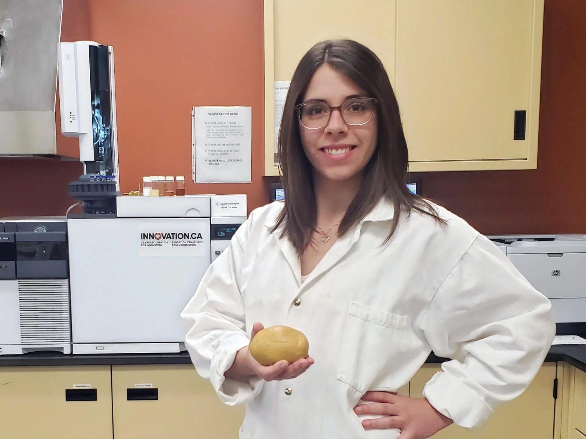

<head>
<meta charset="utf-8">
<link rel="stylesheet" href="slideshow.css">
<link rel="stylesheet" href="column_text_style.css">
<link rel="stylesheet" href="news_style.css">
<script src="slideView.js"></script>
<link rel="alternate" hreflang="en-us" href="../en/news_2021.html">

```{r echo=FALSE, results='asis'}
source('header.R')
```

<section class="col-md-9" style="padding-right:2%">

<div class="row text">

<section class="col-md-3 news_links" id="news_links">
<div class="row">


```{r echo=FALSE, message=FALSE, warning=FALSE, results='asis'}
source("create_news_links.R", local = knitr::knit_global())

```


</div><!-- row under sidebar with news links -->
</section> 

<section class="col-md-9" id="main_news">

<div class="row">


<br>
[Enregistrez pour recevoir les alertes des événements du CPICS.](https://cpics.netlify.app/en/participate.html)


<article>
<strong>2021-12-03</strong>

Notre trésorière [Julie Yergeau] vient de finir sa maîtrise titré « L’identification des espèces de _Phytophthora_ dans les cultures d’arbres de Noël du Québec et la validation de la pathogénicité de _P. abietivora_ » !

En plus, elle a gagné le prix de meilleure présentation dans les Symposiums MicroBioMoléculaires de la Session Automne 2021 à l'Université de Sherbrooke.

Félicitations, Julie!
</article>
<br><br>

<article>
<strong>2021-11-24</strong>

Notre Vice-Président en Réseautage [Romaric Armel Mouafo Tchinda] a réussi son doctorat en phytopathologie, avec la thèse « Comparative epidemiology of the two main clades of Plasmopara viticola prevalent in eastern Canada » avec la Dre. Carole Beaulieu et le Dr. Odile Carisse.

Félicitations !!!
</article>
<br><br>

<article>
<strong>2021-09-02</strong>

Nouvelle publication de une des chercheuses du Centre Séve, Dre [Isabel Desgagné-Penix], et ses étudiants [Manoj Koirala] et [Seydou Ka], en collaboration international avec l'[Universita’ di Napoli Federico II](http://www.unina.it/en_GB/home) (Italie) et l'[Universite Cheikh Anta Diop de Dakar](https://fmpos.ucad.sn/) (Sénégal).
<br>

Publication: 
[Isolation and biological characterization of homoisoflavanoids and the alkylamide N-p-Coumaroyltyramine from _Crinum biflorum_ Rottb., an Amaryllidaceae species collected in Senegal](https://doi.org/10.3390/biom11091298)

<br>
Félicitations à toutes les personnes impliquées dans ce projet pour leur travail assidu et en particulier à la Dre [Isabel Desgagné-Penix] pour sa collaboration avec des chercheurs du monde entier !
</article>
<br><br>


<article>
<strong>2021-08-30</strong>

Voulez vous savoir plus sur les defis des postdocs, la vie d'une bioinformaticienne, ou le parcours academique de notre présidente, Dre [Karen Cristine Goncalves]?

Regardez son entrevue par le doctorant Nikunj Sharma, de l'Université du Québec à Trois-Rivières!

<!-- blank line -->
<figure class="video_container">
<iframe src="https://www.youtube.com/embed/2Xx9Anv2nqY" frameborder="0" allow="accelerometer; autoplay; clipboard-write; encrypted-media; gyroscope; picture-in-picture" allowfullscreen></iframe>
</figure>
<!-- blank line -->
</article>
<br><br>

<article>
<strong>2021-05-05</strong>

Notre présidente, [Karen Cristine Goncalves], a réussi son doctorat en Biologie Cellulaire et Moléculaire avec la thèse "Unrelated Fungal Rust Candidate Effectors Act on Overlapping Plant Functions", sous la direction du Dr. [Hugo Germain] et la Dre. [Isabel Desgagné-Penix].

Elle a aussi publié son travail en MDPI Microorganisms:
[Unrelated Fungal Rust Candidate Effectors Act on Overlapping Plant Functions](https://doi.org/10.3390/microorganisms9050996).

Finallement, elle a commencé sa recherche postoctorale avec le Dr. [Damase Khasa](https://www.sbf.ulaval.ca/professeurs/damase-p-khasa), le Dr. [Juan Carlos Villarreal Aguilar](https://www.bio.ulaval.ca/departement-et-professeurs/professeurs-et-personnel/professeurs/fiche/show/villarreal-a-juan-carlos/) et la Dre. [Ilga Porth](http://www.ibis.ulaval.ca/en/research/ilga-porth/).


Bravo, Karen !!
</article>
<br><br>

<article>
<strong>2021-04-06</strong>

<div id="Professors_articles" class="section level3 .tabset .tabset-fade .tabset-pills">

Bien que l'année 2021 ne fasse que commencer, les chercheur&middot;euse&middot;s membres du Centre SÈVE ont été très occupé&middot;e&middot;s.
Félicitations pour leur excellent travail durant cette pandémie !

Jetez un coup d'œil à leurs publications ici :

```{r results='asis', echo=FALSE}
source('professors_papers.R')
```

</div>
</article>
<br><br>

<article>
<strong>2021-01-29</strong>

Bienvenue à nos deux nouvelles membres de la CIPCS, [Snehi Gazal] (VP Communications) and [Valeria Parra] (VP Réseautage)!

Nous remercions [Claire Lettaneur], [Teura Barff] et [Marianne Bessette] pour leur travail. Elles ne feront plus partie du comité exécutif, mais elles seront toujours invitées à nos réunions et nos événements.
</article>
<br><br>

<article>
<strong>2021-01-27</strong>

Félicitation à Michelle Boivin (UQTR), étudiante du centre SÈVE pour son intriguant projet de revalorisation de matière organique.

<center>

<a href="https://neo.uqtr.ca/2021/01/26/un-elixir-de-jouvence-naturel-pour-les-patates/?fbclid=IwAR20dE7XqTMOcri8oFFGIEJPwXB4ZYWQzzWAaNBSYfqc-folknVrpcIquz4"></a>
</center>
</article>
<br><br>

</div><!-- row main_news -->
</section> 

</div><!-- row text under col9 section -->
</section> 

<section class="col-md-3">

```{r echo=FALSE, message=FALSE, warning=FALSE, results='asis'}
source("sidebar.R", local = knitr::knit_global())

```


</section> 

<button onclick="topFunction()" id="myBtn" title="Go to top">Top</button>
```{r echo=FALSE, message=FALSE, warning=FALSE, results='asis'}
source("topFunctionJS.R", local = knitr::knit_global())

```

</div> <!-- row under container-fluid -->
</main>

```{r echo=FALSE, message=FALSE, warning=FALSE, results='asis'}
source("textLinksNews.R", local = knitr::knit_global())
```


