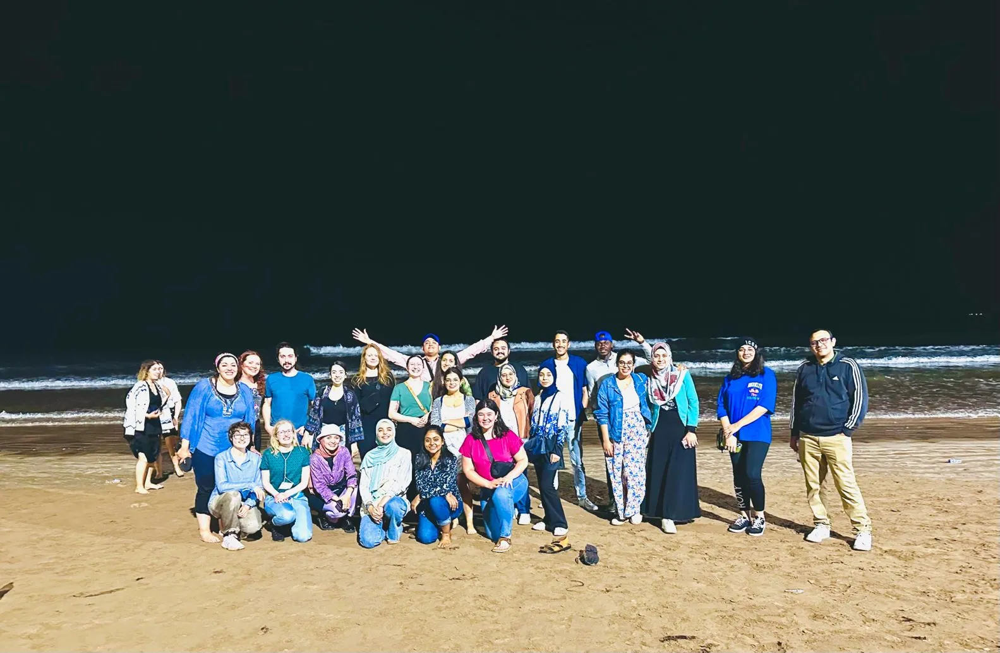

<head>
<meta charset="utf-8">
<link rel="stylesheet" href="slideshow.css">
<link rel="stylesheet" href="column_text_style.css">
<link rel="stylesheet" href="news_style.css">
<script src="slideView.js"></script>
<link rel="alternate" hreflang="en-us" href="../en/news_2023.html">

```{r echo=FALSE, results='asis'}
source('header.R')
```

<section class="col-md-9" style="padding-right:2%">

<div class="row text">

<section class="col-md-3 news_links" id="news_links">
<div class="row">


```{r echo=FALSE, message=FALSE, warning=FALSE, results='asis'}
source("create_news_links.R", local = knitr::knit_global())

```

</div><!-- row under sidebar with news links -->
</section> 

<section class="col-md-9" id="main_news">

<div class="row">

<br>
[Enregistrez pour recevoir les alertes des événements du CPICS.](https://cpics.netlify.app/en/participate.html)

<article id="2023-07-01">
<strong>2023-07-01</strong>

Étiez-vous à la conference da la [SCBV](https://cspb-scbv.ca/) 2023 à l'U. Laval?

Le Centre SÈVE était bien représenté (et le CPICS aussi) cette année, avec plusiers présentations orales et par affiche par des étudiant&middot;e&middot;s, des postdocs et des professeur&middot;e&middot;s de l'UQTR, l'UQAM, l'UdeS, McGill, l'ULaval, l'UQAR et d'autres universités!

Nous félicitons [Charles Roussin-Léveillée] pour recevoir mention honorable pour le <em>Prix Ragai Ibrahim</em> pour son article scientifique sur [des effecteurs conservés utilisés par des bactéries pour créer en environement aqueux dans l'apoplast des feuilles](https://www.sciencedirect.com/science/article/pii/S1931312822000920). Il a aussi reçu le <em>Prix Relève Étoile</em> du FRQNT pour le meme article. Bravo, Charles!!!

Dr. [Peter Moffet], superviseur de recherche de Charles et directeur du Centre SÈVE, a reçu le <em>Prix Mary Spencer</em> pour sa recherche remarquable et son activité dans la communauté de biologie végétale. Félicitations, Peter!

```{r echo=FALSE, results='asis'}
source("Photos_cspb.R", local = knitr::knit_global())

```

<br><br>
</article>

<article id="2023-06-01">
<strong>2023-04-07</strong>

Saviez-vous que l'école d'été du Centre SÈVE cette année était Maroc? Oui, la [Mohammed VI Polytechnic University](https://www.linkedin.com/school/um6p/) a accuilli plusieurs étudiant&middot;e&middot;s et professeur&middot;e&middot;s pour cette oportunité extraordinaire d'apprentissage.

[Snehi Gazal], notre vice-présidente, et [Prabhjot Sanghera], notre secrétaire, ont présenté leurs projets, visité la région et appris sur la culture marocaine.

[Cliquez ici pour lire plus sur leurs expériences.](https://www.linkedin.com/feed/update/urn:li:activity:7064053495145848832/)



<br><br>
</article>

<article id="2023-04-07">
<strong>2023-04-07</strong>

Nous souhaitons la bienvenue à nos nouveaux membres [Prabhjot Sanghera], secrétaire qui commence ça maitrise à l'Université McGill, et [Charlotte Blasi], trésorière qui est à la fin de son doctorat à l'Université Sherbrooke.

Maintenant, avec le comité complet, nous pouvons planifier l'année. Nous esperons vous voir à la conference de la [Societé Canadienne de Biologie Végétale] à Québec en Juin!


<br><br>
</article>


<article id="2023-02-24">
<strong>2023-02-24</strong>

Avec le nouvel an, le temps est arrivé pour renouveler notre comité!

Le 23 février, nous avons acueilli au CPICS [Arghavan Arjmandi] et [Valeria Parra], comme VP aux Communications, [Rohith Grandhi] et [Ayoub Bouhadada], comme VP aux Réseautages, et [Arnold William Tazon], comme secrétaire. Bienvienu·e·s!

Aussi, notre secrétaire de longue date, [Aracely Maribel Diaz Garza], est devenu président, aidée par nottre ancienne VP aux communications, [Snehi Gazal]. Merci pour votre leadearship!

Nous voulons remercier nos membres qui partent du comité pour leur travail ces dernieres années: [Nicolas Sene], [Serge Nouemssi], [Théo Devèze] et [Jennifer Paillassa]. [Karen Cristine Goncalves], notre ancienne secrétaire, a quitté le poste et est maintenant exclusivement notre concepteur de sites Web. Merci à tous pour votre travail!

Finalement, nous avons encore des places pour un·e secrétaire qui parle français et pour des trésoriers. Si tu es intéressé·e, inscris ton nom dans [notre liste de diffusion](./participer.html) pour recevoir le lien de la prochaine réunion (le 6 avril à 15h).


<br><br>
</article>


</div><!-- row main_news -->
</section> 

</div><!-- row text under col9 section -->
</section> 

<section class="col-md-3">
```{r echo=FALSE, message=FALSE, warning=FALSE, results='asis'}
source("sidebar.R", local = knitr::knit_global())

```


</section> 

<button onclick="topFunction()" id="myBtn" title="Go to top">Top</button>
```{r echo=FALSE, message=FALSE, warning=FALSE, results='asis'}
source("topFunctionJS.R", local = knitr::knit_global())

```

</div> <!-- row under container-fluid -->
</main>

```{r echo=FALSE, message=FALSE, warning=FALSE, results='asis'}
source("textLinksNews.R", local = knitr::knit_global())
```
