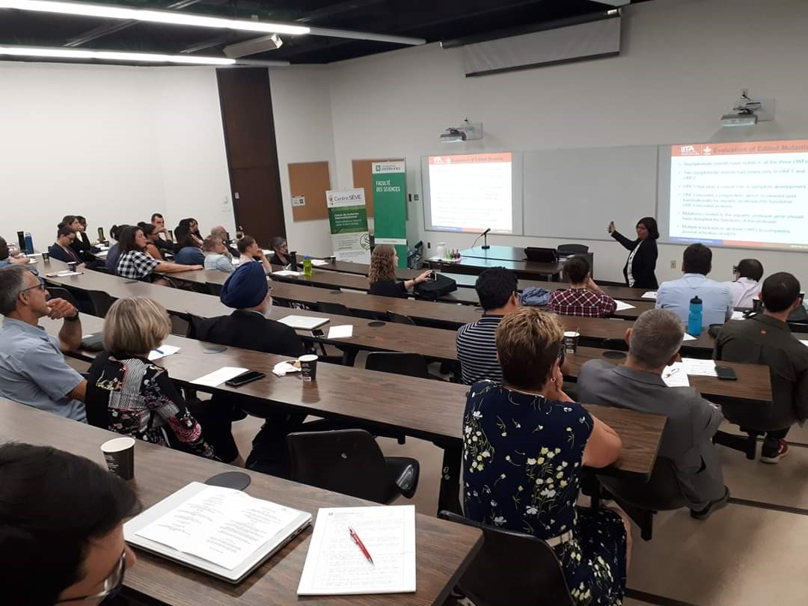
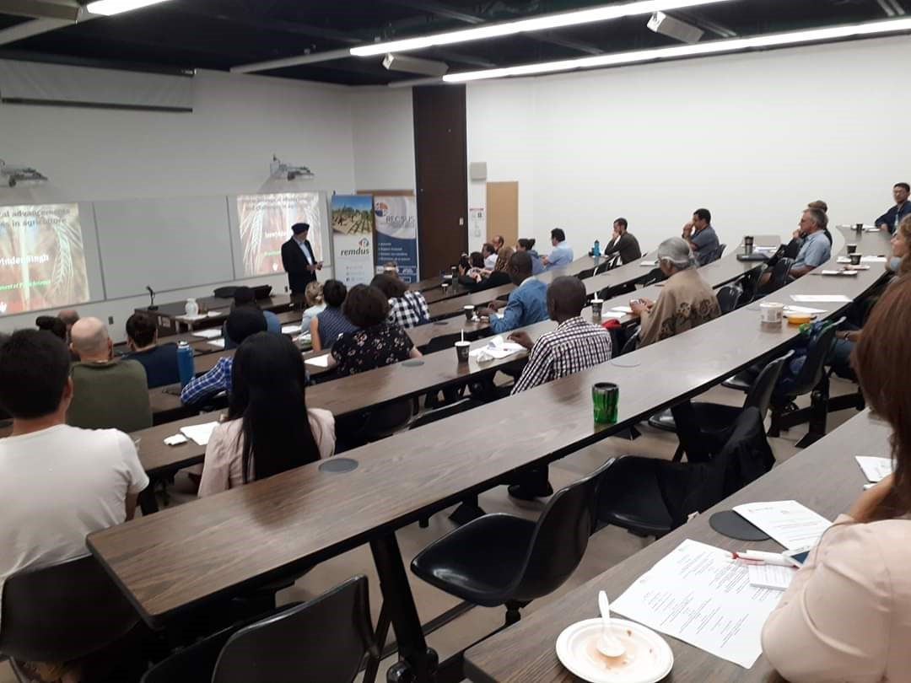
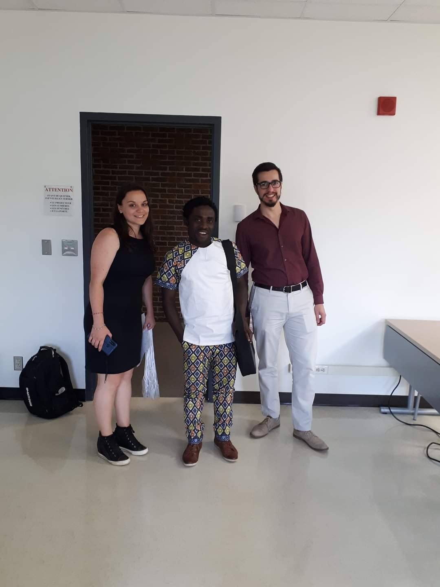

<head>
<link rel="apple-touch-icon" sizes="180x180" href="/apple-touch-icon.png">
<link rel="icon" type="image/png" sizes="32x32" href="/favicon-32x32.png">
<link rel="icon" type="image/png" sizes="16x16" href="/favicon-16x16.png">
<link rel="manifest" href="/site.webmanifest">
<link rel="mask-icon" href="/safari-pinned-tab.svg" color="#5bbad5">
<meta name="msapplication-TileColor" content="#da532c">
<meta name="theme-color" content="#ffffff">
<meta charset="utf-8">
<meta name="viewport" content="width=device-width, initial-scale=1">

<link rel="stylesheet" href="./symposium_style.css">

</head>

 
 Le *Symposium annuel international du Centre SÈVE* est un rassemblement scientifique qui reflète la philosophie du **_CPICS_**. Son objectif est, non seulement, de renforcer et de développer un réseau international du _Centre SÈVE_, mais aussi de permettre aux étudiant(e)s affilié(e)s au _Centre SÈVE_ de rencontrer des scientifiques de renommées internationales et de profiter du partage de leur connaissances. C’est une occasion pour toute la communauté du _Centre SÈVE_ d’agrandir son réseau et de faire naitre de nouvelles collaborations, autant à l’échelle canadienne qu’à l’échelle mondiale. C’est également un moment privilégié pour les étudiant(e)s pour qui c’est l’occasion de présenter leurs travaux devant leur pairs, profitant de la proximité que favorise l’évènement. 
 

# {.tabset}

##   **1^er^ Symposium annuel international du Centre SÈVE** {.tabset .tabset-pills}

  

### Program 

### Professeurs

<table style=" display: block;  margin-left: auto;  margin-right: auto;">
<tr>
<td>
  
</td>
<td>
  
</td>
</tr>
<table>

### Photos

### Partenaires

