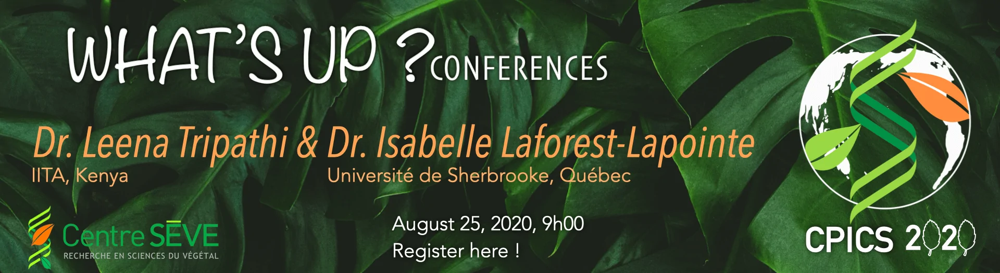

<meta charset="utf-8">
<link rel="apple-touch-icon" sizes="180x180" href="/apple-touch-icon.png">
<link rel="icon" type="image/png" sizes="32x32" href="/favicon-32x32.png">
<link rel="icon" type="image/png" sizes="16x16" href="/favicon-16x16.png">
<link rel="manifest" href="/site.webmanifest">
<link rel="mask-icon" href="/safari-pinned-tab.svg" color="#5bbad5">
<link rel="alternate" hreflang="en-us" href="../en/whats_up.html">
<meta name="msapplication-TileColor" content="#da532c">
<meta name="theme-color" content="#ffffff">
<meta name="viewport" content="width=device-width, initial-scale=1">

<link rel="stylesheet" href="column_text_style.css">
<link rel="stylesheet" href="slideshow.css">
<link rel="stylesheet" href="form.css">

  

<h1></h1>

<h2>19 Mai 2021</h2>

th at 10h am with Dr. Karen Garrett from University of Florida and Dr. Mamadou Lamine Fall from Agriculture et Agroalimentaire Canada" width=100%>

  
 
 

 

<h3>La conférence</h3>

À l'heure de l'internationalisation des connaissances scientifiques, des bouleversements environnementaux et de la pandémie du COVID-19, la science et les scientifiques ont du faire preuve d'inventivité et de résilience.  Mais, après un an: **Comment vont les scientifiques du monde d'aujourd'hui?**  Comment les chercheurs et chercheuses du domaine de la biologie végétale se sont-ils adaptés à la pandémie?
  La troisième édition de la What's Up Conférence **vous amène à la rencontre de deux fascinants chercheurs** qui nous feront part de leurs travaux, leurs projets, leurs enjeux ainsi que leurs réflexions sur le monde scientifique de demain.

Nous vous invitons à participer à cet événement en ligne, qui aura lieu le **19 mai 2021 à 10h** via la plateforme ZOOM. Les inscriptions seront ouvertes le 10 mai ici.

 

 

 **Dre. Karen Garrett**
 

 University of Florida 
 
 

 

 **Dr. Mamadou Lamine Fall**  Agriculture et Agroalimentaire Canada
 
 

<h3>Inscriptions</h3>

<form name="CPICS_whatsup_registration_may2021" method="POST" data-netlify="false">

<label > Prénom :* </label>  

<input type="text" name="First name" placeholder="" required/>
        
	 
<label > Nom :* </label> 

<input type="text" name="Last name" placeholder="" required/>   
    
<label > Affiliation:* </label>  

<input type="text" name="Affiliation" placeholder="" required/>   

<label>Email:* </label> 

<input type="text" name="Email" placeholder="" required/>   

<input type="hidden" name="_subject" value="inscription" />

<label> Vous êtes:* </label>

<select name="Occupation_level" id="Occupation level" onchange="showfield(this.options[this.selectedIndex].value)" required>
<option value="Baccalauréat / Bachelor" > Baccalauréat </option>
<option value="Maîtrise / Master's" > Maîtrise </option>
<option value="Doctorat / PhD" > Doctorat </option>
<option value="Postdoc" > Postdoc </option>
<option value="Technicien(ne) / Technician" > Technicien(ne) </option>
<option value="Chercheur(e) / Researcher" > Chercheur(e) </option>
<option value="Autre / Other"> Autre</option>
</select>

<label> Autre: </label>

<input type="text" name="Other occupation" id="Other occupation" style="padding: 0.75em ; border: 1px solid #e5e5e5; border-radius: 30px; margin: 0em;"/>
    
 
<label> Pour des raisons statistiques, preferez-vous des webinars en: </label>

<select name="Prefered_language" id="Prefered language">
<option value="Anglais / English"> Anglais </option>
<option value="Francais / French"> Francais </option>
<option value="Les deux / Both"> Les deux </option>
</select>

<input type="hidden" name="_gotcha" />
    

<label class="container">En participant au zoom, je consens à être enregistré durant la conférence lorsque j'apparais.
  <input name="agree_recording" type="checkbox" checked="checked" required>
  
</label>
  

<input type="submit" value="Soumettre"/>

</form>

<h2>8 Decembre 2020</h2>

th at 9h30 am with Dr. Eddy L. Ngonkeu from Université de Yaoundé and Dr. Tanya Arseneault from Agriculture et Agroalimentaire Canada" width=100%>

  
 
 

 

<h3>La conférence</h3>

À l'heure de l'internationalisation des connaissances scientifiques, des bouleversements environnementaux et de la pandémie du COVID-19, la science et les scientifiques ont du faire preuve d'inventivité et de résilience.  Mais... **Comment vont les scientifiques du monde d'aujourd'hui?**  Les chercheurs Canadiens ont-il abordés différemment ces problématiques des autres chercheurs à travers le monde? La pandémie a t-elle fait évoluer leurs opinions scientifiques?  La seconde édition de la What's Up Conférence **vous amène à la rencontre de deux fascinants chercheurs** qui nous feront part de leurs travaux, leurs projets, leurs enjeux ainsi que leurs réflexions sur le monde scientifique de demain.

 

 

 **Dr. Eddy L. Ngonkeu**
 

 Université de Yaoundé 
 
 

 

 **Dre. Tanya Arseneault**  Agriculture et Agroalimentaire Canada
 
 

<!-- blank line -->
<figure class="video_container">
<iframe width="816" height="480" src="https://www.facebook.com/plugins/video.php?height=314&href=https%3A%2F%2Fwww.facebook.com%2FCPICS.SEVE%2Fvideos%2F202712751397822%2F&show_text=false&width=560" frameborder="0" allow="accelerometer; autoplay; encrypted-media; gyroscope; picture-in-picture" allowfullscreen style="display: block;margin-left: auto;  margin-right: auto;"></iframe>
</figure>
<!-- blank line -->

### Questions supplémentaires du public

  - **Question:** Bonjour Dre Arseneault, vous avez parlé de vos travaux sur l'étude de l'interaction des microorganismes dans le sol. Avez-vous déjà observé des interactions positives? si oui lesquelles ?
  - **Dre. Tanya Arseneault:** Le projet que j'ai présenté était complété à mi-chemin lorsque les fermetures de laboratoires, dû à la pandémie, ont eu lieues. Étant donné la grande quantité d'échantillons de sol (plusieurs centaines par été) nous n'avons pas encore complété le séquençage mais avons isolé presque tout l'ADN nécessaire. Les analyses d'interactions sont à venir!
  
  - **Question:** Le professeur Ngonkeu semble avoir une approche très appliquée au niveau de ses recherches ainsi qu'un contact direct avec les agriculteurs de son pays. J'imagine que Agriculture et Agroalimentaire Canada possède un programme pour appliquer le résultat de vos recherches aux cultures agricoles du Québec. Savez-vous comment ce processus est mis en place ? À quel point les chercheurs d'Agriculture et Agroalimentaire Canada sont-ils impliqués dans ce processus ?
  - **Dre. Tanya Arseneault:** Nous avons tout un département avec des employé(e)s dédié(e)s au transfert des connaissances et de la technologie qui travaillent avec les chercheurs qui développent des technologies pouvant être commercialisables. Nous avons également un bureau de la propriété intellectuelle pour gérer le partage de nouvelles connaissances et de développement et s'assurer que le tout progresse dans le meilleur intérêt des canadiens et canadiennes. Je vous invite à consulter le site suivant pour d'avantage d'information : https://www.agr.gc.ca/fra/collaboration-scientifique-en-agriculture/transfert-et-licences-de-technologie-agriculture/?id=1196968351190. Le contact des chercheurs avec les producteurs reste un lien privilégié pour être à l'affût de leurs besoins et problématiques et la plupart des chercheurs maintiennent un contact soutenu avec les producteurs, club conseils, et collègues du gouvernement provincial locaux. Leur apport est crucial pour le développement de projets à l'échelle locale mais aussi pour déterminer les priorités ministérielles d'Agriculture et Agroalimentaire Canada à l'échelle du pays
  
  - **Question:** J'aimerais savoir si la méthode de culture appelée "agriculture de précision" tient compte des paramètres climatiques ? si oui, comment est-elle appliquée ? Et j'aimerais aussi savoir si cette méthode pourrait être appliquée à la production à grande échelle. En outre, les performances des plantes en matière d'absorption de nutriments varient en fonction des cultivars... cela est-il également pris en compte?
  - **Dre. Tanya Arseneault:** L'agriculture de précision est un vaste domaine de recherche et s'adapte constamment aux nouvelles technologies et connaissances pour mieux adapter les pratiques agricoles (fertilisation, eau, applications de lutte contre les parasites, etc.) à une plus petite échelle et réduire autant que possible l'approche "taille unique". Elle peut prendre en compte un grand nombre d'informations selon les équipements disponibles et les modèles développés, et oui elle varie beaucoup selon la culture cultivée, la zone climatique et le type de sol. Je vous encourage à lire les publications de la revue Precision Agriculture pour des informations plus détaillées sur ce qui est actuellement étudié dans ce domaine de recherche : https://www.springer.com/journal/11119. Il existe également une [société internationale d'agriculture de précision](https://www.ispag.org).
  
  - **Question:** J'aimerais savoir quels sont les cinq types de biofertilisants utilisés au Cameroun s'il vous plait? 
  - **Dr. Eddy Ngonkeu:** Alors, nous avons développé des biofertilisants pour faire face aux différentes contraintes de production. Contraintes biotiques et abiotiques: biopestices, biofertilisants des sols acides, biofertilisants des sols non acides, biofertilisants des sols salins, biofertilisants des zones arides, biofertilisants des sols riches (volcaniques), biofertilisants des milieux aquatiques (exemple riz irrigué), etc.
  
  - **Question:** Aujourd'hui on se pose assez de questions sur les stratégies africaines de gestion du COVID-19. Vous avez présenté certains travaux sur la gestion du COVID. En quoi consiste ces stratégies? 
  - **Dr. Eddy Ngonkeu:** 
  
    - Le combat contre la pandémie du coronavirus se fait sur plusieurs fronts au niveau de la recherché agricole: sur le plan alimentaire et aussi médicinale. La recherche agricole camerounaise a bénéficié du fond special de solidarité pour la lutte contre le coronavirus à l'effet de réaliser trois grandes activités dont:
        - Utilisation des extraits de plantes médicinales traditionnelles pour le contrôle des parasites intestinaux des ruminants et des maladies/ravageurs des plantes et produits agricoles. Objectif: mettre à disposition de façon accessible des protéines de qualité en quantitité suffisante auprès des populations
        - Production de semences de prébase de cultures vivrières prioritaires pour le renforcement de l'autosuffisance alimentaire et nutritionnelle;
        - Renforcement de la production piscicole et de monogastrique améliorés.

    - Le système immunitaire de l'homme sait se débarrasser du Virus à Corona contrairement au HIV. En travaillant autour du système immunitaire on développement des stratégies simples et efficaces de lutte à défaut de fabriquer le vaccin en Afrique. Il s'agit des stratégies dirigées vers la Production des aliments biofortifiés (Curcuma, Spiruline, Gingembre, aliments biologiques sans pesticides et résidus chimiques etc). Et la Pharmacopée traditionnelles pour des solutions endogènes.
    - La distribution des plants d'*Artemisia* comme mesure endogène de riposte forte contre l'endémie la plus meurtrière en Afrique et surtout cette pandémie redoutable à coronavirus. En effet, un parallèle a été observé entre ce traitement de paludisme et le COVID 19. La plupart des pays Africains qui n'ont enregistré de décès deux mois après la crise sanitaire actuelle et qui font mentir l'hécatombe annoncée par l'OMS en Afrique ont une explication qui repose entre autre sur des traitements traditionnelles à base des plantes (Rwanda, Madagascar, Guinée équatoriale, Ouganda, Sierra Leone, Tchad, RCA et Tchad) parmi lesquels l'emploi de l'*Artemisia annua*. L'effectivité de tel traitement a permis au gouvernement camerounais de faire face à ce combat. Au jour d'aujourd'hui, au Cameroun, très peu de personne porte le masque. Tout le monde va à la messe ou participe à des rassemblements sportifs sans porter le masque.
    - Ajouter à tout cela l'atout de l'Afrique :
        - Bouclier démographique : Une population essentiellement jeune;
        - Engagement des politiques qui a été très forte dans la plupart des pays;
        - Un travail remarquable qui a été fait par le système de santé (traité les personnes infectées, les malades etc); 
        - L'Afrique est dotée d'une forme d'expérience en matière de pandémie (Ebola, on vit avec le VIH depuis une 30 aine d'année, la tuberculose, et le paludisme).
    
    - Nous pouvons mettre cela à notre actif dans la capacité de résilience spectaculaire observée. Tout cela, on les doit à la façon dont nous avons géré les épidémies qui ont précédé. 
  
  - **Question:** N'est-il pas adéquat pour chaque type de sol donné ou écosystème de développer les biofortifiants ou biofertilisant avec des ressources endogènes ? Considérant la spécificité environnementale des organismes ou microorganismes et la cohabitation des espèces dans un environnement.
  - **Dr. Eddy Ngonkeu:** Nous produisons des biofertilisants spécifiques à certains écosystèmes et des biofertilisants généralistes
  
  - **Question:** Les souches de champignons AMF utilisées au champ comme biostimulants sont-elles des souches indigènes à chaque terrain agricole ? N'y a t-il pas à long terme des problèmes écologiques qui pourraient découler de l'introduction d'espèces étrangères dans les agrosystèmes ? Quelle est la pérennité des résultats obtenus par une telle introduction dans les agrosystèmes ?
  - **Dr. Eddy Ngonkeu:** Les souches de champignons utilisés pour produire des biofertilisants sont issues des sols du Cameroun provenant des 5 zones agro écologiques. A notre actif, plus de 1200 isolats sont conservés dans notre banque de ressources génétiques. Moins de 10% de ce potentiel sont exploités à ce jour. Il s’agit des souches à spécificité large, à spécificité écologique et des souches généralistes. Aucun problème d’ordre écologique n’a encore été signalé à ce jour. La forte compétitivité des souches introduites est le mécanisme simple de correction de la mauvaise productivité des sols. Ces souches introduites font partie d’un système qui s’auto entretien pour une production pérenne si en retour il n’y a pas eu application de fongicide ou de feu de brousse dans le milieu.
  
  - **Question:** J'aimerais savoir si la méthode de culture appelée "agriculture de précision" tient compte des paramètres climatiques ? si oui, comment est-elle appliquée ? Et j'aimerais aussi savoir si cette méthode pourrait être appliquée à la production à grande échelle. En outre, les performances des plantes en matière d'absorption de nutriments varient en fonction des cultivars... cela est-il également pris en compte ?
  - **Dr. Eddy Ngonkeu:** Non, nous ne prenons pas en compte les paramètres climatiques. Le processus est le même dans nos cinq zones agroécologiques, la méthode est adaptée à la production à grande échelle. Oui. Pour la production de maïs par exemple, l'engrais recommandé est le NPK 201010 ou d'autres. Selon cette méthode, les caractéristiques chimiques et physiques du sol sont prises en compte pour équilibrer la quantité de chaque élément nutritif. Pour cela, un bulletin technique est disponible pour chaque spéculation.
  
  - **Question:** Pour garantir la sécurité alimentaire (suffisance et sécurité), une production de masse est nécessaire. Comment la recherche menée par votre unité de recherche est-elle liée aux autres défis agricoles que nous avons au Cameroun comme l'insuffisance d'irrigation. Quelles sont vos synergies entre les différentes unités nécessaires pour un développement agricole durable ?
  - **Dr. Eddy Ngonkeu:** La valeur de la chaîne agricole est le point faible de notre unité de recherche. Nous ne maîtrisons que la production de semences et la production à petite échelle. 98% de nos petits agriculteurs ne disposaient pas de système d'irrigation, de transformation, de petite mécanisation, de séchage, de stockage ou de marquage. Si ces aspects ne sont pas disponibles, l'agriculture durable n'existe pas.
  
  - **Question:** J'ai un petit problème avec l'affirmation **"l'agroindustrie tue à pas de géant"**. Sans agroindustrie, comment conservez-vous vos différentes cultures alors?
  - **Dr. Eddy Ngonkeu:** J’entends par agro-industrie: une agriculture industrielle, synonyme d’emploi massif d’intrants chimiques pour une production en quantité. Ce système de production a des conséquences sur le microbiome du sol. Nous avons très récemment détecté plus de 8 résidus chimiques dans les produits maraîchers, comme la tomate. Ces tomates sont bon marché (bien conservé, pas de pourriture etc.), ce qui affecte notre propre microbiome et en conséquence affecte notre santé. Vous savez, la vie fait le sol et le sol fait la vie. Mon expression triste est de ne plus dire bon appétit à table mais bonne chance dans ce contexte de production.

<!--

<h3>Inscriptions</h3>

<form name="CPICS_whatsup_registration_dec2020" method="POST" data-netlify="false">

<label > Prénom :* </label>  

<input type="text" name="First name" placeholder="" required/>
        
	 
<label > Nom :* </label> 

<input type="text" name="Last name" placeholder="" required/>   
    
<label > Affiliation:* </label>  

<input type="text" name="Affiliation" placeholder="" required/>   

<label>Email:* </label> 

<input type="text" name="Email" placeholder="" required/>   

<input type="hidden" name="_subject" value="inscription" />

<label> Vous êtes:* </label>

<select name="Occupation_level" id="Occupation level" onchange="showfield(this.options[this.selectedIndex].value)" required>
<option value="Baccalauréat / Bachelor" > Baccalauréat </option>
<option value="Maîtrise / Master's" > Maîtrise </option>
<option value="Doctorat / PhD" > Doctorat </option>
<option value="Postdoc" > Postdoc </option>
<option value="Technicien(ne) / Technician" > Technicien(ne) </option>
<option value="Chercheur(e) / Researcher" > Chercheur(e) </option>
<option value="Autre / Other"> Autre</option>
</select>

<label> Autre: </label>

<input type="text" name="Other occupation" id="Other occupation" style="padding: 0.75em ; border: 1px solid #e5e5e5; border-radius: 30px; margin: 0em;"/>
    
 
<label> Pour des raisons statistiques, preferez-vous des webinars en: </label>

<select name="Prefered_language" id="Prefered language">
<option value="Anglais / English"> Anglais </option>
<option value="Francais / French"> Francais </option>
<option value="Les deux / Both"> Les deux </option>
</select>

<input type="hidden" name="_gotcha" />
    

<label class="container">En participant au zoom, je consens à être enregistré durant la conférence lorsque j'apparais.
  <input name="agree_recording" type="checkbox" checked="checked" required>
  
</label>
  

<input type="submit" value="Soumettre"/>

</form>

-->

<h3>Enquête post-conférence</h3>

<form name="post_conference_survey_8dec" method="POST" data-netlify="true">

<fieldset>
<legend> Qui êtes vous? </legend>
<label>Nom:* </label>  
<input type="text" name="Name" placeholder="Prénom Nom" required/>   
    
<label > Affiliation:* </label>   
<input type="text" name="Affiliation" placeholder="Université/Institution" required/>   

<label>Email:* </label>  
<input type="text" name="Email" placeholder="email@email.com" required/>   

<input type="hidden" name="_subject" value="survey_8dec" />

<label> Vous êtes:* </label>

<select name="Occupation_level" id="Occupation level" onchange="showfield(this.options[this.selectedIndex].value)" required>
<option value="Baccalauréat / Bachelor" > Baccalauréat </option>
<option value="Maîtrise / Master's" > Maîtrise </option>
<option value="Doctorat / PhD" > Doctorat </option>
<option value="Postdoc" > Postdoc </option>
<option value="Technicien(ne) / Technician" > Technicien(ne) </option>
<option value="Chercheur(e) / Researcher" > Chercheur(e) </option>
<option value="Autre / Other"> Autre</option>
</select>

<label> Autre: </label> 
<input type="text" name="Other occupation" id="Other occupation" placeholder="Assistant de recherche" style="padding: 0.75em ; border: 1px solid #e5e5e5; border-radius: 30px; margin: 0em;"/>
    

</fieldset>
 
<input type="hidden" name="_gotcha" />

<fieldset>
<legend> Sur la Conférence </legend>
<label> Vous avez vu la conférence via:* </label>

<select name="Platform" id="Platform" required>
<option value="Facebook Live"> Facebook Live </option>
<option value="Zoom"> Zoom </option>
<option value="Enregistrement / Recording"> Enregistrement </option>
</select>  

<label> Avez-vous aimé le format?* </label>

<select name="Like_format" id="Like_format" required>
<option value="Yes / Oui" >Oui</option>
<option value="Non / No" >Non</option>
<option value="Pourrait être amélioré / Could be better" >Pourrait être amélioré</option>
</select>  

<label > Suggestions: </label>  
<input type="text" name="suggestions" placeholder="" />   

<label >Quel sujet aimeriez-vous voir discuté?</label>  
<input type="text" name="new_subjects" placeholder="" />   

<input type="submit" value="Soumettre"/>

</fieldset>

</form>

<h2>25 août 2020</h2>

  
 
 

 

<h3>La conférence</h3>

**Comment la science a vécu et s'est adaptée à la pandémie?**

Les chercheurs Canadiens ont-il abordés différemment cette problématique des autres chercheurs à travers le monde?

Comment ce virus a-t-il transformé leurs gestions dans leurs laboratoires?

 

Le Comité de partenariat international du Centre SÈVE (CPICS) vous invite à étudier ces questions en compagnie des professeurs invités pour l'occasion :

 

 **Dre Leena Tripathi**
 

 International Institute of Tropical Agriculture, Kenya 
 
 

 

 **Dre Isabelle Laforest-Lapointe**
 

 Université de Sherbrooke, Canada
 
 

<!-- blank line -->
<figure class="video_container">
<iframe width="816" height="480" src="https://www.youtube.com/embed/-gFsec4hoDk" frameborder="0" allow="accelerometer; autoplay; encrypted-media; gyroscope; picture-in-picture" allowfullscreen style="display: block;margin-left: auto;  margin-right: auto;"></iframe>
</figure>
<!-- blank line -->

<!--

<h3>Inscriptions</h3>

<form name="CPICS_whatsup_registration" method="POST" data-netlify="false">

<label> Prénom* </label>  

<input type="text" name="Prénom" placeholder="" required/>
        
	 
<label> Nom* </label> 

<input type="text" name="Nom" placeholder="" required/>   
    
<label> Affiliation:* </label>  

<input type="text" name="Affiliation" placeholder="" required/>   

<label>Email:* </label> 

<input type="text" name="Email" placeholder="" required/>   

<input type="hidden" name="_subject" value="inscription" />

<label> Vous êtes* </label>

<select name="Occupation_level" id="Occupation level" onchange="showfield(this.options[this.selectedIndex].value)" required>
<option value="Baccalauréat / Bachelor"> Baccalauréat</option>
<option value="Maîtrise / Master's"> Maîtrise</option>
<option value="Doctorat / PhD"> Doctorat</option>
<option value="Postdoc"> Postdoc </option>
<option value="Technicien(ne) / Technician"> Technicien(ne)</option>
<option value="Chercheur(e) / Researcher"> Chercheur(e)</option>
<option value="Autre / Other"> Autre</option>
</select>

<label> Autre:</label>

<input type="text" name="Other occupation" id="Other occupation" style="padding: 0.75em ; border: 1px solid #e5e5e5; border-radius: 30px; margin: 0em;"/>
   
 
<input type="hidden" name="_gotcha" />

<label class="container">En participant au zoom, je consens à être enregistré durant la conférence lorsque j'apparais.
  <input name="agree_recording" type="checkbox" checked="checked" required>
  
</label>
  

<input type="submit" value="Soumettre"/>

</form>

-->

<h3>Enquête post-conférence</h3>

<form name="post_conference_survey_25aug" method="POST" data-netlify="true">

<fieldset>
<legend> Qui êtes vous? </legend>
<label>Nom:* </label> 

<input type="text" name="Name" placeholder="Prénom Nom" required/>   
    
<label > Affiliation:* </label>  

<input type="text" name="Affiliation" placeholder="Université" required/>   

<label>Email:* </label> 

<input type="text" name="Email" placeholder="" required/>   

<input type="hidden" name="_subject" value="survey_25aug" />

<label> Vous êtes:* </label>

<select name="Occupation_level" id="Occupation level" onchange="showfield(this.options[this.selectedIndex].value)" required>
<option value="Baccalauréat / Bachelor" > Baccalauréat </option>
<option value="Maîtrise / Master's" > Maîtrise </option>
<option value="Doctorat / PhD" > Doctorat </option>
<option value="Postdoc" > Postdoc </option>
<option value="Technicien(ne) / Technician" > Technicien(ne) </option>
<option value="Chercheur(e) / Researcher" > Chercheur(e) </option>
<option value="Autre / Other"> Autre</option>
</select>

<label> Autre: </label>

<input type="text" name="Other occupation" id="Other occupation" style="padding: 0.75em ; border: 1px solid #e5e5e5; border-radius: 30px; margin: 0em;"/>
    

</fieldset>
 
<input type="hidden" name="_gotcha" />

<fieldset>
<legend> Sur la Conférence </legend>
<label> Vous avez vu la conférence via:* </label>

<select name="Platform" id="Platform" required>
<option value="Facebook Live"> Facebook Live </option>
<option value="Zoom"> Zoom </option>
<option value="Enregistrement / Recording"> Enregistrement </option>
</select>  

<label> Avez-vous aimé le format?* </label>

<select name="Like_format" id="Like_format" required>
<option value="Yes / Oui" >Oui</option>
<option value="Non / No" >Non</option>
<option value="Pourrait être amélioré / Could be better" >Pourrait être amélioré</option>
</select>  

<label > Suggestions: </label> 

<input type="text" name="suggestions" placeholder="" />   

<label >Quel sujet aimeriez-vous voir discuté?</label> 

<input type="text" name="new_subjects" placeholder="" />   

<input type="submit" value="Soumettre"/>

</fieldset>

</form>

 
 [<i class="fab fa-twitter"></i>](https://twitter.com/CPICSEVE) [<i class="fab fa-linkedin-in"></i>](https://www.linkedin.com/company/cpics/about/) [<i class="fab fa-facebook"></i>](https://www.facebook.com/CPICS-Comit%C3%A9-de-partenariat-international-du-Centre-S%C3%88VE-395275957711442) <a  href = "mailto:cpicseve@gmail.com"><i class="fas fa-envelope" align="center" style="font-size:24px"></i></a> 

<a class="twitter-timeline" data-height=1200px href="https://twitter.com/CPICSEVE?ref_src=twsrc%5Etfw">Tweets by CPICS</a> 

