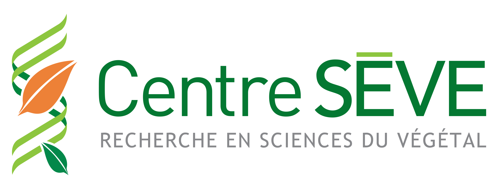

<head>

<meta charset="utf-8">

<meta name="viewport" content="width=device-width, initial-scale=1">

</head>

<section>

 
 [<i class="fab fa-twitter"></i>](https://twitter.com/CPICSEVE) [<i class="fab fa-linkedin-in"></i>](https://www.linkedin.com/company/cpics/about/)
[<i class="fab fa-facebook"></i>](https://www.facebook.com/CPICS-Comit%C3%A9-de-partenariat-international-du-Centre-S%C3%88VE-395275957711442)

<i class="fas fa-envelope" align="center" href="cpicseve@gmail.com" style="padding:2px; font-size:24px"></i> 
 cpicseve@gmail.com

    

 

  

  <a class="twitter-timeline" data-height="800" href="https://twitter.com/CPICSEVE?ref_src=twsrc%5Etfw">Tweets by CPICS</a> 
  

  

  
*Français*

  
Fondé en 2018, le **_Comité de partenariat international du Centre SÈVE (CPICS)_** est un comité étudiant composé d’étudiant(e)s de 2e et 3e cycle affilié(e)s au **_Centre SÈVE_**. Articulé par une dizaine d’étudiant(e)s provenant des universités québécoises, le **_CPICS_** stimule les collaborations entre les scientifiques de la province avec la communauté internationale dans le domaine de la biologie végétale. Il participe aussi au rayonnement international du réseau de recherche Québécois en favorisant une meilleure diffusion des savoirs, allant de l’optimisation de la productivité végétale à la durabilité des écosystèmes végétaux, le tout dans un soucis de proactivité dans le contexte de changement global actuel. 

  
Le **_CPICS_** donne l’occasion à des étudiant(e)s engagé(e)s de s’impliquer dans leur domaine de recherche scientifique et de s’y faire connaitre, mais aussi de gérer l’organisation d’évènements bénéficiant à l’ensemble de la communauté scientifique québécoise dans le domaine des sciences végétales.

  
  

  

  
*English*

  
Created in 2018, **_Center SÈVE International Partnership Committee (CSIPC)_** is a graduate student committee member of **_Center SÈVE_**. Conducted by ten students from Quebec Universities, **_CSIPC_** increase collaborations between Quebec and international researchers in plant biology field. **_CSIPC_** stimulate Quebec research networking by a better broadcast of knowledge from its community through plant productivity or ecosystem sustainability, all together with a proactive behavior facing the actual global changing. 

  
**_CSIPC_** is an opportunity for involved student to contribute to their scientific community and manage the organization of events that benefit the whole scientific community of Plant biologists from Quebec.

  
  

</section>

<section>

 
  
 [<i class="fab fa-twitter"></i>](https://twitter.com/centre_seve) [<i class="fab fa-linkedin-in"></i>](https://www.linkedin.com/company/centre-seve/about/)
[<i class="fab fa-facebook"></i>](https://www.facebook.com/centreseve)

  <i class="fas fa-envelope" align="center" style="display: block;  margin-left: auto;  margin-right: auto; padding:2px; font-size:24px"></i> 
info@centreseve.org

  

  

  
 Le **Centre SÈVE** est le seul centre de recherche interinstitutionnel au Québec à regrouper des chercheurs en sciences du végétal à vocation non forestière. Créé en 2004, le **Centre SÈVE** compte sur un support financier important du *FRQNT* par l'entremise du programme des Regroupements stratégiques. Le **Centre** bénéficie également d'un financement en provenance des établissements universitaires partenaires, des organismes subventionnaires supportant ses activités de recherche et d'autres partenaires.

  
 La vaste expertise scientifique du Centre SÈVE vous est présentée dans la section sur les activités de recherche multidisciplinaires du Centre.

  
 Le **Centre SÈVE** cultive de nombreuses collaborations avec des partenaires qui collaborent à la recherche scientifique, à la diffusion des connaissances, au rayonnement national et international du **Centre** et à la formation d'étudiants de 1er, 2e ou 3e cycle.

  
 Le **Centre SÈVE**, via des collaborations interinstitutionnelles et multidisciplinaires, dispose d’infrastructures technologiques performantes. Un des objectifs du **Centre SÈVE** est d'assurer à ses membres des services communs et l'accès au parc instrumental.

  

  

  
 The **Centre SÈVE** is the only inter-institutional research centre in Quebec to bring together researchers in non-forestry plant science. Founded in 2004, the **Centre SÈVE** relies on major funding from the *FRQNT* through its Strategic Clusters Program. The Centre also receives funding from its university partners, as well as the funding agencies support its research activities and other partners.

  
 The wide-ranging scientific expertise of the **Centre SÈVE** is outlined in the section on multidisciplinary research activities.

  
 The **Centre SÈVE** develops collaborations with many partners that have common objectives of research, dissemination of knowledge, national and international exposure, and training of undergraduate and graduate students.

  
 One objective of the **Centre SÈVE** is to provide its members with access to, and services from, a common infrastructures platform.

  

  

</section>
