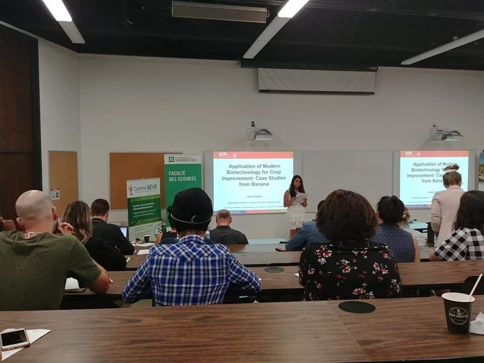

<meta charset="utf-8">
<meta name="viewport" content="width=device-width, initial-scale=1">

<link rel="stylesheet" href="./symposium_style.css">

  
  
  
 Le *Symposium annuel international du Centre SÈVE* est un rassemblement scientifique qui reflète la philosophie du **_CPICS_**. Son objectif est, non seulement, de renforcer et de développer   un   réseau   international   du _Centre SÈVE_,   mais   aussi   de   permettre   aux étudiant(e)s affilié(e)s au _Centre SÈVE_ de rencontrer des scientifiques de renommées internationales et de profiter du partage de leur connaissances. C’est une occasion pour toute la communauté du _Centre SÈVE_ d’agrandir son réseau et de faire naitre de nouvelles collaborations, autant à l’échelle canadienne qu’à l’échelle mondiale. C’est également un moment privilégié pour les étudiant(e)s pour qui c’est l’occasion de présenter leurs travaux devant leur pairs, profitant de la proximité que favorise l’évènement. 

  

  
  
  
The *Annual International Symposium of Center SÈVE* is a scientific meeting which reflects **_CSIPC_**’s philosophy. Its objective is to develop _Center SÈVE_'s international network and, at the same time, give a chance to student members to meet international researcher. This is an opportunity to increase _Center SÈVE_'s visibility at international scene but also to create   new  collaborations   between   Canadians  and   international   researchers.   Student members take advantage of this privileged event to present their own research in front of their peers, enjoying the proximity favored by the event.

  
 
 

 

#  {.tabset .tabset-fade .tabset-pills}

## Program 

  

## Professors / Professeurs

  
  
  

  
  
  

## Photos

![From left to right: Dr. Peter Moffett (Centre SÈVE's president), Romaric Armel Mouafo Tchinda (CSPIC's 2019 Networking Vice-president), Claire Letanneur (CSPIC's 2019 Vice-president), Dr. Alfredo Herrera Estrella (Keynote speaker), Dr. Leenna Tripathi (Keynote speaker), Guilherme Silva-Martins (CSPIC's 2019 President).  De la gauche à la droite: Dr. Peter Moffett (Président du Centre SÈVE), Romaric Armel Mouafo Tchinda (Vice-président de Réseautage du CPICS 2019), Claire Letanneur (Vice-présidente du CPICS 2019), Dr. Alfredo Herrera Estrella (Conférencier invite), Dr. Leena Tripathi (Conférencier invitée), Guilherme Silva-Martins (Président du CPICS 2019)](images/symposium 2019/photos/symposium_2019_photos5.jpg)

![From left to right: Peter Moffett (Centre SÈVE's president), Romaric Armel Mouafo Tchinda (CSPIC's 2019 Networking Vice-president), Claire Letanneur (CSPIC's 2019 Vice-president), Dominique Michaud (Keynote speaker), Jaswinder Singhi (Keynote speaker), Guilherme Silva-Martins (CSPIC's 2019 President).  De la gauche à la droite: Peter Moffett (Président du Centre SÈVE), Romaric Armel Mouafo Tchinda (Vice-président de Réseautage du CPICS 2019), Claire Letanneur (Vice-présidente du CPICS 2019), Dominique Michaud (Conférencier invite), Jaswinder Singhi (Conférencier invite), Guilherme Silva-Martins (Président du CPICS 2019)](images/symposium 2019/photos/symposium_2019_photos6.jpg)

## Sponsors / Partenaires

